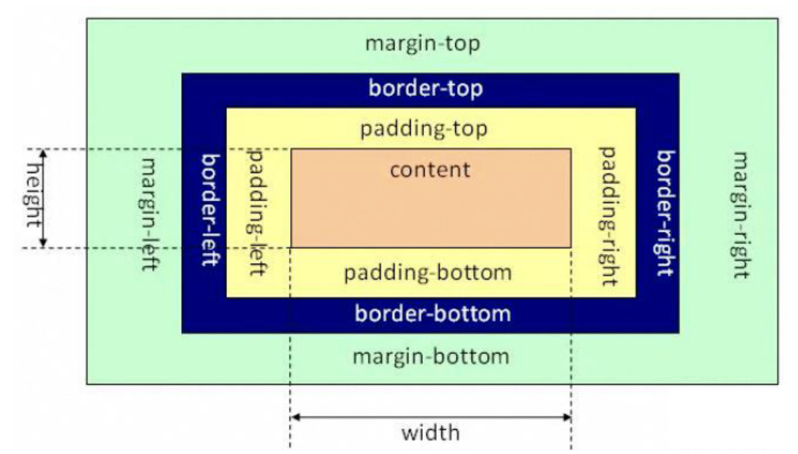

# CSS 盒子模型
HTML 中的每一个元素都是一个容器，这个容器就像是一个盒子，它包括：外边距，边框，填充，和实际内容

| ##container## |
|:--:|
||

- 元素的总宽度 = 左外边距 + 左边框 + 左内边距 + 宽度 + 右内边距 + 右边框 + 右外边距

- 元素的总高度 = 上外边距 + 上边框 + 上内边距 + 高度 + 下内边距 + 下边框 + 下外边距