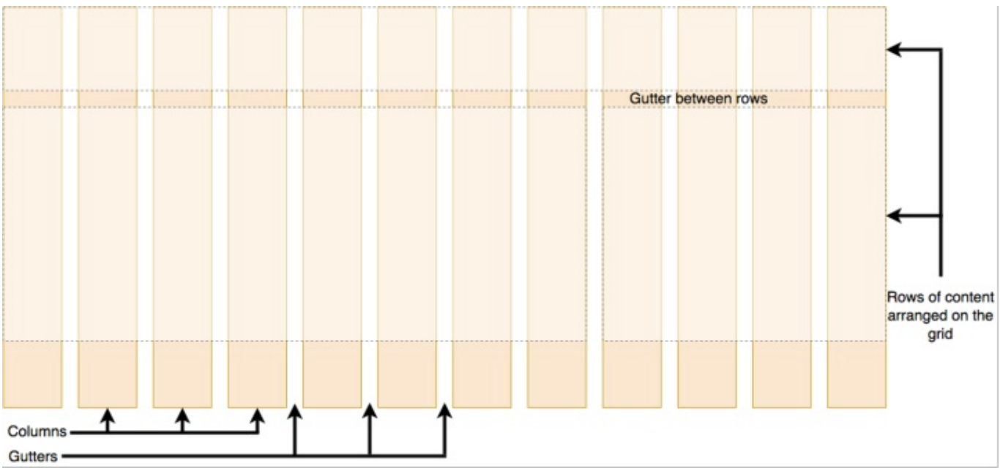

# 网格布局
| ##container## |
|:--:|
||

如上图，**网格布局就是指通过水平和垂直创建的一种模式**，可以在这个模式上排列元素，网格通常具有
行（row）和列（column）以及间隙（列跟列之间的距离，gutter）。

- fr（fraction ，片段）布局单位
    - fr单位被用于在一系列长度值中分配剩余空间，如果多个已指定了多个部分，则剩下的空间根据各自的数字按比例分配。

- repeat
    - CSS 函数表示轨道列表中的重复部分，可以更紧凑地写入列和行重复。

示例

用网格创建一个布局，一行四列，每列等宽

`repeat(4,1fr)`的作用，创建4列等宽的网格，每列`1fr`它们所占的空间量相等。也可以使用百分比依次设置每一列占比

```html
<style>
.wrapper {
    /* 转化元素类型 */
    display: grid;
    /* 设置网格的间隙，包含了行和列，也可以使用grid-row-gap和grid-column-gap分开设置 */
    grid-gap: 10px;
    /* 设置每列的尺寸 */
    grid-template-columns: repeat(4, 1fr);
}
</style>

<div class="wrapper">
    <div class="col">11</div>
    <div class="col">12</div>
    <div class="col">13</div>
    <div class="col">14</div>
    <div class="col">21</div>
    <div class="col">22</div>
    <div class="col">23</div>
    <div class="col">24</div>
</div>
```

<style>
.wrapper {
    /* 转化元素类型 */
    display: grid;
    /* 设置网格的间隙，包含了行和列，也可以使用grid-row-gap和grid-column-gap分开设置 */
    grid-gap: 10px;
    /* 设置每列的尺寸 */
    grid-template-columns: repeat(4, 1fr);
}

.col {
    background-color: red;
}
</style>

可以尝试改变一下浏览器窗口大小:
<div class="wrapper">
    <div class="col">11</div>
    <div class="col">12</div>
    <div class="col">13</div>
    <div class="col">14</div>
    <div class="col">21</div>
    <div class="col">22</div>
    <div class="col">23</div>
    <div class="col">24</div>
    <div class="col">25</div>
</div>