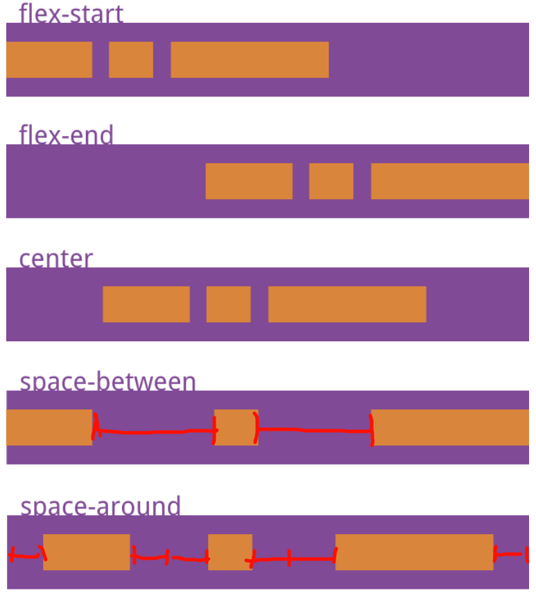
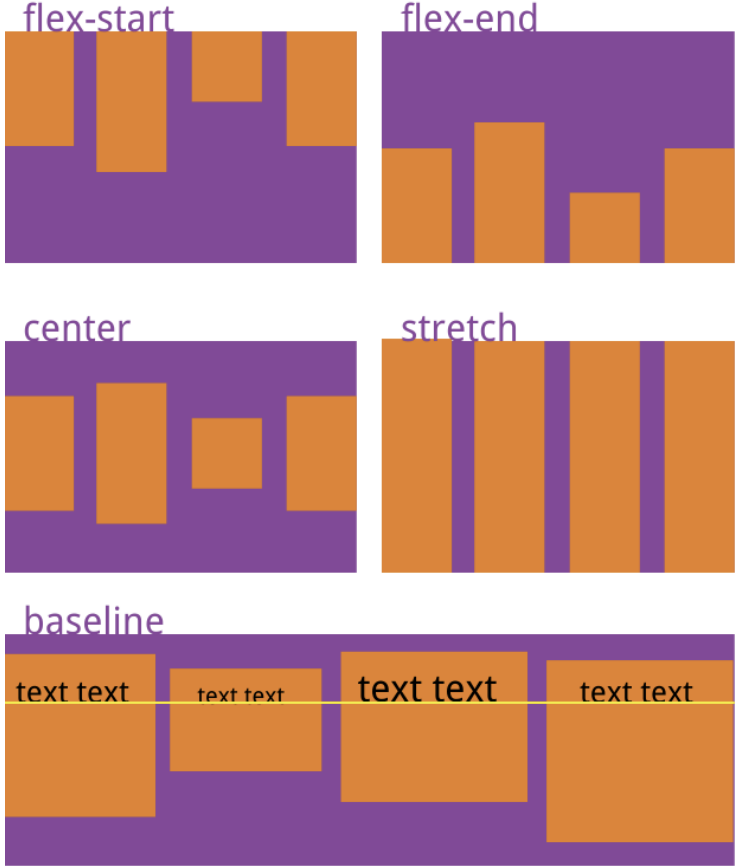
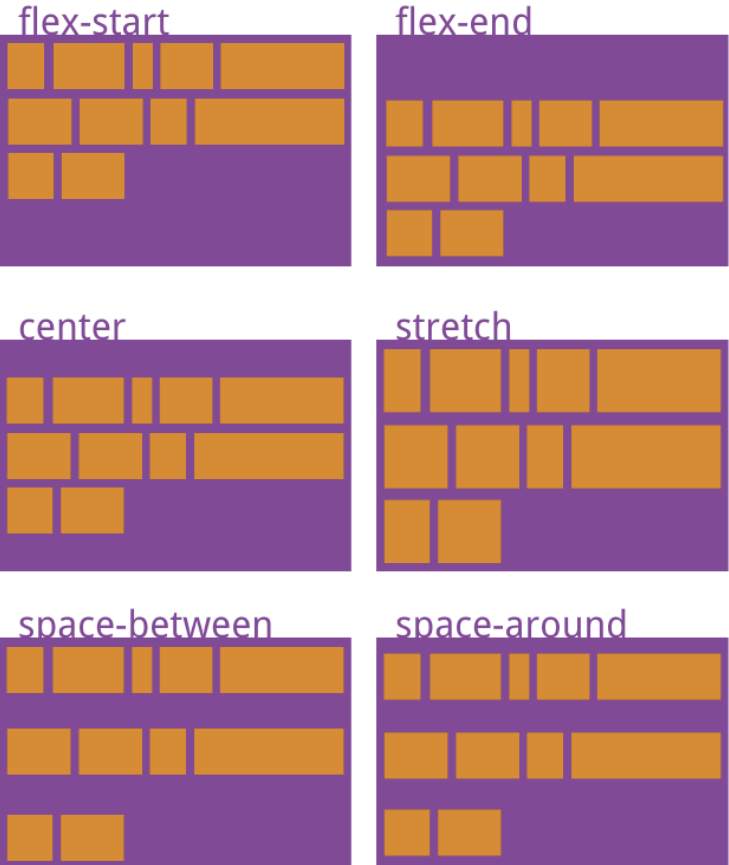

# Flex 布局
## Flex简介
Flex 是 Flexible Box 的缩写，意为"弹性布局"。采用 Flex 布局的元素，称为 Flex 容器（flex container），简称"容器"。它的所有子元素自动成为容器成员，称为 Flex 项（flex item）。

| ##container## |
|:--:|
||

容器默认存在两根轴：水平的主轴（main axis）和垂直的交叉轴（cross axis）。主轴的开始位置（与边框的交叉点）叫做`main start`，结束位置叫做`main end`；交叉轴的开始位置叫做`cross start`，结束位置叫做`cross end`。

Flex 项默认沿主轴排列。单个项占据的主轴空间叫做`main size`，占据的交叉轴空间叫做`cross
size`。

## 容器的属性

以下6个属性设置在容器上。
- flex-direction
- flex-wrap
- flex-flow
- justify-content
- align-items
- align-content

## 决定主轴方向 flex-direction 属性
`flex-direction`属性决定主轴的方向（即项目的排列方向）

```css
.box {
    flex-direction: row | row-reverse | column | column-reverse;
}
```
- row （默认值）：主轴为水平方向，起点在左端。
- row-reverse ：主轴为水平方向，起点在右端。
- column ：主轴为垂直方向，起点在上沿。
- column-reverse ：主轴为垂直方向，起点在下沿。

注: `flex-direction`属性是应用于使用`display: flex`或`display: inline-flex`的元素的

主轴为水平方向，起点在左端
<div style="display: flex; flex-direction: row">
    <span>a</span>
    <span>b</span>
    <span>c</span>
    <span>d</span>
</div>

---

主轴为水平方向，起点在右端
<div style="display: flex; flex-direction: row-reverse">
    <span>a</span>
    <span>b</span>
    <span>c</span>
    <span>d</span>
</div>

---

主轴为垂直方向，起点在上沿
<div style="display: flex; flex-direction: column">
    <span>a</span>
    <span>b</span>
    <span>c</span>
    <span>d</span>
</div>

---

主轴为垂直方向，起点在下沿
<div style="display: flex; flex-direction: column-reverse">
    <span>a</span>
    <span>b</span>
    <span>c</span>
    <span>d</span>
</div>

---

## 如何换行 flex-wrap 属性
默认情况下，Flex 项目都排在一条线（又称"轴线"）上。 flex-wrap 属性定义，如果一条轴线排不下，如何换行。

```css
.box{
    flex-wrap: nowrap | wrap | wrap-reverse;
}
```

- nowrap （默认）：不换行


- wrap ：换行，第一行在上方


- wrap-reverse ：换行，第一行在下方


## 简写 flex-flow

flex-flow 属性是 flex-direction 属性和 flex-wrap 属性的简写形式，默认值为 row nowrap 。

```css
.box {
    flex-flow: <flex-direction> || <flex-wrap>;
}
```

## 主轴上对齐方式 justify-content 属性
`justify-content`属性定义了项目在主轴上的对齐方式
```css
.box {
    justify-content: flex-start | flex-end | center | space-between | space-around;
}
```

- flex-start （默认值）：左对齐
- flex-end ：右对齐
- center ： 居中
- space-between ：两端对齐，项目之间的间隔都相等。
- space-around ：每个项目两侧的间隔相等。所以，项目之间的间隔比项目与边框的间隔大一倍。

| ##container## |
|:--:|
||

## 交叉轴上对齐方式 align-items 属性
`align-items`属性定义项目在交叉轴上如何对齐
```css
.box {
    align-items: flex-start | flex-end | center | baseline | stretch;
}
```

- flex-start ：交叉轴的起点对齐。
- flex-end ：交叉轴的终点对齐。
- center ：交叉轴的中点对齐。
- baseline : 项目的第一行文字的基线对齐。
- stretch （默认值）：如果项目未设置高度或设为auto，将占满整个容器的高度。

| ##container## |
|:--:|
||

## 多根轴线的对齐方式 align-content 属性
`align-content`属性定义了多根轴线的对齐方式。如果项目只有一根轴线，该属性不起作用

```css
.box {
    align-content: flex-start | flex-end | center | space-between | space-around | stretch;
}
```
- flex-start ：与交叉轴的起点对齐。
- flex-end ：与交叉轴的终点对齐。
- center ：与交叉轴的中点对齐。
- space-between ：与交叉轴两端对齐，轴线之间的间隔平均分布。
- space-around ：每根轴线两侧的间隔都相等。所以，轴线之间的间隔比轴线与边框的间隔大一倍。
- stretch （默认值）：轴线占满整个交叉轴。

| ##container## |
|:--:|
||

## Flex 项的属性
以下6个属性设置在`Flex`项上。

- `order`
- `flex-grow`
- `flex-shrink`
- `flex-basis`
- `flex`
- `align-self`

### 排列顺序 order 属性
`order`属性定义项目的排列顺序。数值越小，排列越靠前，默认为 0

```css
.item {
    order: <integer>;
}
```

| ##container## |
|:--:|
||

### 放大比例 flex-grow 属性
`flex-grow`属性定义项目的放大比例，默认为 0 ，即如果存在剩余空间，也不放大

```css
.item {
    flex-grow: <number>; /* default 0 */
}
```

| ##container## |
|:--:|
||

如果所有项目的`flex-grow`属性都为1，则它们将等分剩余空间（如果有的话）。如果一个项目的`flex-grow`属性为2，其他项目都为1，则前者占据的剩余空间将比其他项多一倍。

### 缩小比例 flex-shrink 属性
`flex-shrink`属性定义了项目的缩小比例，默认为 1 ，即如果空间不足，该项目将缩小

```css
.item {
    flex-shrink: <number>; /* default 1 */
}
```

| ##container## |
|:--:|
||

如果所有项目的`flex-shrink`属性都为1，当空间不足时，都将等比例缩小。如果一个项目的`flex-shrink`属性为0，其他项目都为1，则空间不足时，前者不缩小。

负值对该属性无效。

### flex-basis 属性
`flex-basis`属性定义了在分配多余空间之前，项目占据的主轴空间（main size）。浏览器根据这个属性，计算主轴是否有多余空间。它的默认值为 auto ，即项目的本来大小。

```css
.item {
    flex-basis: <length> | auto; /* default auto */
}
```

它可以设为跟 width 或 height 属性一样的值（比如350px），则项目将占据固定空间。

### flex 属性
flex 属性是 flex-grow , flex-shrink 和 flex-basis 的简写，默认值为 0 1 auto 。后两个属性可选。

```css
.item {
    flex: none | [ <'flex-grow'> <'flex-shrink'>? || <'flex-basis'> ]
}
```

该属性有两个快捷值： `auto` `( 1 1 auto )` 和 `none` `( 0 0 auto )`。

建议优先使用这个属性，而不是单独写三个分离的属性，因为浏览器会推算相关值

### align-self 属性
align-self 属性允许单个项目有与其他项目不一样的对齐方式，可覆盖 align-items 属性。默认值为auto ，表示继承父元素的 align-items 属性，如果没有父元素，则等同于 stretch

```css
.item {
    align-self: auto | flex-start | flex-end | center | baseline | stretch;
}
```

该属性可能取6个值，除了auto，其他都与`align-items`属性完全一致.

| ##container## |
|:--:|
||
