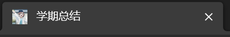

# [案例]网页标签相关
## 大纲
```markmap ##h200##
# 网页标签
## 标签图标
## 滚动标题
## 窗口切换判断
```

## 标签图标


|效果展示|
|:-:|
||

如下即可

```html
<title>标题</title>
<link rel="shortcut icon" href="./src/icon/title_loli.ico">
```

## 滚动标题

添加 `id`, 然后使用下面的代码即可.
```html
<title id="title">滚动标签标题</title>
```

```js
// 滚动标题
setInterval(function() {
    var tag = document.getElementById('title'); // 根据id获取元素
    var content = tag.innerText;                // 获取title标签的文本内容
    var firstStr = content.charAt(0);           // 获取第一个字
    var surplue = content.substring(1, content.length); // 删除第一个字
    var new_content = surplue + firstStr;               // 把第一个字加到最后面
    tag.innerText = new_content;
}, 500); // 延迟
```

## 窗口切换判断

这是一个事件监听器。该代码使用`addEventListener`方法监听`visibilitychange`事件，当页面可见性状态发生变化时，执行回调函数中的代码，从而更改文档标题。

```html
<script>
        // 离开当前页面就更改标题
        document.addEventListener('visibilitychange', function () {
                if (document.visibilityState == 'hidden') {
                    normal_title = document.title;
                    document.title = '网络连接无响应';
                } else {
                    document.title = normal_title;
                }
        });
</script>
```