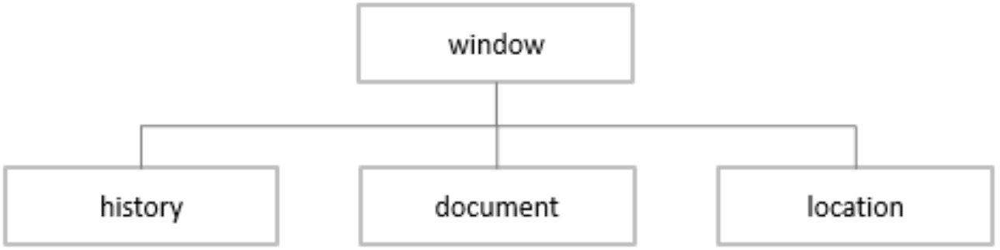
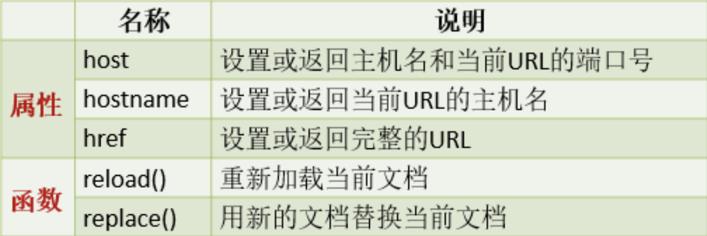

# BOM对象
## BOM 概念
BOM（Browser Object Model），即浏览器对象模型，BOM 提供了独立于内容的对象结构，可以与浏
览器窗口进行互动

| ##container## |
|:--:|
||

## window 对象
window对象包含了3个对象：history、document和location。

### history 对象
`history`对象主要用于控制页面的历史记录的显示

|名称|说明|
|-|-|
|back()|页面展示前一个历史记录|
|forward()|页面展示后一个历史记录|
|go(整数)|根据给定数量显示历史记录，如果正数, 则使用前面史记录，如果是负数，则使用后面|

示例 (可以类别于浏览器左上角那个`前进`和`后退`按钮)
```html
<a href="javascript: back()">上一个</a>
<a href="javascript: forward()">下一个</a>
<a href="javascript: go(-2)">上二个</a>
```

### location 对象
location 对象主要用于获取以及更改浏览器地址栏信息。

| ##container## |
|:--:|
||

示例
```html
<!--javascript:void(0)表示点击超链接时不做任何事情-->
<a href="javascript:void(0)" onclick="showAddress()">显示地址栏信息</a>
<a href="javascript:void(0)" onclick="refresh()">刷新页面</a>
<a href="javascript:void(0)" onclick="changePage()">替换新页面</a>
<script>
    function showAddress() {
        console.log(location.host); // 获取 ip:端口
        console.log(location.hostname); // ip
        console.log(location.href); // 网址
    }
    function refresh() {
        location.reload(); // 刷新
    }
    function changePage() {
        location.replace("#");
    }
</script>
```

### document 对象
document对象主要用于操作页面元素

| 名称 | 说明 |
| --- | --- |
| `getElementById("ID值")` | 获取给定ID值的元素 |
| `getElementsByName("名称")` | 获取给定名称的元素的集合 |
| `getElementsByClassName("类名")` | 获取给定类名的元素的集合 |
| `getElementsByTagName("标签名")` | 获取给定标签名的元素的集合 |

示例
```html
<body>
    <div id="a">a</div>
    <div id="b" class="c">b</div>
    <div class="c">c</div>
    <div name="d">d</div>
</body>
<script type="text/javascript">
    let div = document.getElementById("a"); //得到单个元素
    console.log(div)
    // div.innerText = "将内容改变为b"; // 内部文本内容
    div.textContent = "<h1>文本内容</h1>"; // 作用与innerText一样
    // div.innerHTML = "<h1>内容支持标签</h1>"; // 内部HTML内容
    console.log("============================")
    //通过标签名获取元素
    let divArr = document.getElementsByTagName("div");
    console.log(divArr)
    console.log("============================")
    //通过类名获取元素
    let arr = document.getElementsByClassName("c");
    console.log(arr)
    console.log("============================")
    let nameArr = document.getElementsByName("d");
    console.log(nameArr)
</script>
```