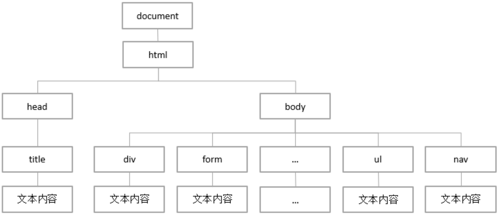

# DOM 操作
## DOM 概念
**DOM（Document Object Model）**，即文档对象模型，DOM主要提供了对于页面内容的一些操作。<span style="color:red">在DOM中，所有的内容（标签和文本）都是DOM节点，所有的标签都是DOM元素。</span>

## DOM 节点关系
| ##container## |
|:--:|
||

## 节点属性

| 属性名称 | 描述 |
| :--- | :--- |
| parentNode | 获取父节点 |
| childNodes | 获取所有下一级子节点 |
| firstChild | 获取第一个子节点 |
| lastChild | 获取最后一个子节点 |
| nextSibling | 获取下一个同级节点 |
| previousSibling | 获取上一个同级节点 |

换行、标签、注释 都会被当做一个结点, 不局限于一个元素(`<p></p>`)

示例
```html
<body>
    <div id="hx">
        <!-- 我是注释 -->
        <p>1</p>
        <p>2</p>
        <p>3</p>
        <p>4</p>
        <p>5</p>
        <p>6</p>
    </div>
</body>
<script>
   let box = document.getElementById("hx");
    console.log(box.parentNode)      // 父节点
    let childNodes = box.childNodes; // 文本内容包括enter键在内的换行、注释都属于节点
    console.log(childNodes)
    console.log(box.firstChild)      // 第一个子节点
    console.log(box.lastChild)       // 最后一个子节点
    let first = childNodes[0];       // 第一个子节点
    console.log(first.nextSibling);
    let last = box.lastChild;        // 最后一个子节点
    console.log(last.previousSibling)
</script>
```

## 元素属性

| 属性名称 | 描述 |
| :---| :--- |
| parentElement | 获取父元素 |
| children | 获取所有下一级子元素 |
| firstElementChild | 获取第一个子元素 |
| lastElementChild | 获取最后一个子元素 |
| nextElementChild | 获取下一个同级元素 |
| previousElementChild | 获取上一个同级元素 |

元素就是一个`<xx></xx>`

示例
```html
<body>
    <div id="hx">
        <!-- 我是注释 -->
        <p>1</p>
        <p>2</p>
        <p>3</p>
        <p>4</p>
        <p>5</p>
        <p>6</p>
    </div>
</body>
<script>
   let box = document.getElementById("hx");
   console.log(box.parentElement);  // 父元素，元素也就是标签
    let children = box.children;    // 下一级子元素
    console.log(children)
    console.log(box.firstElementChild); // 第一个子元素
    console.log(box.lastElementChild);  // 最后一个子元素
    console.log(box.firstElementChild.nextElementSibling);      // 第一个子元素的下一个同级元素
    console.log(box.firstElementChild.previousElementSibling);  // 第一个子元素的上一个同级元素
</script>
```

## 节点操作

| 名称 | 描述 |
| :--- | :--- |
| createElement( tagName) | 根据给定的标签名创建元素节点 |
| A.appendChild( B) | 将节点B追加到节点A的末尾 |
| A.remove() | 将节点A从DOM树中移出 |
| getAttribute("属性名") | 获取给定属性名对应的属性值 |
| setAttibute("属性名","属性值") | 为给定的属性名设置给定的属性值 |

示例
```html
<body>
<input type="button" value="查询" id="searchBtn">
<table>
    <thead>
        <tr>
            <td>姓名</td>
            <td>性别</td>
            <td>年龄</td>
        </tr>
    </thead>
    <tbody id="dataBox">
    </tbody>
</table>
</body>
<script type="text/javascript">
    let stus = [{
        name: '张三1',
        sex: '男',
        age: 20
    }, {
        name: '张三2',
        sex: '男',
        age: 21
    }, {
        name: '张三3',
        sex: '男',
        age: 26
    }, {
        name: '张三4',
        sex: '男',
        age: 25
    }];
    let btn = document.getElementById("searchBtn");
    btn.onclick = function () {
        let dataBox = document.getElementById("dataBox");
        let table = dataBox.parentElement; // 获取table标签元素
        dataBox.remove(); // 将tbody从DOM树中移除
        dataBox = document.createElement("tbody"); // 创建tr标签
        dataBox.setAttribute("id", "dataBox");
        table.appendChild(dataBox);
        for (let i = 0; i < stus.length; i++) {
            let tr = document.createElement("tr"); // 创建tr标签
            let td = document.createElement("td"); // 创建td标签
            td.textContent = stus[i].name;
            tr.appendChild(td); // 将td追加到tr的末尾
            td = document.createElement("td"); // 创建td标签
            td.textContent = stus[i].sex;
            tr.append(td);
            td = document.createElement("td"); // 创建td标签
            td.textContent = stus[i].age;
            tr.append(td);
            dataBox.appendChild(tr);
        }
    }
</script>
```

## 节点样式
### style 样式
```js
节点.style.样式属性 ＝ "值";
```

### class 样式
```js
节点.className = "样式名称";
```

示例
```html
<head>
    <meta charset="UTF-8">
    <title>节点样式</title>
    <style>
        .box {
            width: 200px;
            height: 200px;
            border: 1px solid #ddd;
        }

        .active {
            background-color: red;
        }
    </style>
</head>

<body>
    <div id="a" class="box active"></div>
</body>
<script type="text/javascript">
    let div = document.getElementById("a");
    // div.style.height = '50px';
    // div.style.backgroundColor = "red";
    div.className = "box"; // 重新设置类, 相当于删除了 active 类
</script>
```

## 节点属性

| 属性 | 描述 |
| :--- | :--- |
| offsetleft | 返回当前元素左边界到它上级元素的左边界的距离，只读属性 |
| offsetTop | 返回当前元素上边界到它上级元素的上边界的距离，只读属性 |
| offsetHeight | 返回元素的高度 |
| offsetWidth | 返回元素的宽度 |
| offsetParent | 返回元素的偏移容器，即对最近的动态定位的包含元素的引用 |
| scrollTop | 返回匹配元素的滚动条的垂直位置 |
| scrollLeft | 返回匹配元素的滚动条的水平位置 |
| clientWidth | 返回元素的可见宽度 |
| clientHeight | 返回元素的可见高度 |

示例
```html
<body id="body">
    <div style="height: 2000px;">
        <ul id="u">
            <li>测试</li>
        </ul>
    </div>
    <input type="button" value="按钮" id="btn">
</body>
<script type="text/javascript">
    let u = document.getElementById("u");
    console.log(u.offsetLeft)
    console.log(u.offsetTop)
    console.log(u.offsetHeight + " x " + u.offsetWidth);
    console.log(u.clientWidth + " x " + u.clientHeight);
    document.getElementById("btn").onclick = function () {
        let body = document.getElementById("body");
        console.log(body.scrollTop)
    }
</script>
```