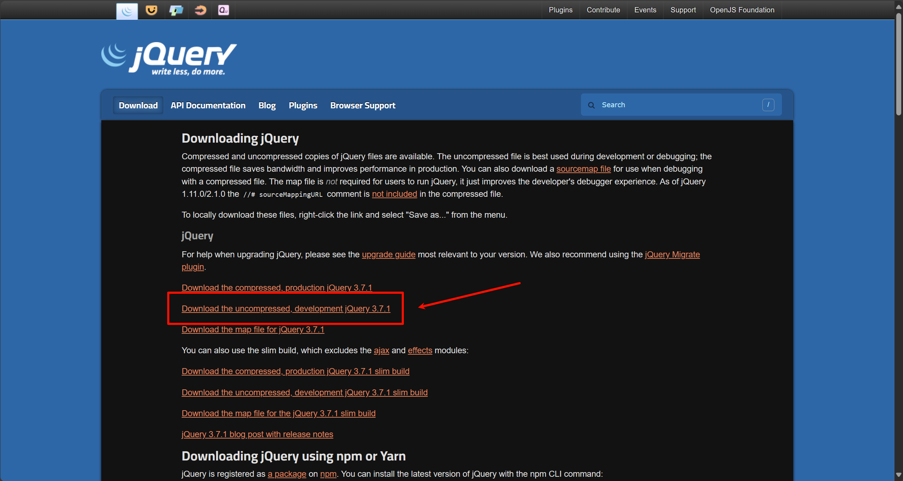
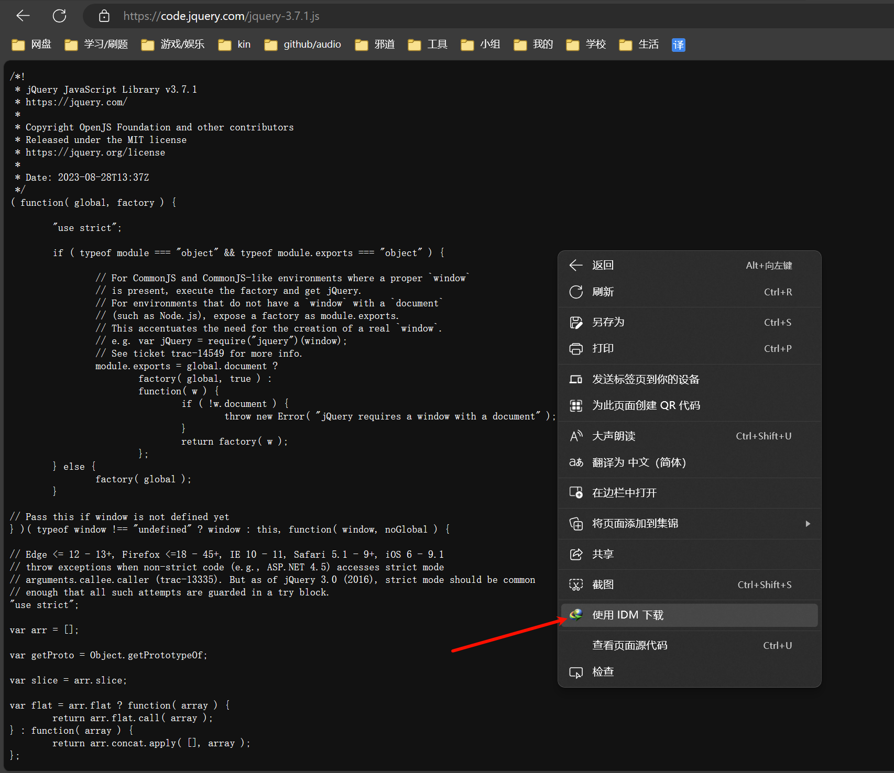

# jQuery
## jQuery 简介
[jQuery](https://jquery.com/) 由美国人 John Resig 于2006年创建。它是对 JavaScript 对象和函数的封装。其设计思想是 write less, do more (少写, 多做)。

## jQuery用途
- 访问和操作DOM元素
- 控制页面样式
- 对页面事件进行处理
- 扩展新的jQuery插件
- 与Ajax技术完美结合

## jQuery优势
- 体积小，压缩后只有100KB左右
- 强大的选择器
- 出色的DOM封装
- 可靠的事件处理机制
- 出色的浏览器兼容性
- 使用隐式迭代简化编程
- 丰富的插件支持

## jQuery 下载
| ##container## |
|:--:|
||
||

## 引入 jQuery

```html
<script type="text/javascript" src="jQuery库文件路径"></script>
```