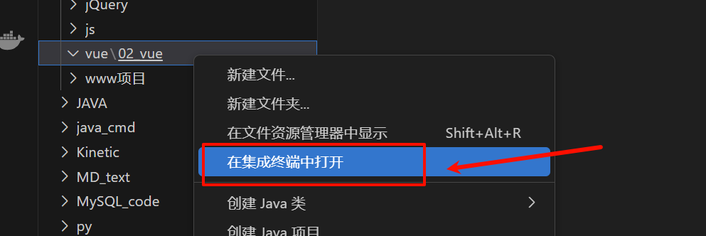
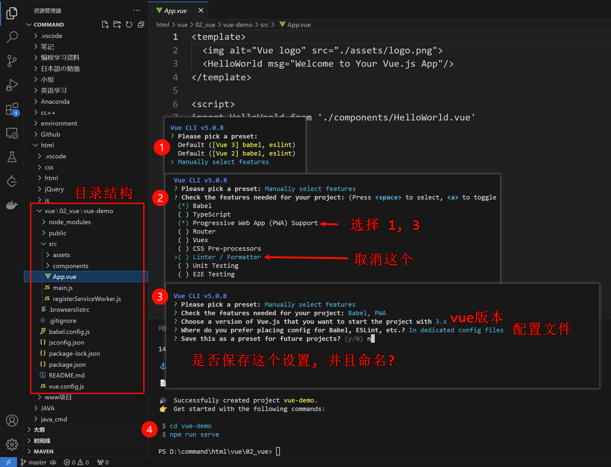
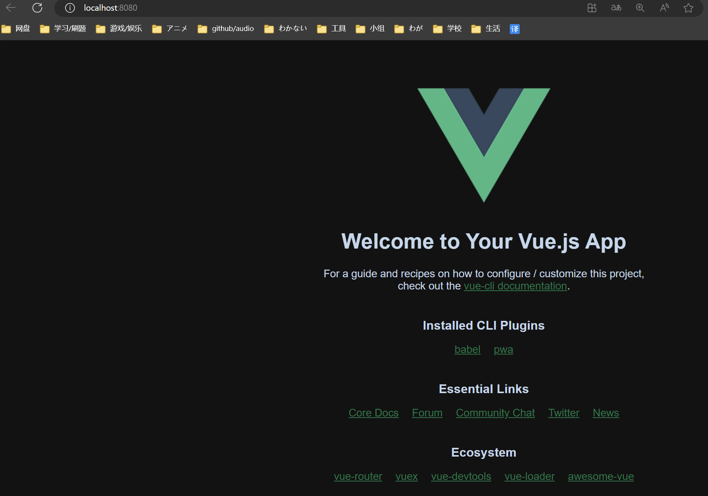

# 二、Vue 开发前端的准备
## 2.0 Vue 官网

- [Vue.js](https://cn.vuejs.org/)

## 2.1 安装 Vue 工具
`Vue.js`开发的标准工具，`Vue CLI`是一个基于`Vue.js`进行快速开发的完整系统

```cmd
npm install -g @vue/cli
```

验证是否安装成功

```cmd
vue --version
```

## 2.2 VScode: 创建第一个 Vue 项目

| ##container## |
|:--:|
||

运行以下命令来创建一个新项目, 只能使用小写, 可以多个`-`连接

```cmd
vue create vue-demo
```

> [!TIP]
> **温馨提示**
>
> 在控制台中，可以用上下按键调整选择项
> 在控制台中，可以用空格（spacebar）选择是否选中和取消选中

可以选择默认项目模板，或者选"手动选择特性"来选取需要的特性。

| ##container## |
|:--:|
||

## 2.3 运行项目

- 第一步: 进入项目根目录`cd vue-demo`

- 第二步: 运行`npm run serve`启动项目


大功告成:

| ##container## |
|:--:|
||


## 2.4 安装Vue高亮插件
VSCode中安装`vetur`或者`volar`都可，前者针对Vue2版本，后者针对Vue3版本 ~~(反正找个下载多的/或者你打开文件就会提示你安装相关插件了)~~