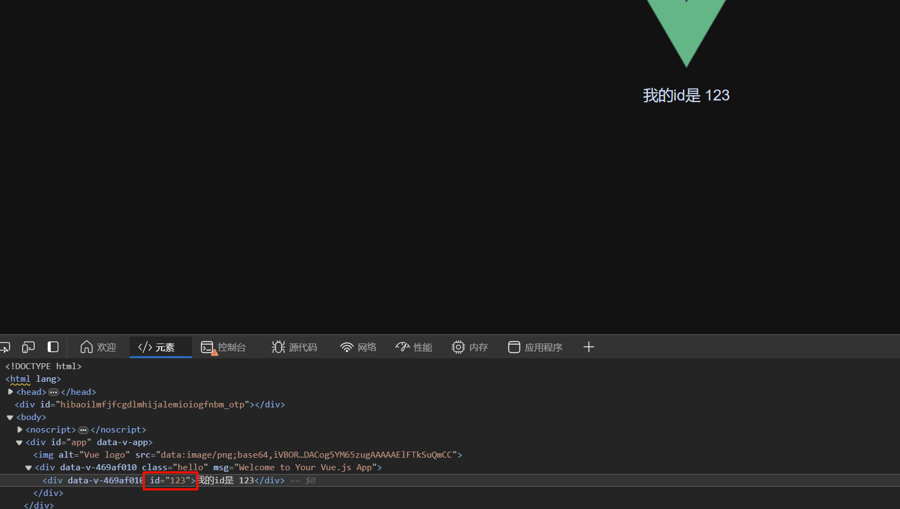
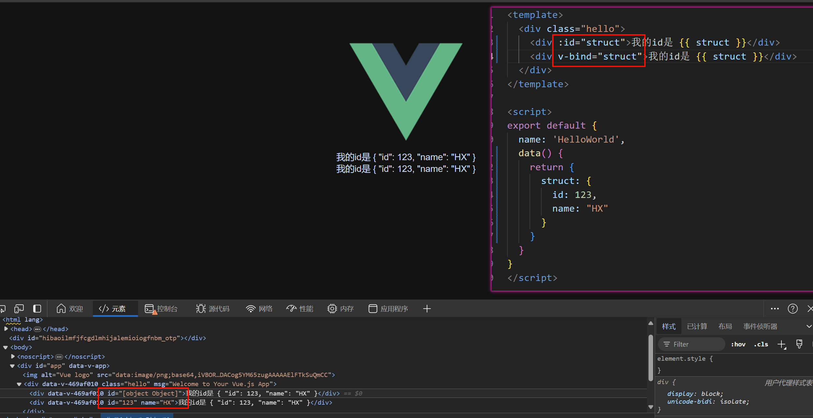

# 三、Vue 模版语法

- 官方文档: [模板语法 | Vue.js](https://cn.vuejs.org/guide/essentials/template-syntax.html)

## 3.1 文本插值

最基本的数据绑定形式是文本插值，它使用的是“Mustache”语法 (即双大括号):

```html
<span>Message: {{ msg }}</span>
```

双大括号标签会被替换为`相应组件实例`中 msg 属性的值。同时每次 msg 属性更改时它也会同步更新。

示例: (还有补充请见`3.4`)

```html
<template>
  <div class="hello">
    <h1>{{ isOk ? msgTrue : msgFalse }}</h1>
  </div>
</template>

<script>
export default {
  name: 'HelloWorld',
  data() { // 这个是一个函数, 暂时不用理解这个是什么, 先临摹~
    return {
      isOk: 0,
      msgTrue: "awa",
      msgFalse: '单引号'
    }
  }
}
</script>
```

## 3.2 原始 HTML
双大括号会将数据解释为纯文本，而不是 HTML。若想插入 HTML，你需要使用`v-html`指令:

```html
<template>
  <div class="hello">
    <p>插入HTML: <span v-html="rawHtml"></span>, 而不是 {{ rawHtml }}</p>
  </div>
</template>

<script>
export default {
  name: 'HelloWorld',
  data() {
    return {
      rawHtml: '<span style="color: red">我是红色</span>'
    }
  }
}
</script>
```

运行效果: 
> 插入HTML: <span style="color: red">我是红色</span>, 而不是 \<span style="color: red">我是红色\</span>

> [!WARNING]
> 在网站上动态渲染任意 HTML 是非常危险的，因为这非常容易造成 [XSS 漏洞](https://zh.wikipedia.org/wiki/%E8%B7%A8%E7%B6%B2%E7%AB%99%E6%8C%87%E4%BB%A4%E7%A2%BC)。请仅在内容安全可信时再使用 v-html，并且永远不要使用用户提供的 HTML 内容。

## 3.3 Attribute 绑定
双大括号不能在 HTML attributes 中使用。想要响应式地绑定一个 attribute，应该使用`v-bind`指令:

```html
<template>
  <div class="hello">
    <div v-bind:id="dynamicId">我的id是 {{ dynamicId }}</div>
  </div>
</template>

<script>
export default {
  name: 'HelloWorld',
  data() {
    return {
      dynamicId:  123
    }
  }
}
</script>
```

| ##container## |
|:--:|
||

`v-bind`指令指示 Vue 将元素的`id`attribute 与组件的`dynamicId`属性保持一致。如果绑定的值是`null`或者`undefined`，那么该 attribute 将会从渲染的元素上移除。

### 3.3.1 简写
因为`v-bind`非常常用，我们提供了特定的简写语法:

```html
<div :id="dynamicId"></div>
```

> 接下来的指引中，我们都将在示例中使用简写语法，因为这是在实际开发中更常见的用法。

### 3.3.2 同名简写<sup>(3.4+)</sup>

如果 attribute 的名称与绑定的 JavaScript 值的名称相同，那么可以进一步简化语法，省略 attribute 值:

```html
<!-- 与 :id="id" 相同 -->
<div :id></div>

<!-- 这也同样有效 -->
<div v-bind:id></div>
```
这与在 JavaScript 中声明对象时使用的属性简写语法类似。请注意，这是一个只在 Vue 3.4 及以上版本中可用的特性。

### 3.3.3 动态绑定多个值
如果你有像这样的一个包含多个 attribute 的 JavaScript 对象:

```js
data() {
  return {
    objectOfAttrs: {
      id: 'container',
      class: 'wrapper'
    }
  }
}
```

通过不带参数的`v-bind`，你可以将它们绑定到单个元素上:

| ##container## |
|:--:|
||

## 3.4 使用 JavaScript 表达式
至此，我们仅在模板中绑定了一些简单的属性名。但是 Vue 实际上在所有的数据绑定中都支持完整的 JavaScript 表达式:

```js
{{ number + 1 }}

{{ ok ? 'YES' : 'NO' }}

{{ message.split('').reverse().join('') }}

<div :id="`list-${id}`"></div>
```

这些表达式都会被作为 JavaScript ，以当前组件实例为作用域解析执行。

在 Vue 模板内，JavaScript 表达式可以被使用在如下场景上:

- 在文本插值中 (双大括号)
- 在任何 Vue 指令 (以`v-`开头的特殊 attribute) attribute 的值中

### 3.4.1 仅支持表达式

每个绑定仅支持**单一表达式**，也就是一段能够被求值的 JavaScript 代码。一个简单的判断方法是是否可以合法地写在 return 后面.

无效:
```html
<!-- 这是一个语句，而非表达式 -->
{{ var a = 1 }}

<!-- 条件控制也不支持，请使用三元表达式 -->
{{ if (ok) { return message } }}
```

### 3.4.2 调用函数
可以在绑定的表达式中使用一个组件暴露的方法:

```html
<time :title="toTitleDate(date)" :datetime="date">
  {{ formatDate(date) }}
</time>
```
