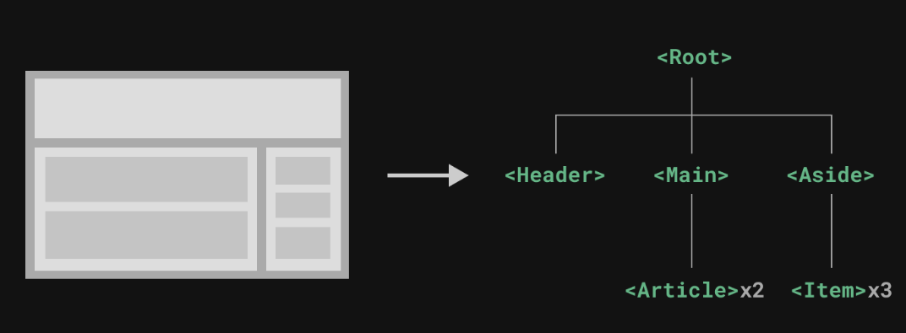

# 八、Vue 组件基础
- 官方文档: [组件基础 | Vue.js](https://cn.vuejs.org/guide/essentials/component-basics.html)

## 8.1 组件树
组件允许我们将 UI 划分为独立的、可重用的部分，并且可以对每个部分进行单独的思考。在实际应用中，组件常常被组织成层层嵌套的树状结构

| ##container## |
|:--:|
||

这和我们嵌套 HTML 元素的方式类似，Vue 实现了自己的组件模型，使我们可以在每个组件内封装自定义内容与逻辑。Vue 同样也能很好地配合原生 Web Component。如果你想知道 Vue 组件与原生 Web Components 之间的关系，可以阅读此章节: [Vue 与 Web Components](https://cn.vuejs.org/guide/extras/web-components.html)。

## 8.2 定义一个组件
当使用构建步骤时，我们一般会将 Vue 组件定义在一个单独的`.vue`文件中，这被叫做单文件组件 (简称 SFC):

于`./compomemts/MyCompomemts.vue`写入 (compomemts就是组件文件夹)

注: `<template>`是组件必须写的内容, 其他都是可选的.

```html
<template>
    <div class="hello">
        <h3>自定义组件</h3>
    </div>
</template>

<script>
export default {
    name: 'MyCompomemts', // 组件名称
    data() {
        return {

        }
    }
}
</script>

<!--
    如果加上scoped, 
    那么css只会在当前组件生效, 
    不会把命名空间引入到[使用这个组件的.vue里面] 
-->
<style scoped>
h3 {
    color: red;
}
</style>
```

## 8.3 使用组件

在任意`.vue`都可以这样:

```html
<template>
  
  <!-- 可以多次使用 -->
  <MyCompomemts msg="这个是自定义组件"/>
  <MyCompomemts msg="这个是自定义组件"/>
  <!-- 支持使用`-`代替驼峰的命名方式 -->
  <my-compomemts msg="这个是自定义组件 可以使用多次~"/>
  <HelloWorld msg="Welcome to Your Vue.js App"/>
  <h3>这个不是红色</h3>
</template>

<script>
import HelloWorld from './components/HelloWorld.vue'
import MyCompomemts from './components/MyCompomemts.vue' // 1. 引入

export default {
  name: 'App',
  components: {
    HelloWorld,
    MyCompomemts // 2. 类似于注册 | 注入
  }
}
</script>
```

## 8.4 传递 props
- 父数据传递到子控件

如果我们正在构建一个博客，我们可能需要一个表示博客文章的组件。我们希望所有的博客文章分享相同的视觉布局，但有不同的内容。要实现这样的效果自然必须向组件中传递数据，例如每篇文章标题和内容，这就会使用到 props。

Props 是一种特别的 attributes，你可以在组件上声明注册。要传递给博客文章组件一个标题，我们必须在组件的 props 列表上声明它。这里要用到`props`选项:

示例:

- 组件:
```html
<template>
    <div class="hello">
        <h3>自定义组件</h3>
        <p>{{ title }}</p>
        <p v-for="i in dataArr" :key="id">
            {{ i.data }}
        </p>
        <p> class: {{ dataClass }}</p>
    </div>
</template>

<script>
export default {
    name: 'HelloWorld',
    data() {
        return {

        }
    },
    props: {
        title: { // 键(字段)名
            type: String, // 类型
            default: ""   // 默认值
        },
        dataArr: {
            type: Array, // 如果类型是数组或者对象, 那么需要使用工厂方法(函数)创建
            default: function () {
                return [];
            }
        },
        dataClass: {
            type: Object, // 匿名函数创建
            default: () => {new {
                name: '',
                game: ''
            };}
        }
    }
}
</script>

<style scoped>
h3 {
    color: red;
}
</style>
```

- 父:

```html
<template>
  
  <!-- 传参 -->
  <MyCompomemts msg="这个是自定义组件"
    :title="title"
    :dataArr="dataArr"
    :dataClass="dataClass"
  />
</template>

<script>
import MyCompomemts from './components/MyCompomemts.vue'

export default {
  name: 'App',
  components: {
    HelloWorld,
    MyCompomemts
  },
  data() {
    return {
      title: '我是标题',
      dataArr: [{
        id: 101,
        data: '内容1'
      }, {
        id: 102,
        data: '内容2'
      },
      ],
      dataClass: {
        name: '对象名字',
        game: '游戏'
      }
    }
  }
}
</script>
```

## 8.5 自定义事件组件交互 (监听事件)
- 子控件传递数据到父组件 的一种实现方法.

- 子控件

```html
<template>
    <div class="hello">
        <button @click="sendClickHandle">点击传递</button>
    </div>
</template>

<script>
export default {
    name: 'HelloWorld',
    data() {
        return {
            msg: '传递'
        }
    },
    methods: {
        sendClickHandle() {
            // 第一个参数是字符串, 可以任意, 但得有意义 (并且需要和下面的父控件的对应)
            // 第二个参数是传递的数据 (可变参数)
            this.$emit("onEvent", this.msg);
        }
    }
}
</script>
```

- 父控件

```html
<template>
  
  <!-- onEvent是上面$emit的第一个参数 -->
  <MyCompomemts @onEvent="getDataHandle"/>
  {{ msg }}
</template>

<script>
import MyCompomemts from './components/MyCompomemts.vue'

export default {
  name: 'App',
  components: {
    MyCompomemts
  },
  data() {
    return {
      msg: '',
    }
  },
  methods: {
    getDataHandle(data) { // 这里参数列表对应上面`$emit`的可变参数列表
      this.msg = data;
    }
  }
}
</script>
```