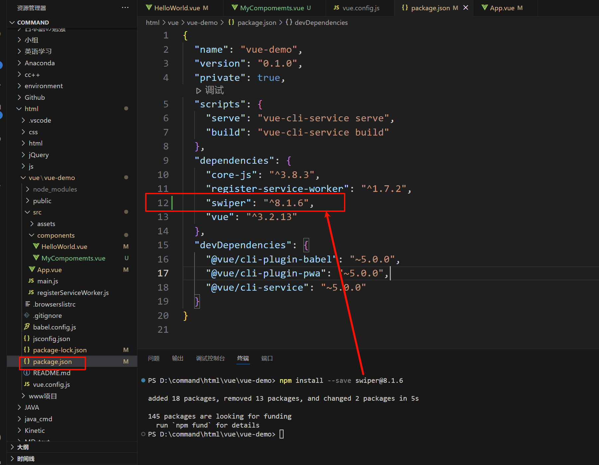

# 十、Vue 引入第三方
## 10.1 如何寻找第三方库

1. Github 搜索

2. 在Vue2官网有这个链接: [Awesome Vue.js](https://github.com/vuejs/awesome-vue), 里面有很多库, 你可以选择有Vue3版本的来康康.

## 10.2 示例: 导入Swiper第三方库

官方文档: [swiper官网](https://swiperjs.com/vue) (这是一个轮换图库)

- [npm install XXX 加上-s、-d、-g和什么都不加的区别](https://blog.csdn.net/LinWang__King/article/details/120518442)

```cmd
npm install --save swiper@8.1.6
:: 包名@版本号
```

| ##container## |
|:--:|
||

## 10.3 使用第三方库

```html
<template>
  <div class="hello">
    <Swiper :modules="modules" :pagination="{clickable: true}">
      <swiper-slide>
        
      </swiper-slide>
      <swiper-slide>
        
      </swiper-slide>
      <swiper-slide>
        
      </swiper-slide>
    </Swiper>
  </div>
</template>

<script>
import {Pagination}from 'swiper'; // 导入指示器
import {Swiper, SwiperSlide} from'swiper/vue'; // 轮换图库

// 对应的样式
import 'swiper/css';
import 'swiper/css/pagination';

export default {
  name: 'HelloWorld',
  components: {
    Swiper,
    SwiperSlide,
    Pagination
  },
  data() {
    return {
      modules: [Pagination] // 不要漏了这里, 不然没有指示器
    }
  }
}
</script>
```