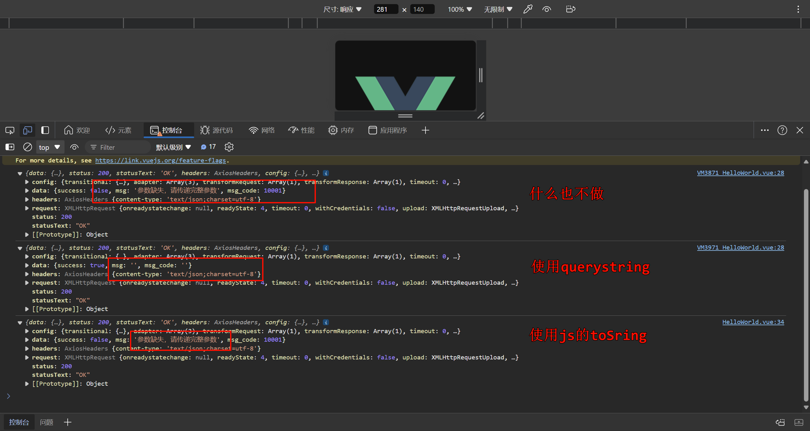

# 十一、Vue 第三方: Axios网络请求
## 11.1 安装第三方

```cmd
npm install --save axios

:: 用于post请求的data转为string
npm install --save querystring
```

## 11.2 引入
普通引入

```js
import axios from 'axios';
```

## 11.3 使用
- 简单使用:

```html
<script>
import axios from 'axios';
import querystring from 'querystring';

export default {
  name: 'HelloWorld',
  mounted() { // 生命周期函数
    axios({
      method: "get",
      url: 'https://cn.vuejs.org/guide/essentials/lifecycle.html'
    }).then(res => {
      console.log(res.data);
    });
    
    axios({
      method: "post",
      url: 'http://iwenwiki.com/api/blueberrypai/login.php',
      data: querystring.stringify({
        user_id:"iwen@qq.com",
        password:"iwen123",
        verification_code:"crfvw"
      })
    }).then(res => {
      console.log(res);
    })
  }
}
</script>
```
- then 相当于执行结果调用的回调函数..

注: 如果使用`post`请求, 需要`querystring`来转化一下参数:

| ##container## |
|:--:|
||

- 简化调用:

```html
<script>
import axios from 'axios';
import querystring from 'querystring';

export default {
  name: 'HelloWorld',
  mounted() {
    axios.get('https://cn.vuejs.org/guide/essentials/lifecycle.html')
      .then(res => {
        console.log(res.data);
      });

    axios.post('http://iwenwiki.com/api/blueberrypai/login.php',
      querystring.stringify({
        user_id: "iwen@qq.com",
        password: "iwen123",
        verification_code: "crfvw"
      })
    ).then(res => {
      console.log(res);
    })
  }
}
</script>
```

## 11.4 全局引入(挂载)

在`main.js`:

```js
import axios from 'axios';

const app = createApp(App);
app.config.globalProperties.$axios = axios
app.mount('#app')
```

使用

```js
this.$axios

// 如:
this.$axios.get('https://cn.vuejs.org/guide/essentials/lifecycle.html')
  .then(res => {
    console.log(res.data);
  }
);
```

## 11.5 封装
写一个`./utils/http.js`:

```js
import axios from "axios";
import querystring from 'querystring';

const instance = axios.create({
    // 网络请求的公共配置
    timeout: 5000, // ms
});

const errorHandle = (status, info) => {
    switch (status) {
        case 400:
            console.log("语义有误");
            break;
        case 401:
            console.log("服务器认证失败");
            break;
        case 403:
            console.log("服务器拒绝访问");
            break;
        case 404:
            console.log("地址错误");
            break;
        case 500:
            console.log("服务器遇到意外");
            break;
        case 502:
            console.log("服务器无响应");
            break;
        default:
            console.log(info);
            break;
    }
};

// === 拦截器: 发送数据之前 ===
instance.interceptors.request.use(
    config => { // config: 包含着网络请求的所有信息
        if (config.methods === "post")
            config.data = querystring.stringify(config.data);
        return config;
    },
    error => {
        return Promise.reject(error);
    }
);

// === 拦截器: 获取数据之前 ===
instance.interceptors.response.use(
    response => response.status === 200 ? Promise.resolve(response) : Promise.reject(response),
    error => {
        const { response } = error;
        errorHandle(error.status, error.info);
    }
)

// 导出
export default instance;
```

以及`./api/path.js`:

```js
const path = {
    baseUrl:"http://iwenwiki.com",
    chengpin:"/api/blueberrypai/getchengpinDetails.php"
};

export default path;
```

然后是调用`./api/index.js`:

```js
import axios from "../utils/http";
import path from "./path";

const api = {
    // 调用详细地址
    getChengPin() {
        return axios.get(path.baseUrl + path.chengpin);
    }
}

export default api;
```

最后就是使用:

```html
<script>
import index from '../api/index';

export default {
  name: 'HelloWorld',
  data() {
    return {
    }
  },
  mounted() {
    index.getChengPin().then(
      res => console.log(res)
    );
  }
}
</script>
```