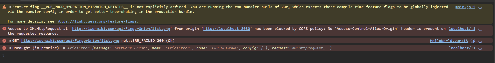
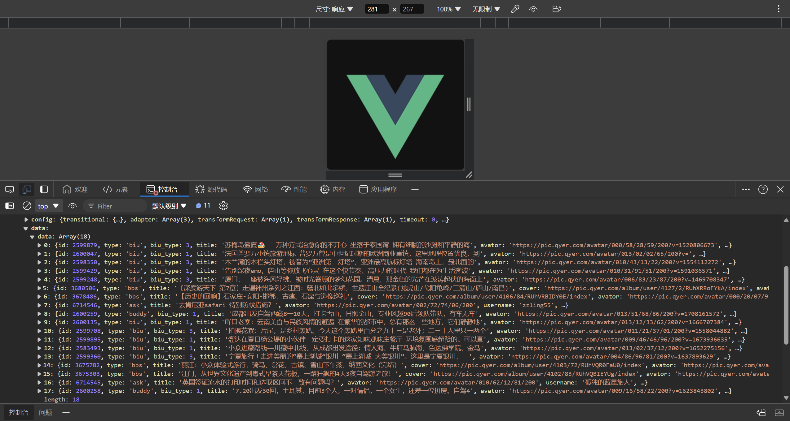

# 十二、Vue 网络请求跨域的解决方案

## 12.1 同源策略の紹介
JS采取的是`同源策略`

`同源策略`是浏览器的一项安全策略，浏览器只允许js代码请求和当前所在服务器域名，端口，协议相同的数据接口上的数据，这就是同源策略，

也就是说，当协议、域名、端口任意一个不相同时，都会产生跨域问题，所以又应该如何解决跨域问题呢?

- 解决方案有两种, 后端和前端都可以解决, 此处介绍前端的解决方案.

## 12.2 跨域错误提示信息

错误示例:
```html
<script>
import axios from 'axios';

export default {
  name: 'HelloWorld',
  mounted() {
    axios.get('http://iwenwiki.com/api/FingerUnion/list.php').then(
      res => console.log(res)
    );
  }
}
</script>
```



## 12.3 解决方案
1. 在`./vue.config.js`加上:

```js
devServer: {
  proxy: {
    '/api': {
      target: 'http://iwenwiki.com',
      changeOrigin: true
    }
  }
}
```

如:
```js
const { defineConfig } = require('@vue/cli-service')
module.exports = defineConfig({
  transpileDependencies: true,
  devServer: {
    proxy: {
      '/api': {
        target: 'http://iwenwiki.com',
        changeOrigin: true
      }
    }
  }
})
```

2. 去掉之前代码的`http://iwenwiki.com`:

```html
<script>
import axios from 'axios';

export default {
  name: 'HelloWorld',
  mounted() {
    axios.get('/api/FingerUnion/list.php').then(
      res => console.log(res)
    );
  }
}
</script>
```

效果:



更多介绍:

```js
const proxy = require('http-proxy-middleware');

module.exports = {   
    devServer:{
        host: 'localhost', //target host
        port: 8080,
        //proxy:{'/api':{}},代理器中设置/api,项目中请求路径为/api的替换为target
        proxy:{
            '/api':{
                target: 'http://192.168.1.30:8085',//代理地址，这里设置的地址会代替axios中设置的baseURL
                changeOrigin: true,// 如果接口跨域，需要进行这个参数配置
                //ws: true, // proxy websockets
                //pathRewrite方法重写url
                pathRewrite: {
                    '^/api': '/' 
                    //pathRewrite: {'^/api': '/'} 重写之后url为 http://192.168.1.16:8085/xxxx
                    //pathRewrite: {'^/api': '/api'} 重写之后url为 http://192.168.1.16:8085/api/xxxx
               }
        }}
    },
    //...
}
```

> `'/api': {}`, 就是告诉`node`, 我接口只要是`’/api’`开头的才用代理，所以你的接口就要这么写`/api/xx/xx`. 最后代理的路径就是`http://xxx.xx.com/api/xx/xx`.
>
> `pathRewrite`的作用是因为正确的接口路径是没有`/api`的，所以需要用`'^/api': '/'`，表示请求接口时去掉`api`