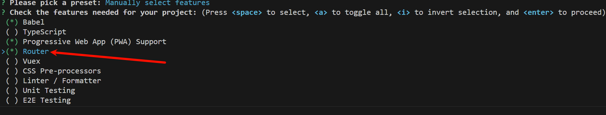
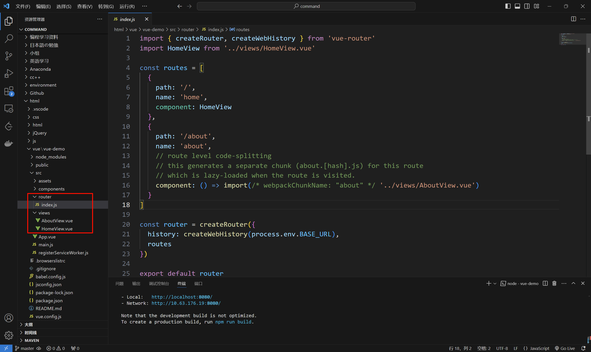
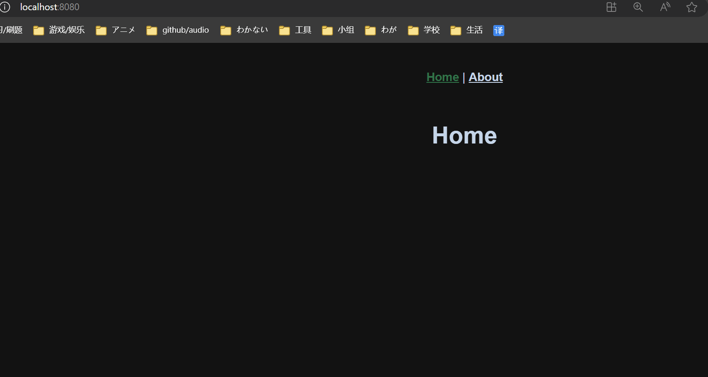

# 十三、Vue 路由配置
## 13.1 认识 VueRouter
在Vue中，我们可以通过`vue-router`路由管理页面之间的关系

VueRouter是Vue.js的官方路由。它与Vue.js核心深度集成，让用Vue.js构建单页应用变得轻而易举

## 13.2 在 Vue 中引入路由 (手动配置)
### 13.2.1 安装路由
```cmd
npm install --save vue-router
```

### 13.2.2 配置独立路由文件
创建一个`./src/router/index.js`
```js
import { createRouter, createMemoryHistory, createWebHashHistory, createWebHistory } from 'vue-router'

import HomeView from '../view/HomeView.vue'
import AboutView from '../view/AboutView.vue'

const routes = [
    {
        path: '/',
        component: HomeView
    },
    {
        path: '/about',
        component: AboutView
    },
]

const router = createRouter({
    /**
     * createMemoryHistory()
     * - 不会有任何影响/显示
     */
    /**
     * createWebHashHistory()
     *  - http://localhost:8080/#/
     *  - http://localhost:8080/#/about
     *  本质是一个a标签的锚点
     */
    /**
     * createWebHistory()
     *  - http://localhost:8080/
     *  - http://localhost:8080/about
     *  这种方式需要后台配合做重定向, 不然会404
     *  本质是html5的pushState()
     */
    history: createWebHashHistory(),
    routes,
})

export default router;
```
参考:
- [不同的历史模式 | vue-router](https://router.vuejs.org/zh/guide/essentials/history-mode.html)

### 13.2.3 引入路由到项目
修改`main.js`:

```js
import router from './router';

// 添加".use(router)", 表示使用vue的路由配置
createApp(App).use(router).mount('#app')
```

### 13.2.4 指定路由显示入口 & 指定路由跳转
html:

```html
<template>
  <!-- 跳转 -->
  <router-link to="/">首页</router-link>|
  <router-link to="/about">关于</router-link>
  <!-- 路由显示入口 -->
  <router-view></router-view>
</template>

<script>
import router from './router';

export default {
  name: 'App',
}
</script>
```

## 13.3 在 Vue 中引入路由 (自动配置)

- 安装这个, 在创建项目的时候



- 会发现它已经帮我们把之前手动做的事情自动化了~



## 13.4 路由传递参数
配置好: `/:参数名`即传参
```js
import { createRouter, createWebHistory } from 'vue-router'
import HomeView from '../views/HomeView.vue'

const routes = [
  {
    path: '/',
    name: 'home',
    component: HomeView
  },
  {
    path: '/about',
    name: 'about',
    component: () => import('../views/AboutView.vue')
  },
  {
    path: '/external-links/:url',
    name: 'external-links',
    component: () => import('../views/ExternalLinksView.vue') // 异步加载: 需要用到这个页面才会加载, 节约内存/宽带
  }
]

const router = createRouter({
  history: createWebHistory(process.env.BASE_URL),
  routes
})

export default router
```

分页面:
```html
<template>
    <h2>您即将离开HX.loli:</h2>
    <p>去往 <a style="color: #990099;" href="{{ $route.params.url }}">{{ $route.params.url }}</a></p>
</template>
```

`App.vue`:
```html
<template>
  <nav>
    <router-link to="/">Home</router-link> |
    <router-link to="/about">About</router-link>|
    <router-link to="/external-links/网络链接不行">个人Github</router-link>
  </nav>
  <router-view/>
</template>
```

## 13.5 嵌套路由配置
我们在很多时候, 会出现除了有大导航栏, 还有每一个导航栏对应的小导航栏, 那么如何实现呢?

配置: `index.js`
```js
const routes = [
  {
    path: '/',
    name: 'home',
    component: HomeView
  },
  {
    path: '/about',
    name: 'about',
    component: () => import('../views/AboutView.vue'),
    children: [ // 嵌套
      {
        path: 'us',
        component: () => import('../views/AboutUs.vue'),
        children: [] // 还可以嵌套
      },
      {
        path: 'info',
        component: () => import('../views/AboutInfo.vue'),
      },
    ]
  }
]
```

在`AboutView.vue`:
```html
<template>
  <div class="about">
    <h1>This is an about page</h1>
    <nav>
      <router-link to="/about/us">关于我的</router-link> |
      <router-link to="/about/info">关于Info</router-link>
    </nav>
    <router-view />
  </div>
</template>
```

效果:


