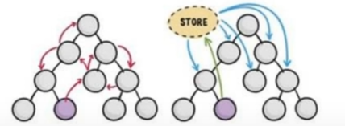

# 十四、Vue 状态管理 (Vuex)
## 14.1 什么是状态管理 & Vuex
Vuex是一个专为Vue.js应用程序开发的 **状态管理模式+库**。它采用集中式存储管理应用的所有组件的状态，并以相应的规则保证状态以一种可预测的方式发生变化.

简单来说，状态管理可以理解成为了更方便的管理组件之间的数据交互，提供了一个集中式的管理方案(类似于[中介者模式](../../../../../001-计佬常識/002-设计模式/009-行为型模式/005-中介者模式/index.md))，任何组件都可以按照指定的方式进行读取和改变数据.

| ##container## |
|:--:|
||

## 14.2 手动配置和简单使用 Vuex
### 14.2.1 安装 Vuex
```cmd
npm install --save vuex
```

### 14.2.2 配置 Vuex 文件
创建: `./src/store/index.js`
```js
import { createStore } from "vuex";

export default createStore({
    // 所有的状态都放这里
    state: {
        cnt: 0
    }
})
```

### 14.2.3 在主文件中引入 Vuex
`main.js`:
```js
import store from './store'

createApp(App).use(store).mount('#app')
```

### 14.2.4 使用(朴素)

`App.vue`:
```html
<template>
  <HelloWorld msg="Welcome to Your Vue.js App"/>
  <p>cnt = {{ $store.state.cnt }}</p>
</template>
```

### 14.2.5 使用(快捷读取)
`HelloWorld.vue`:
```html
<template>
  <div class="hello">
    <p>cnt = {{ cnt }}</p>
  </div>
</template>

<script>
// vuex 提供 state 快捷读取方式
import { mapState } from 'vuex';

export default {
  name: 'HelloWorld',
  computed: {
    ...mapState(["cnt"])
  }
}
</script>
```

## 14.3 自动配置和上手使用 Vuex
### 14.3.1 在创建项目的时候勾选
- (*) vuex

### 14.3.2 认识 Vuex 的 getters
类似于面向对象的`getXxx`方法

### 14.3.3 认识 Vuex 的 mutations
类似于面向对象的`setXxx`方法

### 14.3.4 认识 Vuex 的 actions
可以理解成: 支持异步的`mutations`(即网络请求放在这里)

### 14.3.5 示例

`store/index.js`:
```js
import { createStore } from 'vuex'
import axios from "axios";

export default createStore({
    state: {
        cnt: 0
    },
    getters: {
        getCnt(state) {
            return state.cnt >= 0 ? state.cnt : "cnt值不合法";
        }
    },
    mutations: {
        addCnt(state, num) {
            state.cnt += num;
        }
    },
    actions: { // 可以理解成: 支持异步的 mutations (即网络请求放在这里)
        actionsCnt({ commit }) {
            axios.get("http://iwenwiki.com/api/generator/list.php")
                .then(res => {
                    commit("addCnt", res[0])
                }
            );
        }
    },
    modules: {
    }
})
```

使用(交互):

```html
<template>
  <div class="home">
    
    <HelloWorld msg="Welcome to Your Vue.js App"/>
    <p> 安全的cnt = {{ $store.getters.getCnt }}</p>
    <button @click="addCntVal">++cnt</button>|
    <button @click="addCntValByMethods">安全自增</button>|
    <button @click="addCntValByActions">通过网络请求自增</button>
  </div>
</template>

<script>
// @ is an alias to /src
import HelloWorld from '@/components/HelloWorld.vue'

export default {
  name: 'HomeView',
  components: {
    HelloWorld
  },
  methods: {
    addCntVal() {
      // 不推荐
      ++this.$store.state.cnt;
    },
    addCntValByMethods() {
      this.$store.commit("addCnt", 2);
    },
    addCntValByActions() {
      this.$store.dispatch("actionsCnt");
    }
  }
}
</script>
```

#### 14.3.5.1 简写

```html
<template>
  <div class="home">
    
    <HelloWorld msg="Welcome to Your Vue.js App"/>
    <p> 安全的cnt = {{ $store.getters.getCnt }} = {{ getCnt }}</p>
    <button @click="addCntVal">++cnt</button>|
    <button @click="addCntValByMethods">安全自增</button>|
    <button @click="addCntValByActions">通过网络请求自增</button>
  </div>
</template>

<script>
// @ is an alias to /src
import HelloWorld from '@/components/HelloWorld.vue'
import { mapActions, mapMutations, mapGetters } from "vuex"; // 快捷读取

export default {
  name: 'HomeView',
  components: {
    HelloWorld
  },
  computed: {
    ...mapGetters(["getCnt"]),
  },
  methods: {
    ...mapMutations(["addCnt"]),
    ...mapActions(["actionsCnt"]),
    addCntVal() {
      // 不推荐
      ++this.$store.state.cnt;
    },
    addCntValByMethods() {
      // this.$store.commit("addCnt", 2);
      this.addCnt(3);
    },
    addCntValByActions() {
      // this.$store.dispatch("actionsCnt");
      this.actionsCnt();
    }
  }
}
</script>
```
