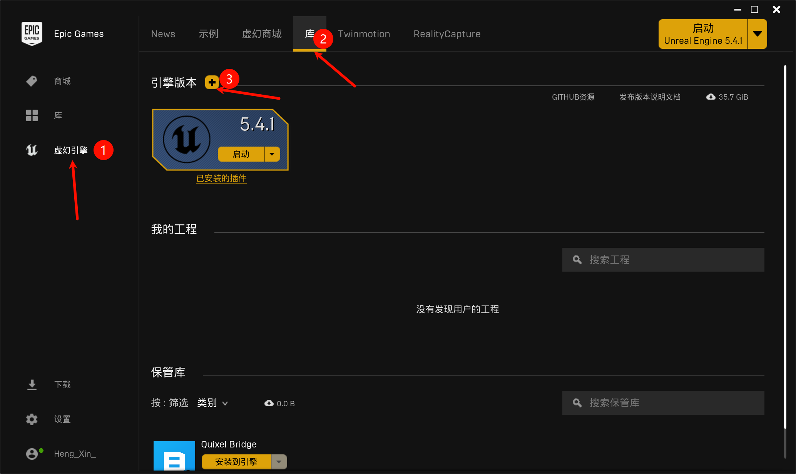

# ゼロ: 前言

为了配合视频 P1, P2

## 0.1 安装虚幻引擎

1. 安装 EPIC ~~(对, 就是天天送游戏的那个)~~

2. 如下操作 (安装最新的就行(应该))

注: 在此之前, 最好先到 `设置`>`编辑保存库缓存位置` 设置一下, 不然C盘告危ってかもん

| ##container## |
|:--:|
||

3. 大功告成, 您已经击败 ? % 的对手.

## 0.2 文件命名规范

- 详细请见: [ue5-style-guide](https://github.com/Allar/ue5-style-guide) / 中文: [zh-cn ue5-style-guide](https://github.com/thejinchao/ue5-style-guide)

以下是节选:

> ### 0.2.0 需要强制执行的全局规范
>
> @TODO: Make this section 1 and update this document accordingly. Or maybe we don't?
>
> #### 00.1 禁止使用的字符
>
> 标识符
> 对于标识符类型的命名，除非必要，绝对不要使用以下字符:
>
> - 空格或者其他类似的空白字符
> - 反斜杠 \
> - 各种符号，例如 #!@$%
> - 任何Unicode字符集
> 
> 标识符应该只包含以下字符（用正则表达式表示就是`[A-Za-z0-9_]+`)
>
> - ABCDEFGHIJKLMNOPQRSTUVWXYZ
> - abcdefghijklmnopqrstuvwxyz
> - 1234567890
> - _ (下划线)
>
> 这样做的原因是，尽可能确保跨平台和工具链的兼容性。并有也有助于防止那些不是你控制的程序处理你的工程资产时，因为这些程序中的字符处理错误而导致的意外故障。

## 0.3 版本管理

- 详细说明: [【腾讯文档】虚幻教程序章附件-项目文件结构](https://docs.qq.com/sheet/DT3ZxZ0lpYU13UmRp)

你应该学习一下[Git常用命令](../../../../../004-DevOps与版本控制/003-Git分布式版本管理/002-Git常用命令/index.md)或者小乌龟来操作版本管理.

不然有些东西你可能就改不回来了

如果有条件, 可以连虚幻引擎也备份, 因为有些修改是全局的!