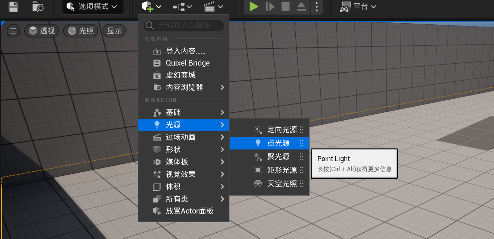

# 1.2 初步体验虚幻引擎: 熟悉常用操作
## 1.2.1 直接启动虚幻引擎
> [!TIP]
> 可能会遇到需要安装.NET组件, 你安装就OK
>
> 然后就是提示要允许网络什么的, 你全部允许就OK

## 1.2.2 虚幻项目浏览器 界面

- 选择: `游戏>第三人称游戏`, 设置`项目位置`和`项目名称`, 注意全部使用英文或者数字, (阿斯克码字符!!!, 不然必然偶然突然出现BUG!!!)

- 其他的就默认就OK, 因为你也还是可以进入到里面才设置的!

> (注: 上图的`项目名称`没有使用全英文!!!, 你要记得改!!!)

## 1.2.3 进入到游戏界面

(注: 可能会有两个窗口, 一个是实时预览, 一个是`内容浏览器`; 你可以像我这样, 把`内容浏览器`的窗口拖到 **下面**, 然后就会合成为一个窗口了(或者CTRL + 空格), 固定到左下)

## 1.2.4 视野移动
1. `按住鼠标右键 + WASD`, 可以四处移动 (类似于MineCraft的旁观者模式), (当然单纯按住鼠标右键是可以移动视角的(摄像机方向)) (移动方向相对于摄像机)

2. `按住鼠标右键 + E`(上升), `按住鼠标右键 + Q`(下降) (均是相对于世界坐标)

3. `按住鼠标右键 + 鼠标左键`, 也是移动, 但是更加细致, 类似于固定摄像机视角, 然后平移

4. `按住鼠标右键 + C`(放大), `按住鼠标右键 + Z`(缩小(拉伸(就像高斯冲刺一样的视角))) (均是点一次放缩一个单位, 可以长按, 放开右键视角变回正常)

## 1.2.5 自然光设置 (太阳方位)

长按`CTRL + L`, 然后移动鼠标即可, (注: 你可以使用`右CTRL`键, 而不是骂骂咧咧的说单手怎么按)

## 1.2.6 反悔与反反悔 ~~(程序员最会的操作)~~

- CTRL + Z 是撤销 (回到上一步)

- CTRL + Y 是~~撤销撤销~~(回到下一步)

## 1.2.7 放置物体 与 物体的简单操作
### 1.2.7.1 放置物体

### 1.2.7.2 移动物体 <轴>

### 1.2.7.3 旋转 / 缩放 / 单位增量

大同小异

## 1.2.8 摄像机速度

- `鼠标右键 + 滚轮`也可以调节

## 1.2.9 tp 物体 (快速定义)

我们可以通过`大纲`, 快速移动到物体前 (双击 或者 选择 + f)

(如果你飞到无尽的虚空, 就需要用这个回来~)

## 1.2.10 选项模式

上面的工具栏是很常见的, 我们初学, 先不用理这么细的.

下面这个`选项模式`, 是我们最常用的模式, 其他的你也可以看看, 玩玩.

## 1.2.11 添加光源 | 在大纲中的布局 | 细节

> [!TIP]
> 当然你可以添加其他的

在大纲中, 你可以对你的对象分类, 比如某些场景的灯, 可以统一开关(是否可见)等等...

可以在细节中对对象的各种属性进行微调

## 1.2.12 保存 | 全部保存

- CTRL + S -> 保存当前编辑

- CTRL + SHIFT + S -> 全部保存

## 1.2.13 蓝图 | 关卡蓝图

我们打开关卡蓝图, 先玩一玩. (实际开发的时候很少使用这个, 的说)

> [!TIP]
> 这里如果蓝图节点是英文的话，在上面“编辑”-“编辑器偏好设置”-“区域和语言”里把“使用本地化图表编辑器节点”打勾.[弹幕大佬的提醒]

然后这样: 创建开始结点后, 在三角形处拉一条线, 搜索打印, 然后这样...

这样进入游戏就会打印内容:

## 1.2.14 运行此关卡
### 1.2.14.1 关卡预览窗口设置

建议使用上图选项, 因为第一个的话, 结束退出, 你原本的位置也会变成你在预览关卡时候移动到的位置.

- 按`ESC`可以退出

> [!TIP]
> 如果是实际大测试, 请使用「独立进程游戏」. (退出需要直接关闭窗口)

### 1.2.14.2 多人联机本地测试

如此设置:

然后就OK了:

(注: 可以使用TAB+ALT切换窗口(鼠标), 或者SHIFT+F1或者`~`键(命令窗口, 但是小心命令窗口下按ESC会退出游戏, 除非是`独立进程模式`))

### 1.2.14.3 逐帧细看

### 1.2.14.4 运行关卡时, 场景编辑
你可以在`选中窗口视图`模式下启动游戏, 然后按`F8`进入编辑模式, 但是不会保存, 当然你可以设置它. (没啥用好像qwq?)

## 1.2.15 文件夹视图多开

如下操作:

## 1.2.16 全局搜索资产

- CTRL + P 召唤这个窗口, 你可以使用搜索来搜索, 等价于所有`内容浏览器`的文件去掉文件夹平铺到这里. 可以双击预览等等... ~~(考验硬盘的时候到啦)~~

## 1.2.17 打开多个视口

比如这样:

然后是这样的视角: (三视图)

当然这样可能还是很难看, 比如我们希望在左上角看向这个物体, 然后右上也看向这个物体, 可以这样: 

- `窗口 > 视口`, 这样开多个:

可以互相跨窗口实时显示的操作

## 1.2.18 显示设置

## 1.2.19 光照设置

## 1.2.20 杂项设置

 

