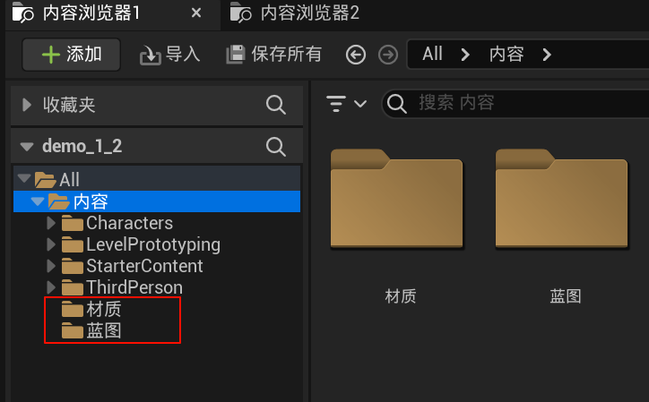
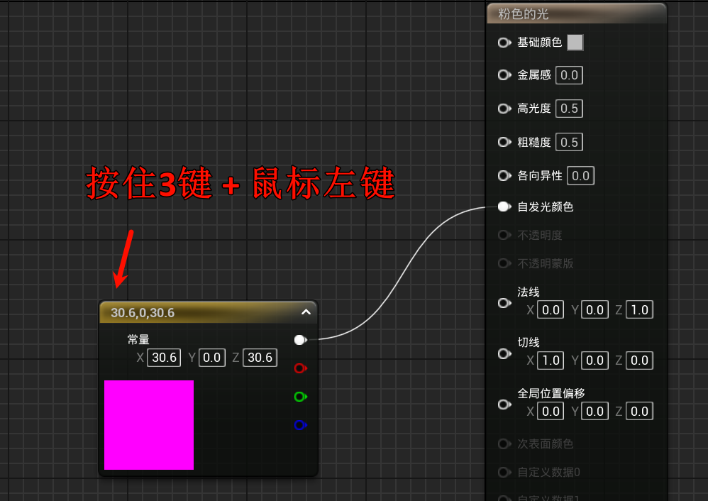
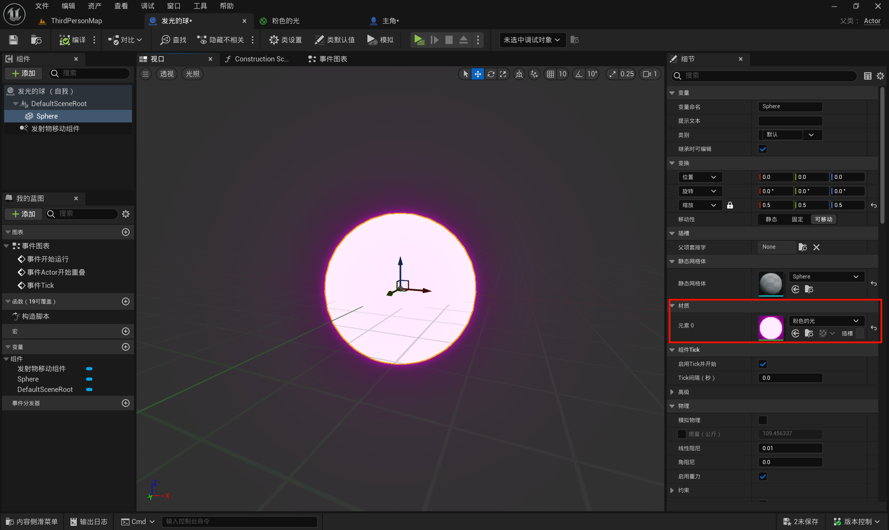
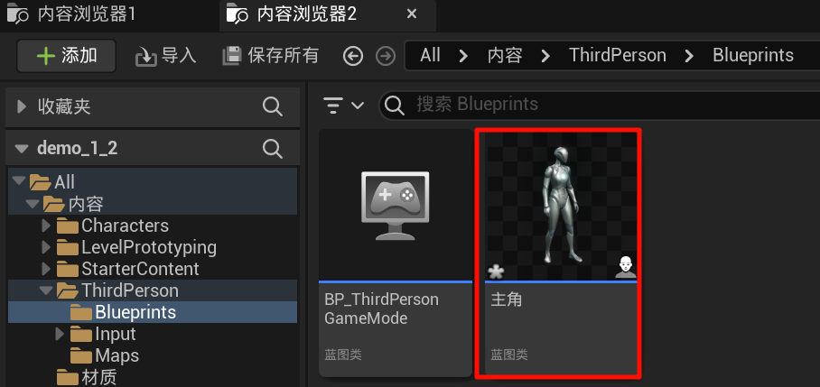
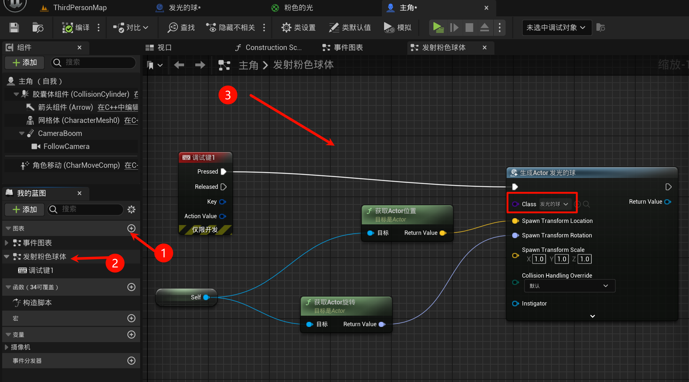
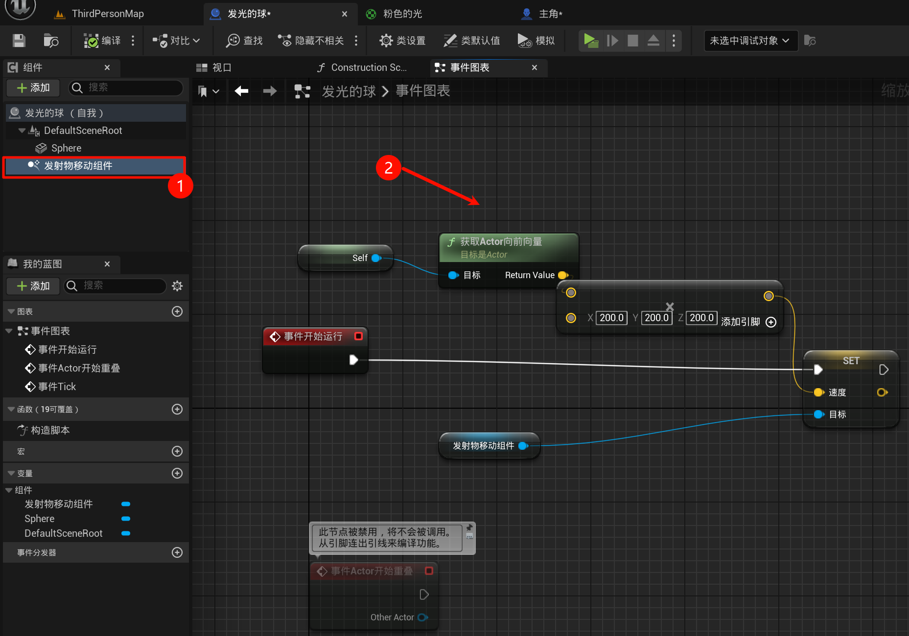

# 1.4 蓝图基础，组件机制，创建一个发光的发射物
## 1.4.0 前言
本节主要是实操, 因此只是简单记录过程, 具体请看视频.

## 1.4.1 新建文件夹

然后在材质文件夹, 右键, 新建[材质]; 同理在蓝图文件夹新建[蓝图类], 并且选择`Actor`作为父类.

## 1.4.2 发光の材质

双击材质进入这个界面: 并且使用快捷键召唤出这个:

设置好颜色, 然后不用忘记连线.

> [!TIP]
> 颜色就是xyz这个向量, 也就是RGB, 大于 1 代表的是发光.

## 1.4.3 发光の球

在蓝图, 创建这个球, 调整一下尺寸, 然后使用这个材质.

## 1.4.4 按键发射球

找到这个大自然的馈赠的人: (此处重命名了)

然后这样:

## 1.4.5 球の蓝图

然后一波操作...(结束了, 你看视频去吧)