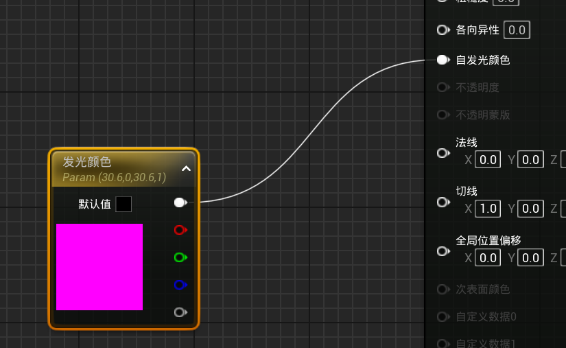
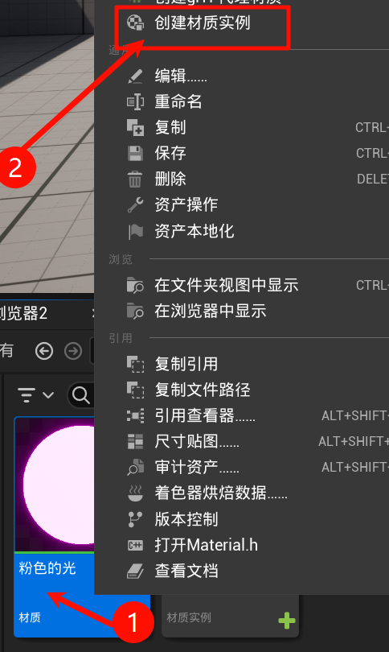
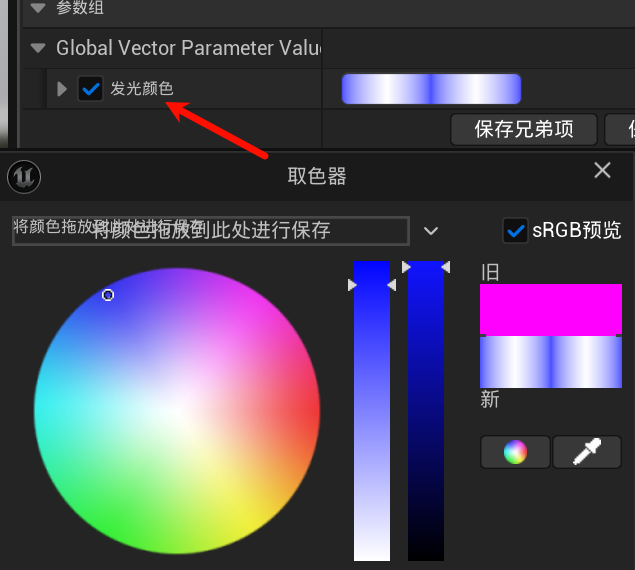
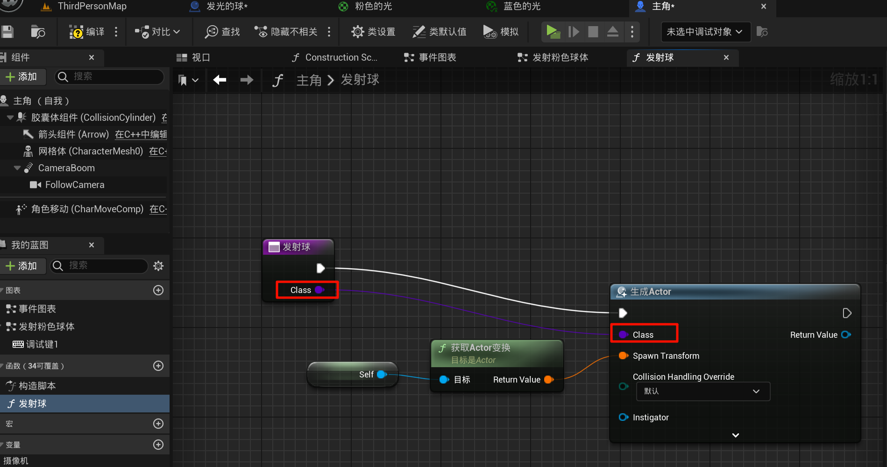
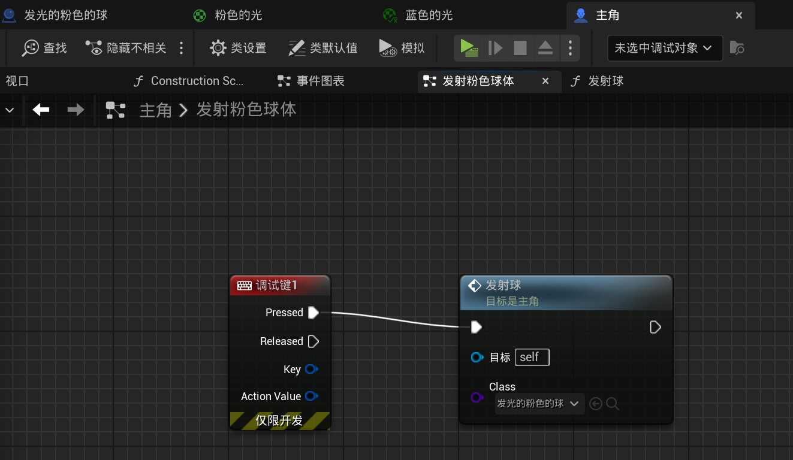

# 1.5 函数与参数，复制与继承，发射不同颜色的球
## 1.5.1 提升为参数

这个:

一定要点击保存!

## 1.5.2 创建材质实例

右键【粉色的光】文件, 然后:

然后在参数处就可以修改之前提升的参数了:

## 1.5.3 折叠为函数

在之前发射球体处, 折叠部分逻辑为函数, 选择`class`为参数:

然后外部就可以传入函数的参数了:

## 1.5.4 复制与继承

同理我们可以复制一份[粉色球]的蓝图, 然后把颜色改为蓝色; 也可以`创建子类蓝图`(继承), 然后把颜色改为绿色.

继承就是会依旧保留父类的函数等等, 并且如果之后父类修改, 子类也同步生效.

但是复制就是互相不认了.