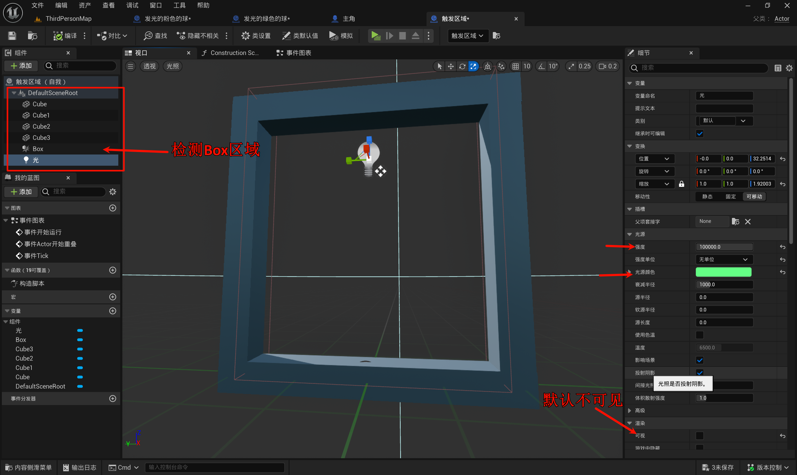
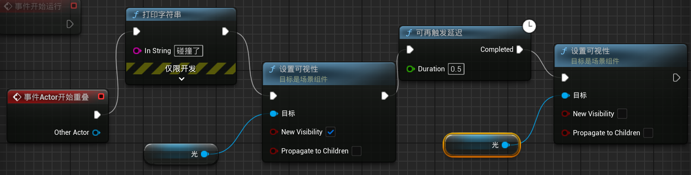
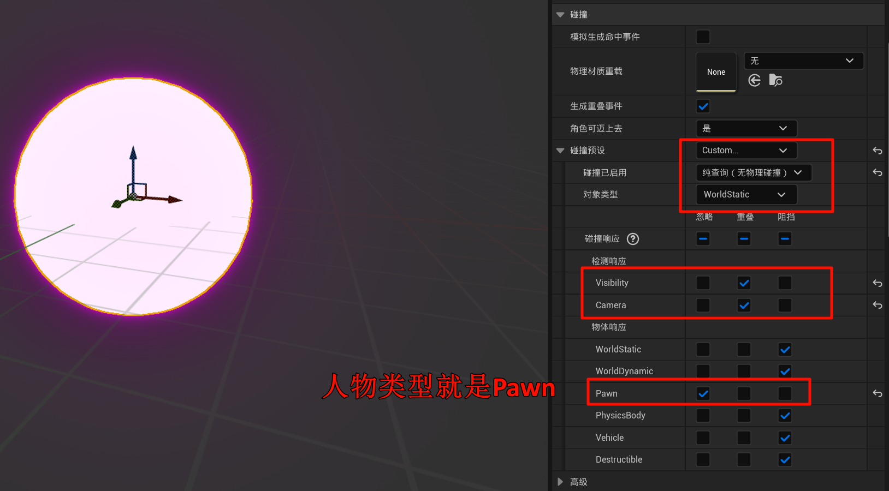

# 1-6.触发区域，当球进入区域时，发出1秒绿光

## 1.6.1 创建一个蓝图: 创建一个触发区域

## 1.6.2 编写蓝图逻辑

先设置可见, 然后延迟, 再设置不可见.

> [!TIP]
> 使用[可再触发延迟], 表示每次计时, 如果倒数还没有结束又有倒数, 就需要重置计时.
>
> 而使用普通的[延迟], 则不行, 会出现一闪一闪的

> 我观察到, 每一个物体进入`触发区域`时候, 只会触发一次, 不会一直触发.

## 1.6.3 设置小球

(如果不设置, 那么就不会计算小球的碰撞)

