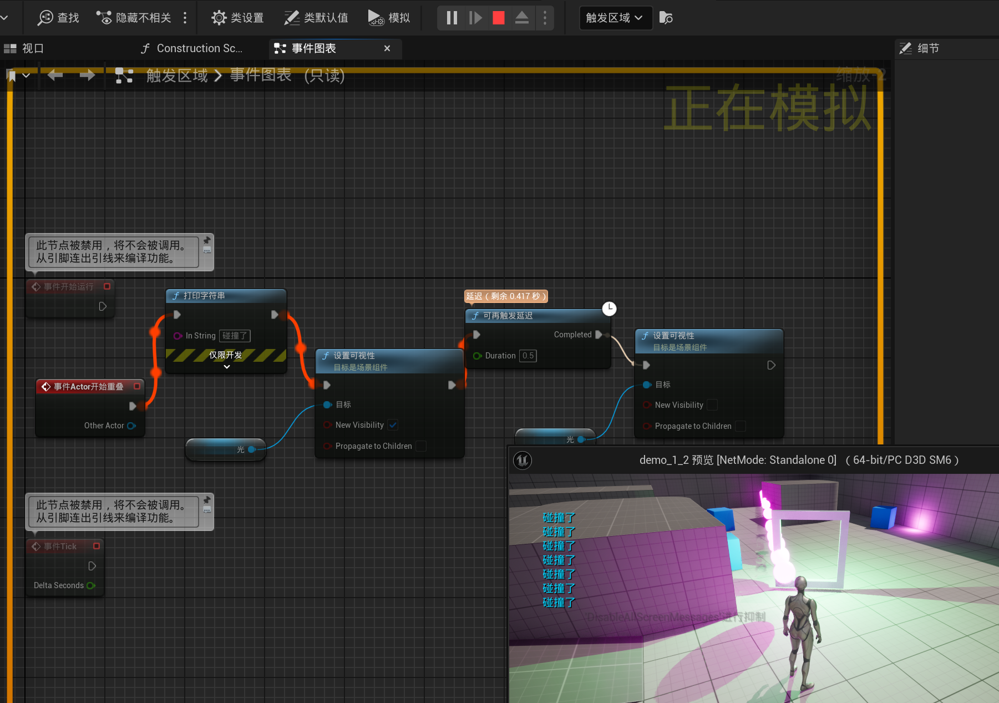
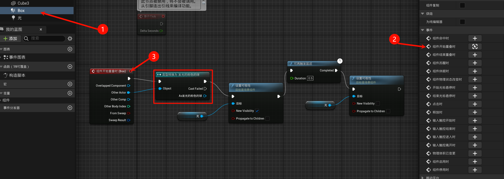
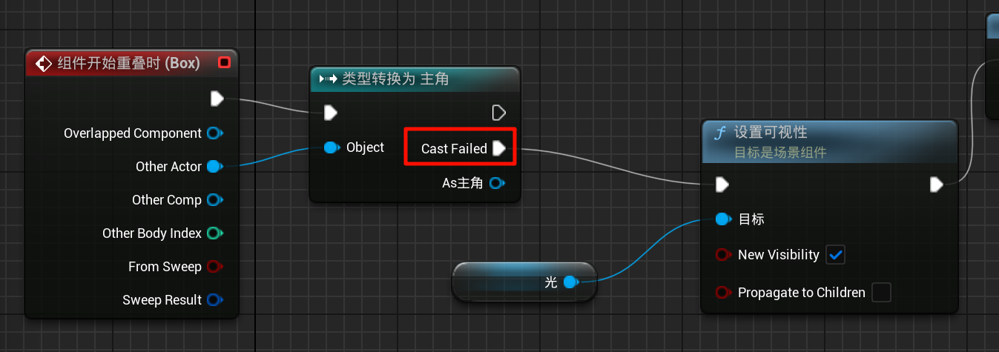

# 1.7 蓝图调试，两种延迟，用类型转换判断角色

## 1.7.1 蓝图调试

在`开始`按钮的右边, 可以选择`调试区域`, 没有选择的话是显示: `未选中调试对象`

这样你的操作响应, 就会在蓝图那里体现, 变量等也可以检测到.

## 1.7.2 两种延迟

你调试看一下区别就OK

## 1.7.3 用类型转换判断角色

我们发现, 如果人物走近框框, 也会发光, 我们需要把玩家排除在外怎么办?

可以这样: 使用类型转换

注意, 这样就不能让蓝球通过然后发光了, 但是绿球可以, 因为粉球是绿球的父类.

那我们还可以`if (!val)`这样判断:

即失败则执行.

> [!TP]
> 注: 以上两种类型转化可能开销比较高.