# 1.8 简单UI，自定义事件，变量计算，得分显示
## 1.8.1 创建简单的UI
新建`UI`文件夹, 创建一个`用户界面 > 控件蓝图 > 用户控件(默认)`

然后这样:

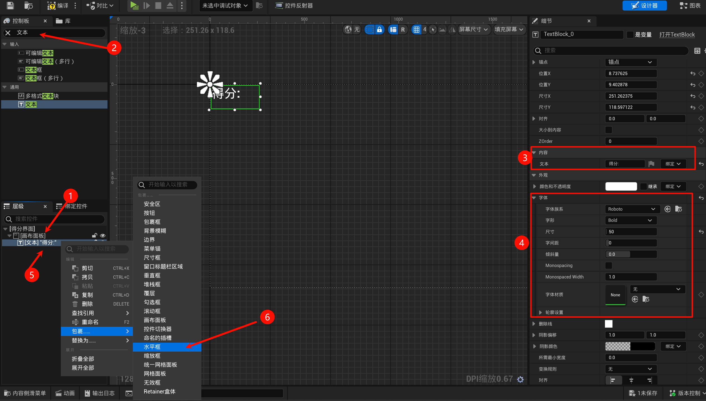

然后布局为这样:

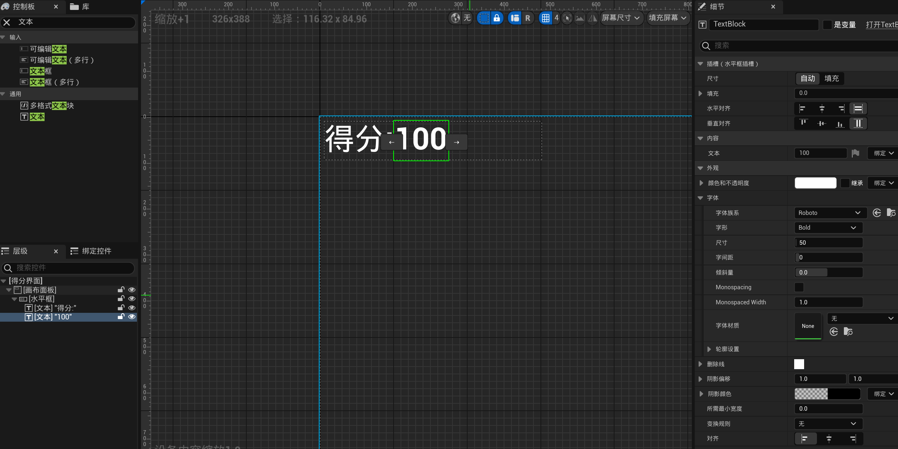

## 1.8.2 自定义事件: 显示UI

找个位置放自定义事件:

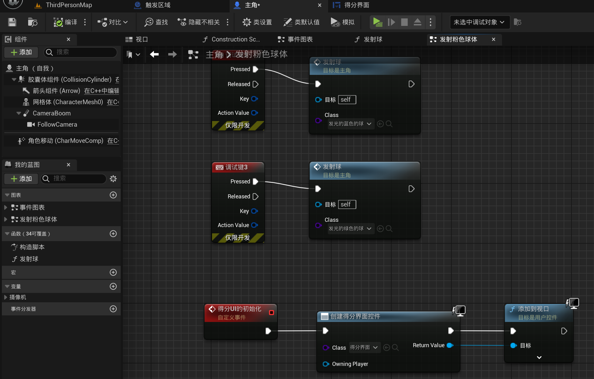

然后这样是调用初始化:

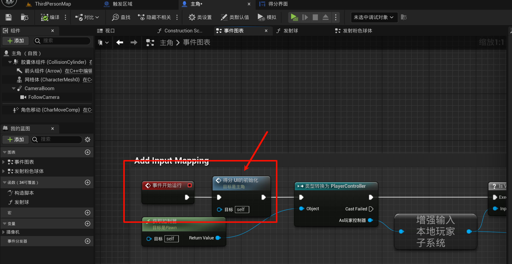

这时候应该就有得分的UI了.

## 1.8.3 UI界面关联玩家主角对象实例

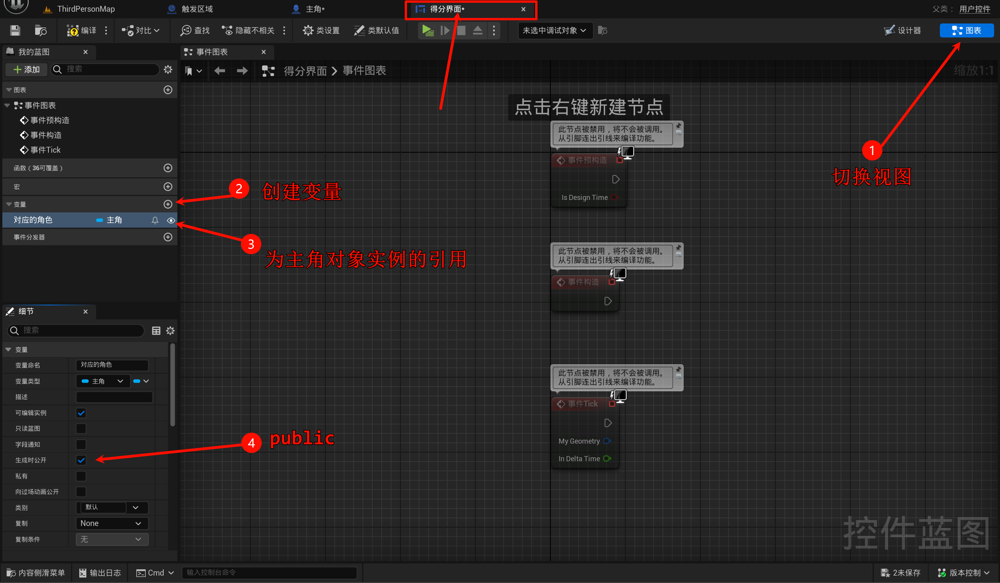

记得点一下编译!, 然后就可以在创建控件这个地方看到多出来这样一个东西:

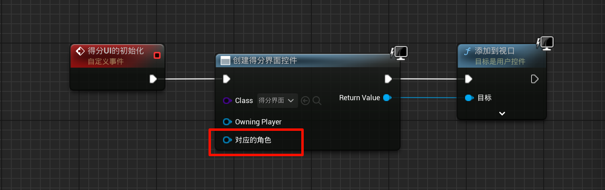

然后绑定一下:

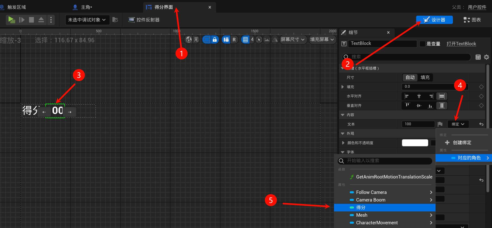

然后把之前的线传参一个`seft`进去即可:

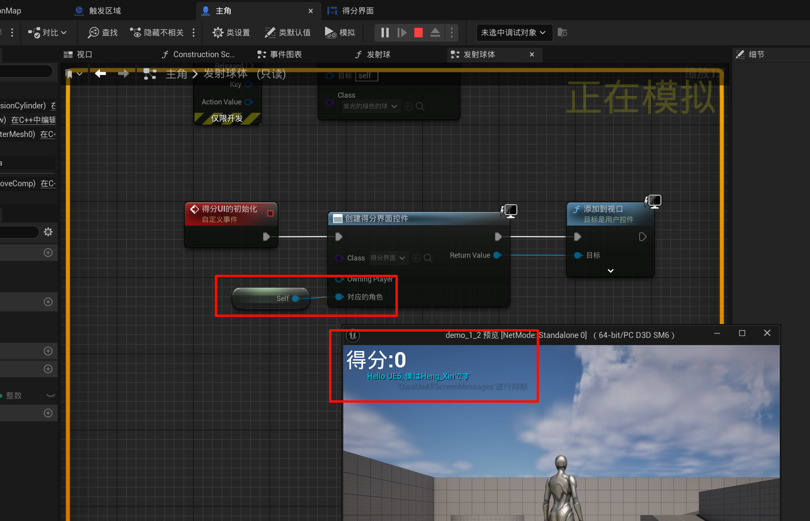

这样就可以使用`角色`对象的成员变量`得分`来初始化`得分UI`的分数了.

## 1.8.4 设定不同球的分数
我们在父类这里添加一个成员变量, 这样子类可以继承它, (注意, 这里我已经把之前那个复制出来的球删除, 然后新建一个一模一样但是是继承的球): (请依照个人喜好规定一个分值, 子类也请设置.)

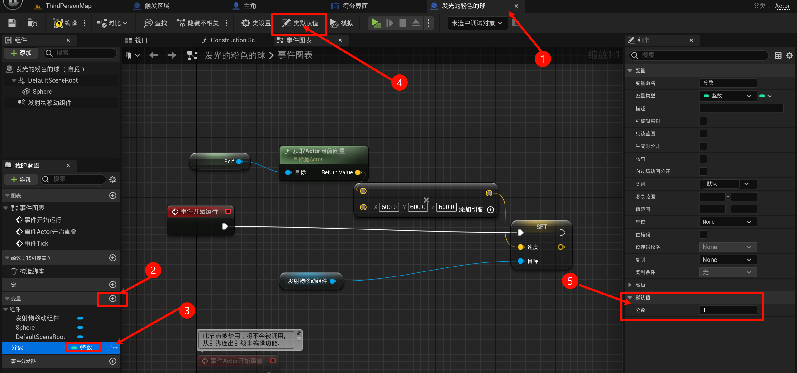

然后就是在`触发区域`处补上计算分数的逻辑即可:

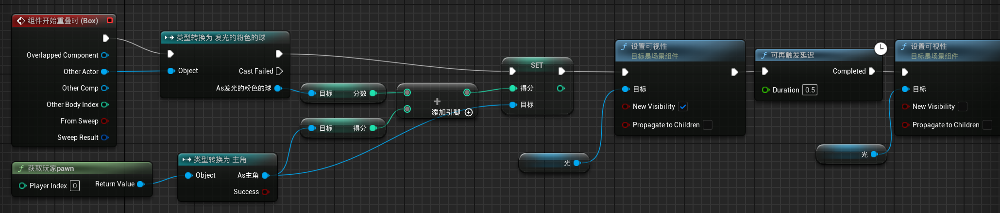

说人话就是: 获取碰撞的小球的分数, `玩家的得分 += 小球的分数`.

> [!TIP]
> 你可以在第三人称项目使用: **获取玩家pawn** 然后转换类型(此处使用的是`纯类型转换`(右键它可以调(区别就是少了可以连白色的线)))

然后就大功告成了:

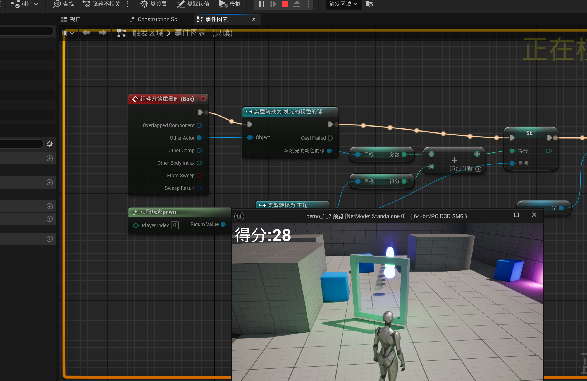
