# 1.10 地图触发器，摄像机控制，后期盒子，关卡蓝图
## 1.10.0 蓝图の复用性

蓝图相当于类, 拖拽出来的就是对象实例, 你就可以改它的颜色. (同Docker里面镜像与容器的关系一样)

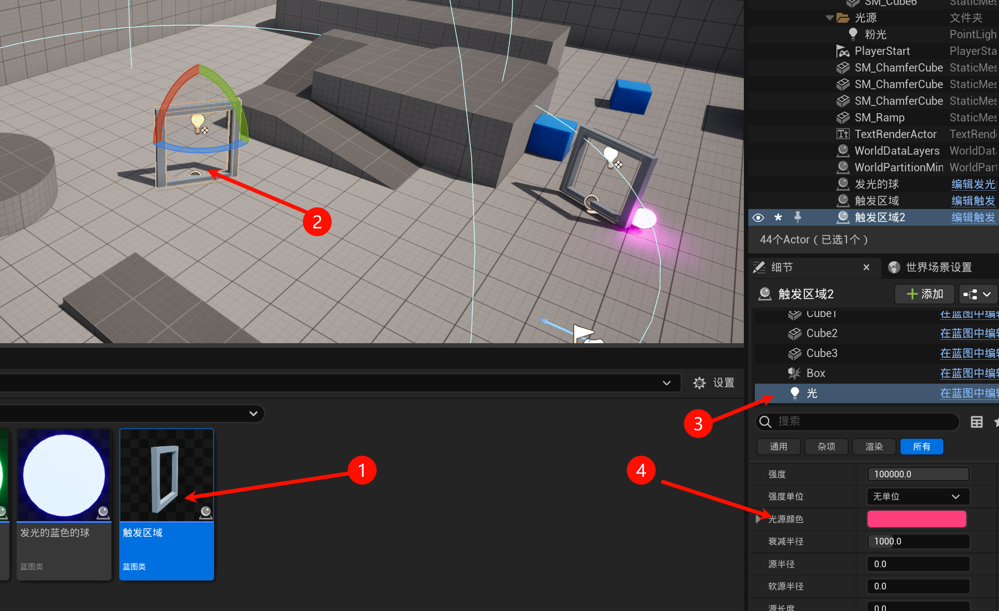

## 1.10.1 地图触发器
### 1.10.1.1 创建触发器
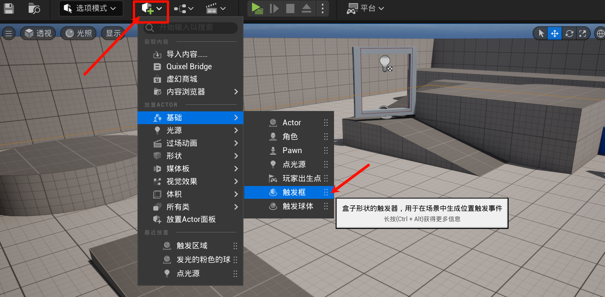

### 1.10.1.2 编写触发事件
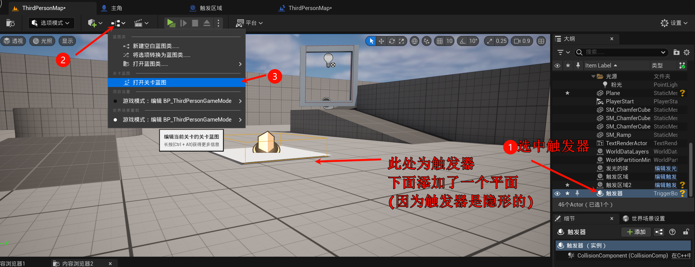

选中后在关卡蓝图空白处右键可以看到:

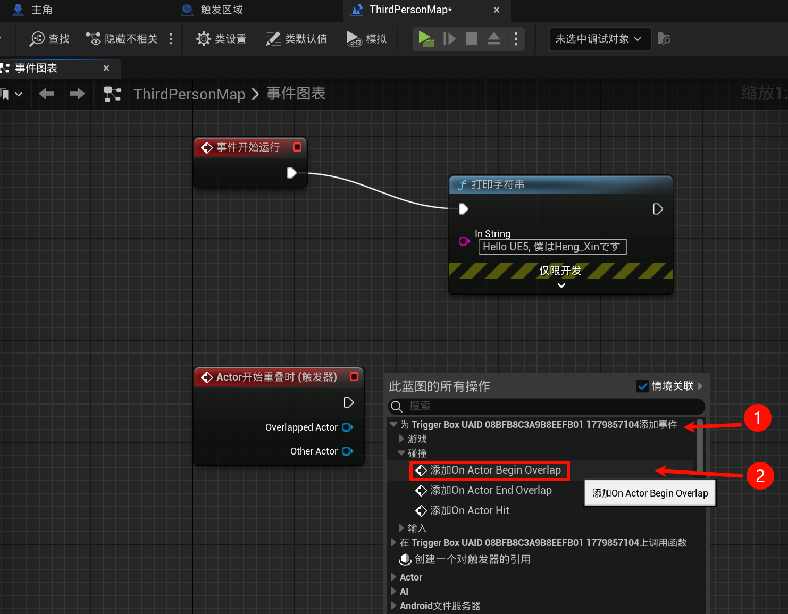

然后就可以写逻辑了:

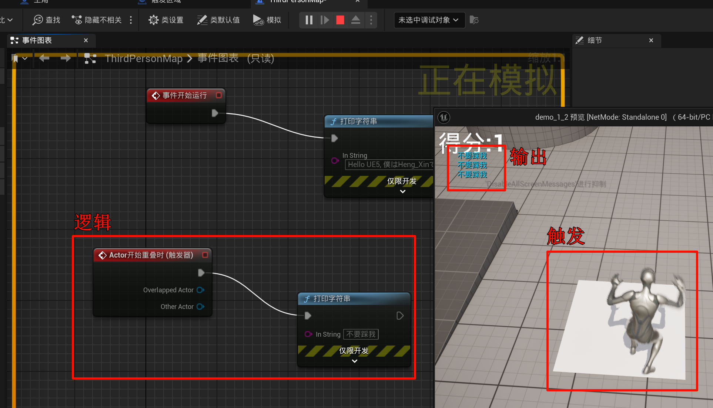

## 1.10.2 摄像机控制
### 1.10.2.1 切换摄像机
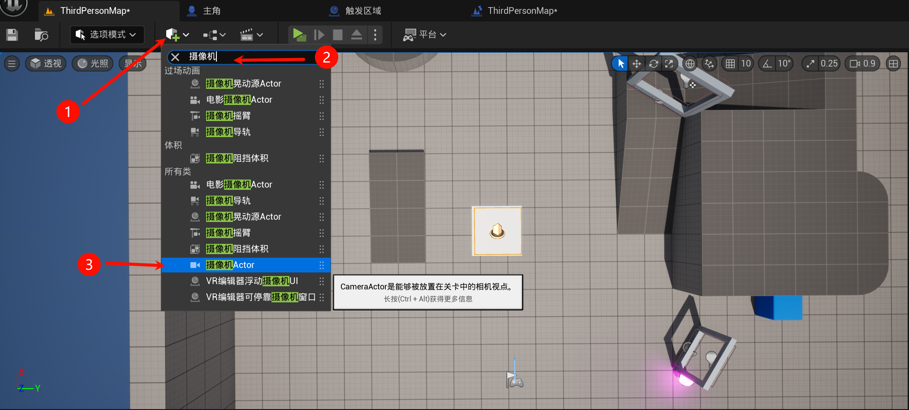

同上面步骤, 选中, 然后关卡蓝图:

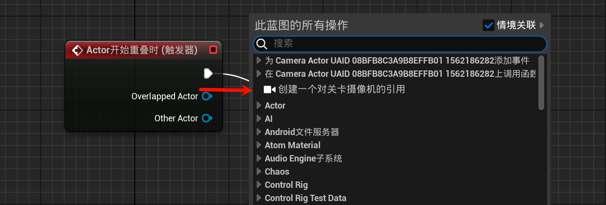

放好摄像机:

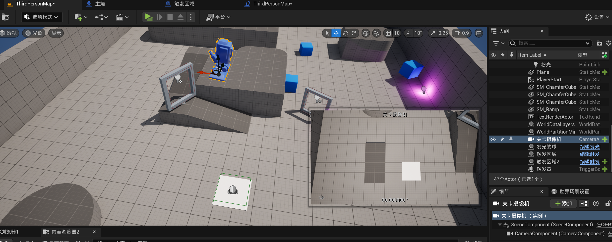

写点逻辑:

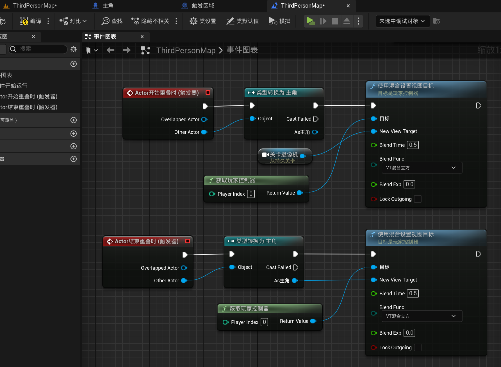

效果:

### 1.10.2.2 摄像机的视野

不妨重命名主角的摄像机, 然后设置其视野. (默认是`90.0`), > 90 是广角(类似于高斯冲刺的镜头拉伸), < 90反之.

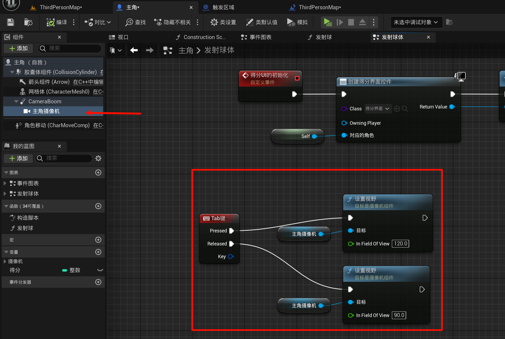

## 1.10.3 后期盒子

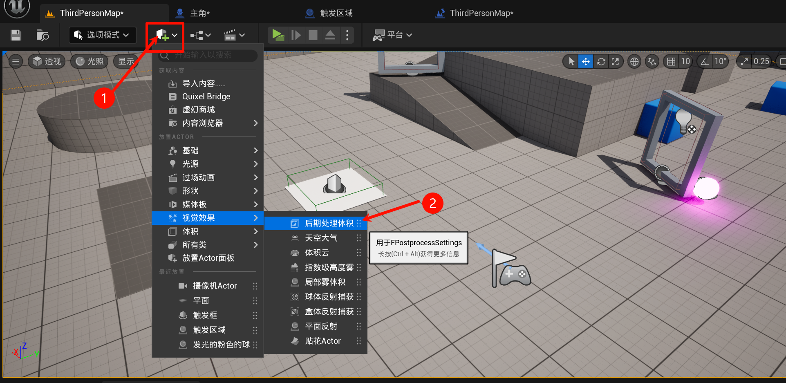

作用: (注意: 需要是摄像机进入哦~)

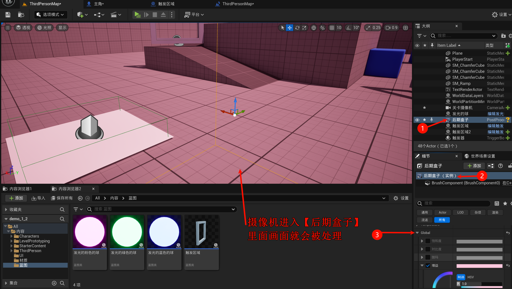

可以全局生效.

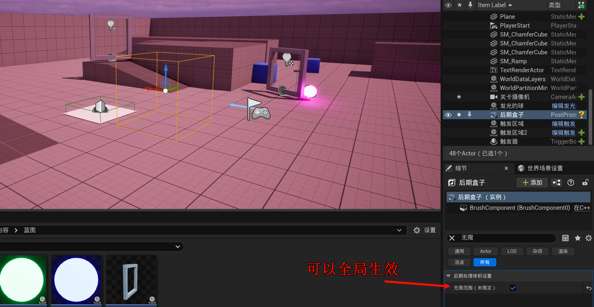
