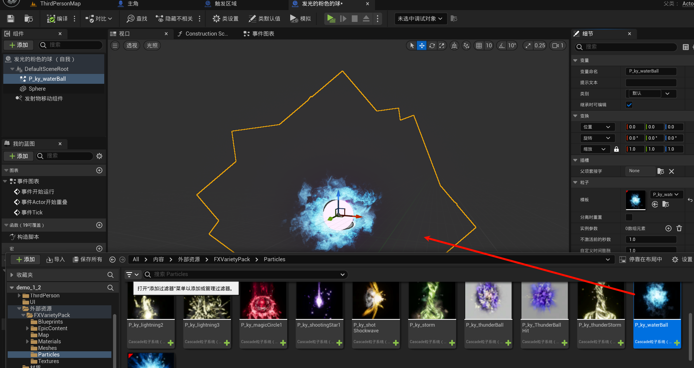
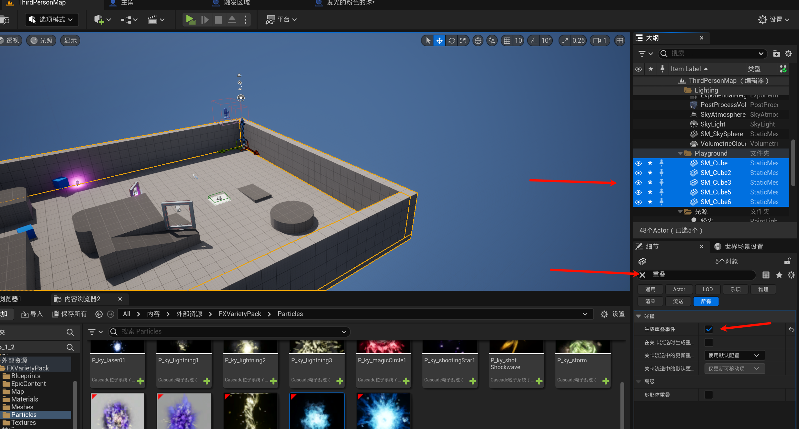
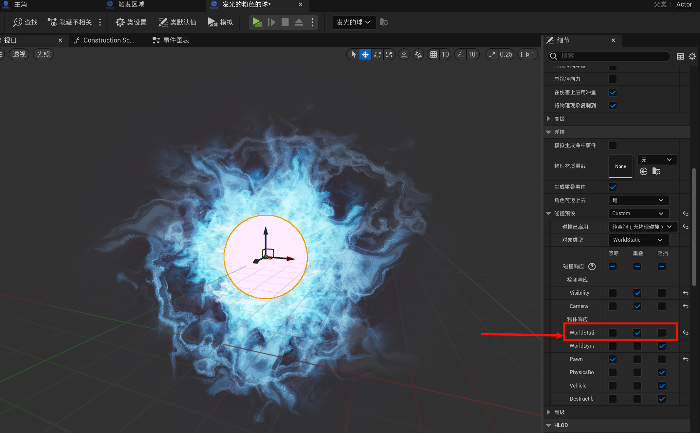
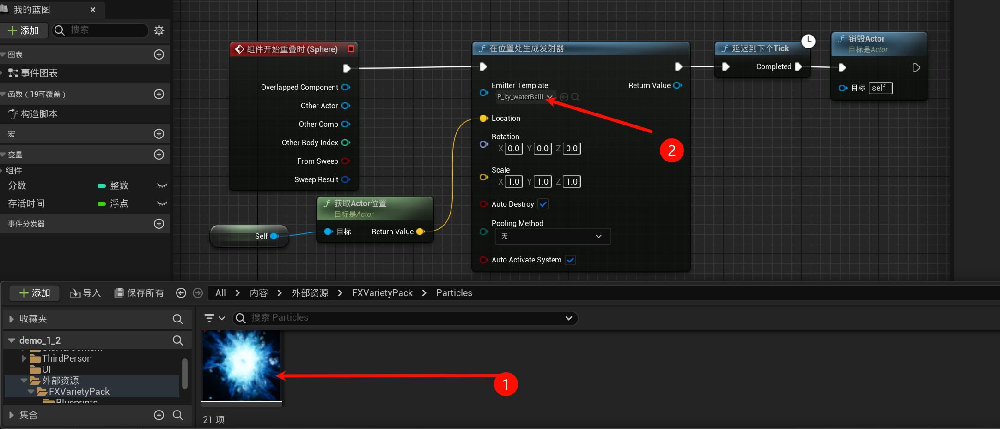
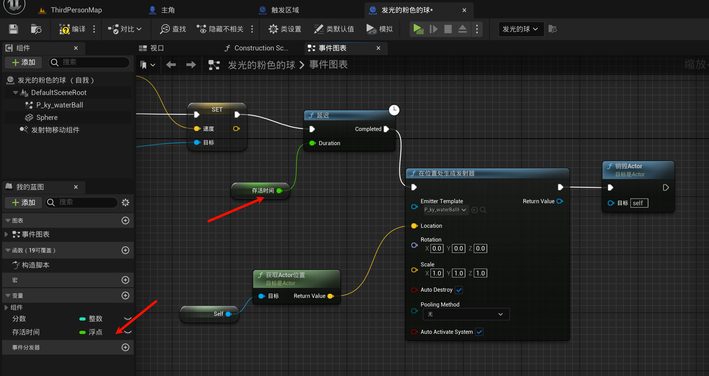
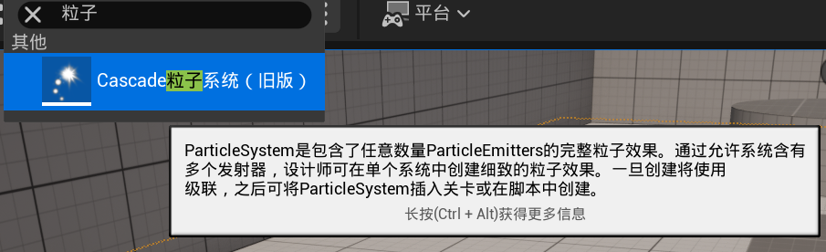
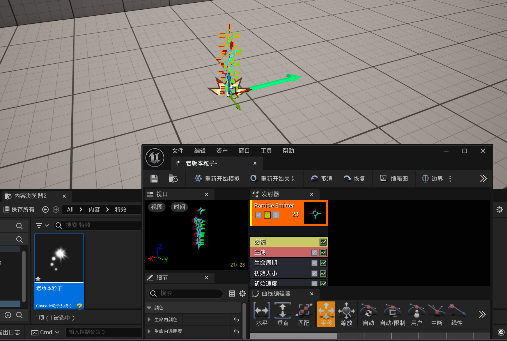
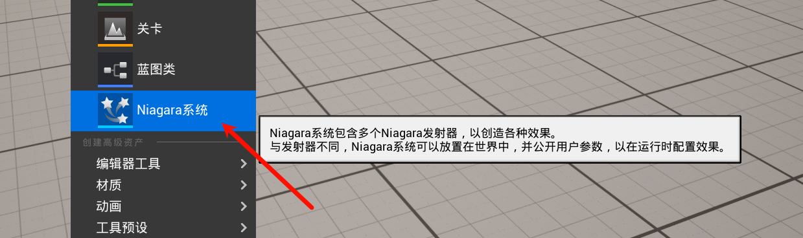
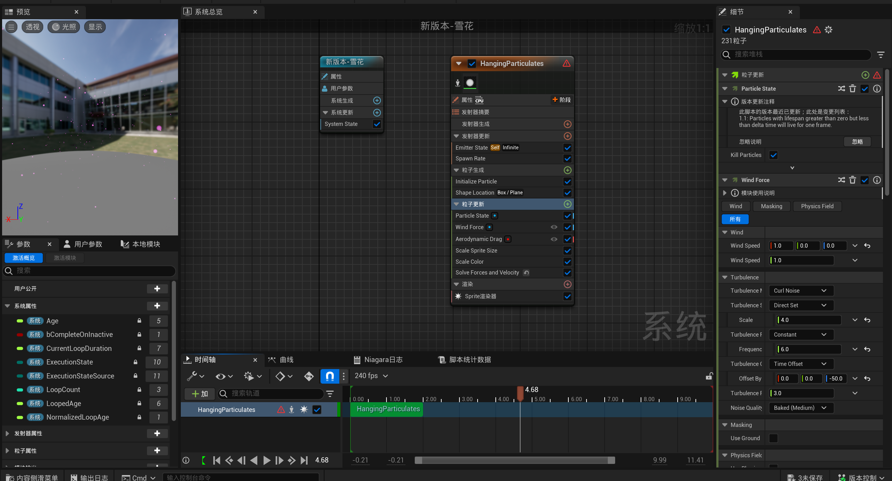

# 1.12 播放特效、自制特效，发射冰球，销毁actor
## 1.12.1 添加特效到小球

直接拖出来(或者搜索它)

## 1.12.2 小球击中墙壁的特效
### 1.12.2.1 设置场景的[生成重叠事件]为true

### 1.12.2.2 设置小球的重叠属性

### 1.12.2.3 编写碰撞后销毁小球的逻辑, 并且播放特效

> [!TIP]
> 值得注意的是: 需要延迟一下再销毁小球, 因为小球还有分数变量, 可能会被使用到得分, 如果此时销毁则导致内存泄漏(引用被释放).

### 1.12.2.4 发射物应该有存活时间

需要释放啊喂~

## 1.12.3 了解虚幻中的两种 粒子系统/特效
### 1.12.3.1 老版本的粒子系统

### 1.12.3.2 新版本的粒子系统(或者说是特效)

