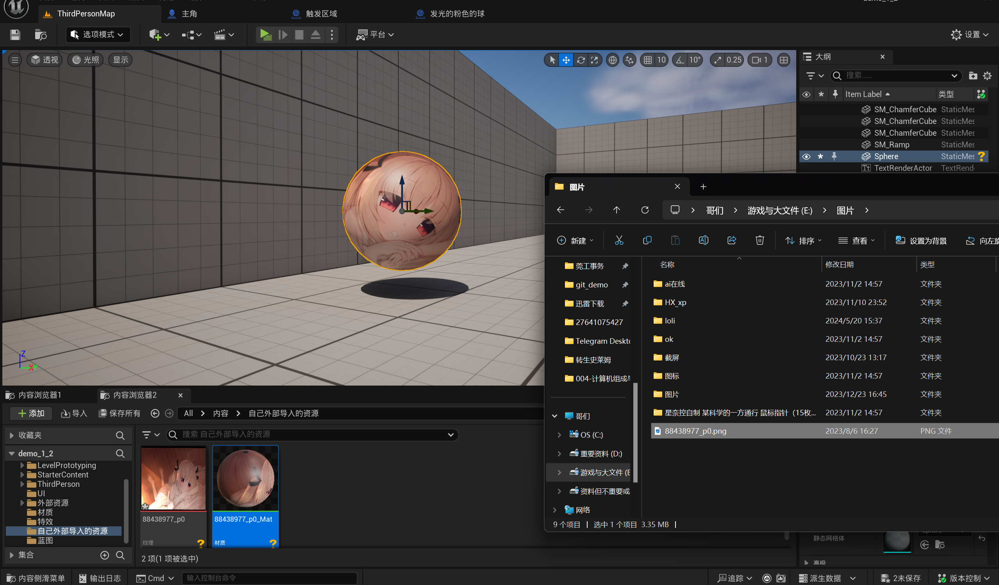
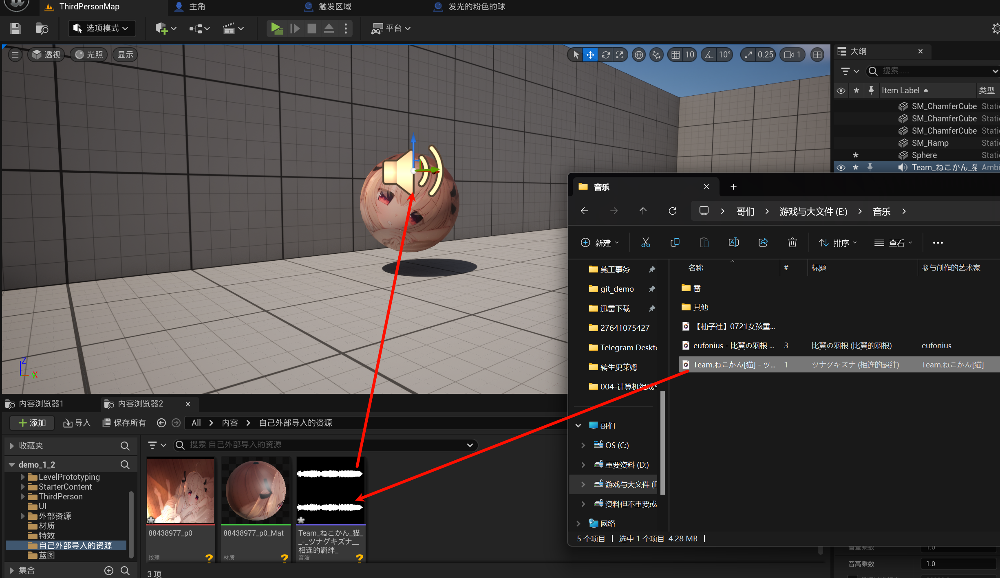
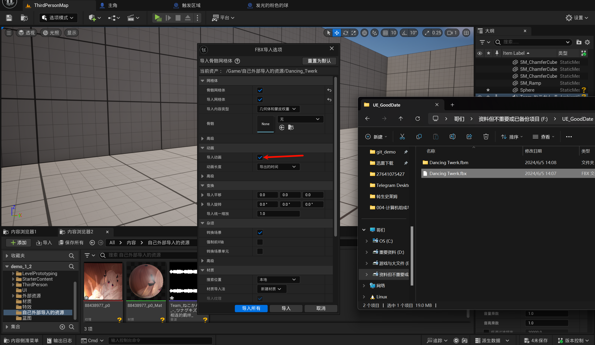
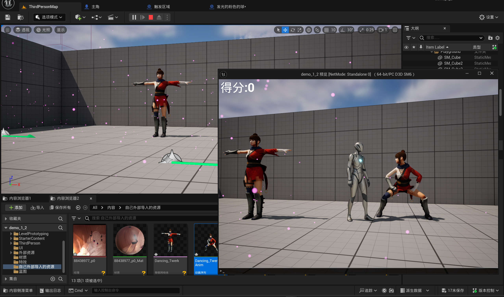

# 1.13 外部资源导入 音乐 图片 模型 动画
## 1.13.0 前提
> [!TIP]
> 你导入的资源必需是你有版权的! 不然会有很大的法律风险!

## 1.13.1 导入外部图片

几乎任何类型都可以, 直接拖进来就OK!

## 1.13.2 导入外部音频
几乎任何类型都可以, 直接拖进来就OK!

## 1.13.3 导入外部模型/动画

几乎任何类型都可以, 直接拖进来就OK! (实际上我也不认识什么类型)

- 免费模型网站: [mixamo](https://www.mixamo.com/)

注意有骨骼网格体与动画之分

