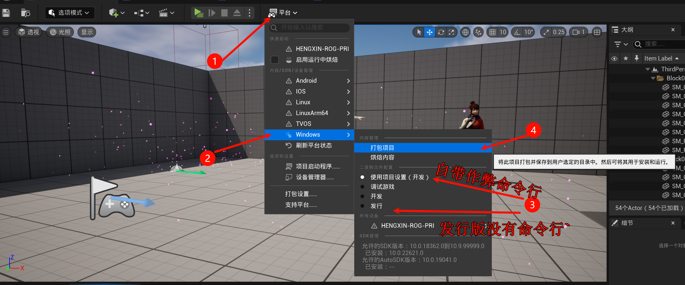
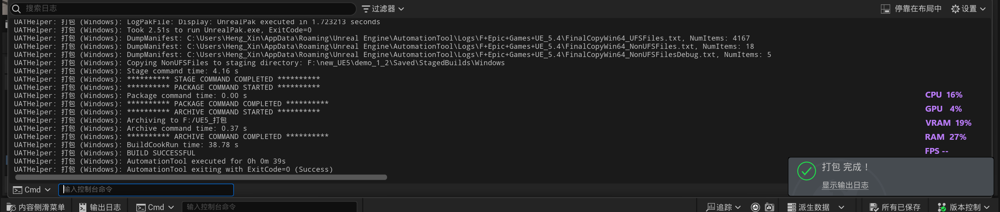
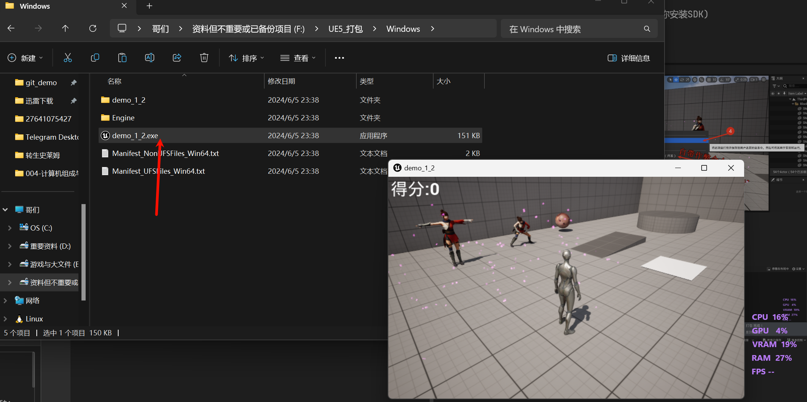

# 1.14 游戏打包到电脑、VS安装、独立运行游戏
## 1.14.1 安装 VS2022
实际上按照学习C++时候的安装就够了(不然会报错让你安装SDK)

## 1.14.2 打包

点击(4)开始打包.

第一次可能有点慢.

## 1.14.3 启动: 独立运行游戏

按`F11`是窗口化, `ALT + F4` 是退出. (因为`123`键我们使用的是调试按键, 所以使用`发行版`打包, 按键是没有效果的!)