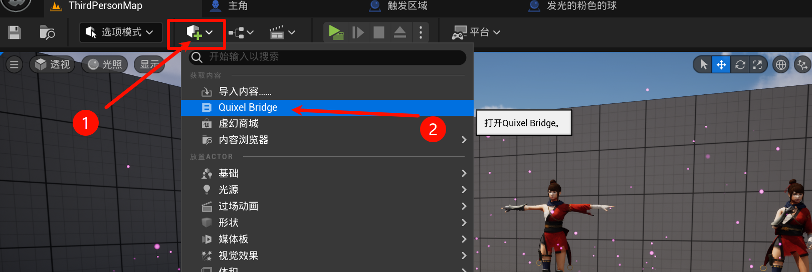
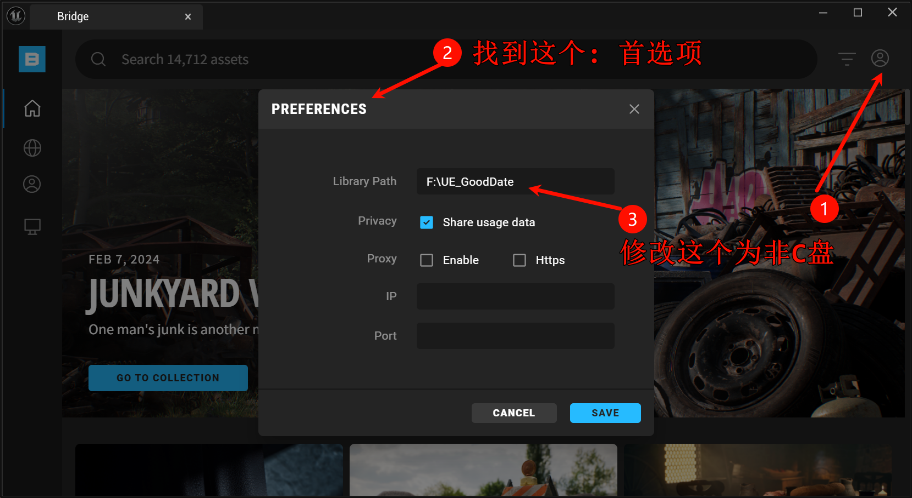
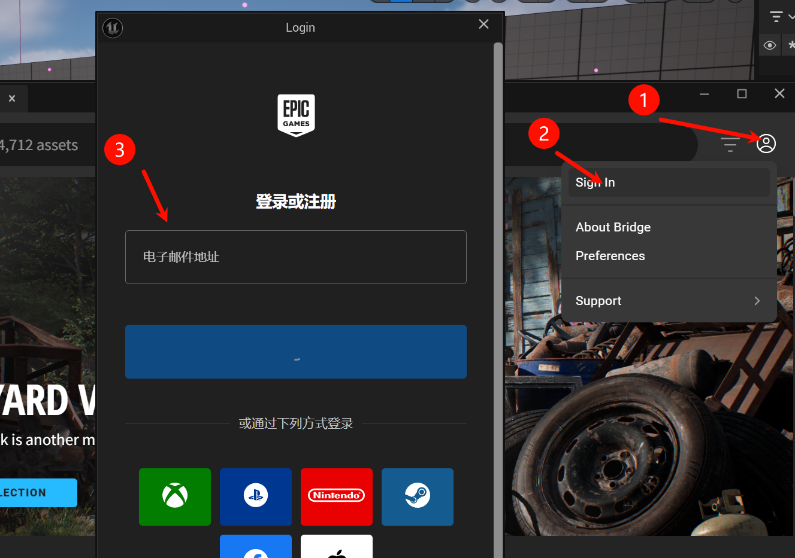
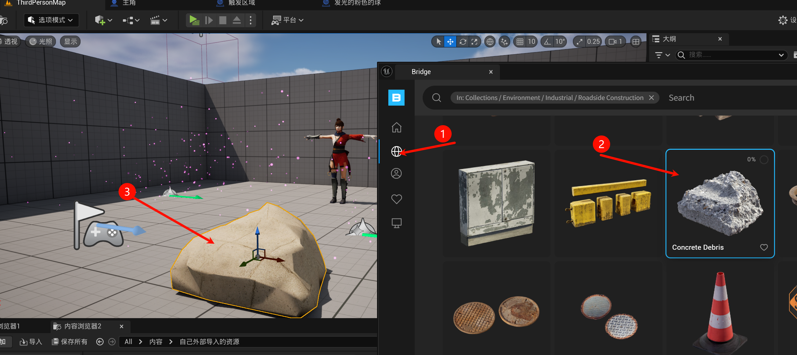
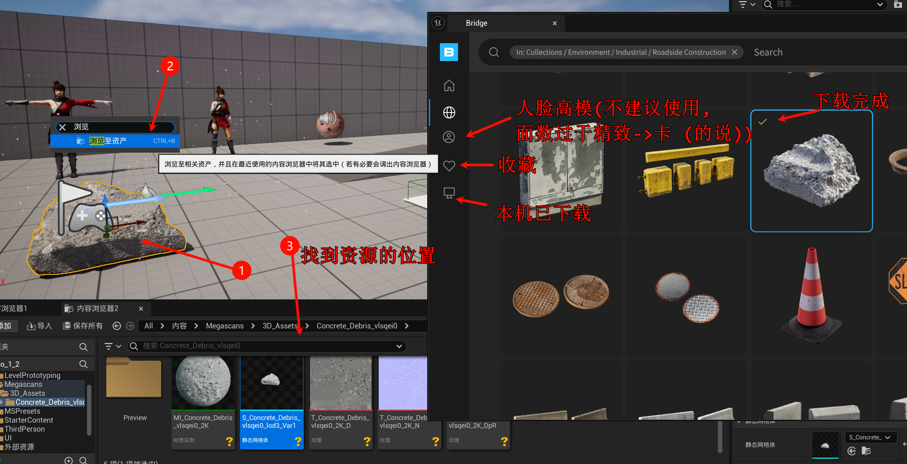

# 1.14.补充: 资产库Quixel-Bridge介绍

Quixel-Bridge介绍: 简单地说就是虚幻官方的通过扫描出来的真实的资源的模型/材质等, 可以免费使用的. 

## 1.14.补充.1 打开Quixel-Bridge

## 1.14.补充.2 配置文件夹

## 1.14.补充.3 登录

## 1.14.补充.4 使用

找到你喜欢的, 直接拖出来, 它会先加载一个低模, 然后再下载完整的, ok后替换它.

## 1.14.补充.5 资源管理

