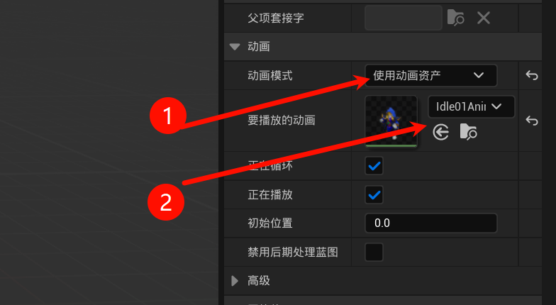

# 2.4 创建主角，角色蓝图
## 2.4.1 找到资源示例角色

## 2.4.2 创建角色父类蓝图
所有角色(玩家/怪物)都继承这个父类蓝图.

新建后命名为`角色总类`.

> [!TIP]
> 继承关系: Actor(基类) <--继承-- Pawm <--继承-- 角色

然后基于`角色总类`蓝图新建子类蓝图, 并且命名为`01角色`

## 2.4.3 角色蓝图新建角色

整个待机动画

对齐武器拿的位置

