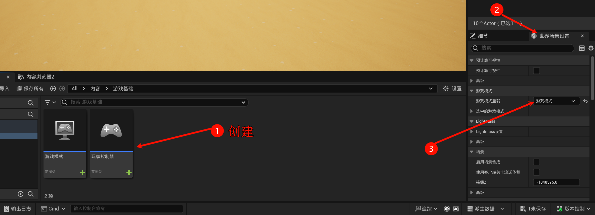
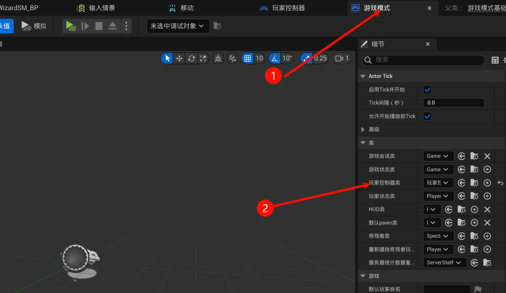
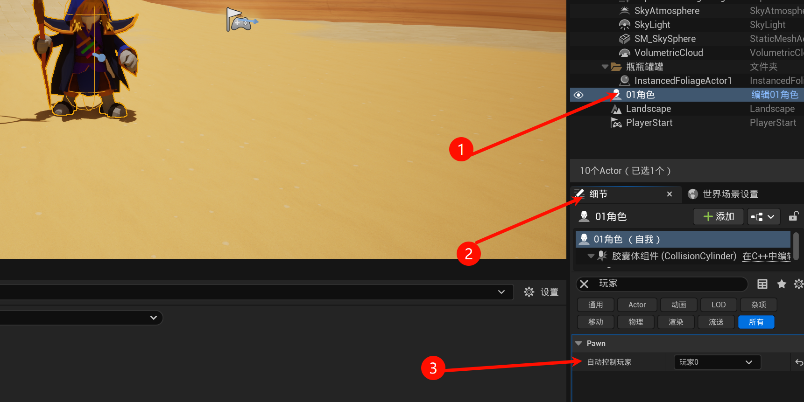
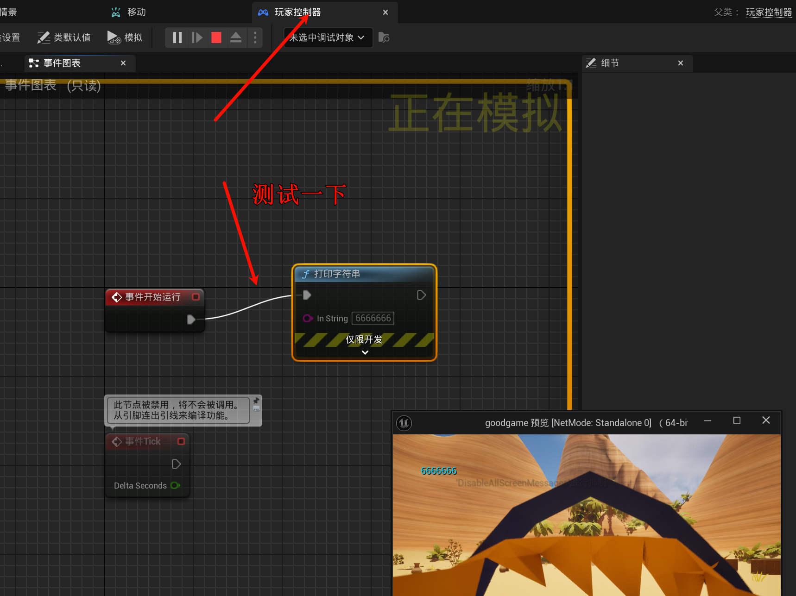
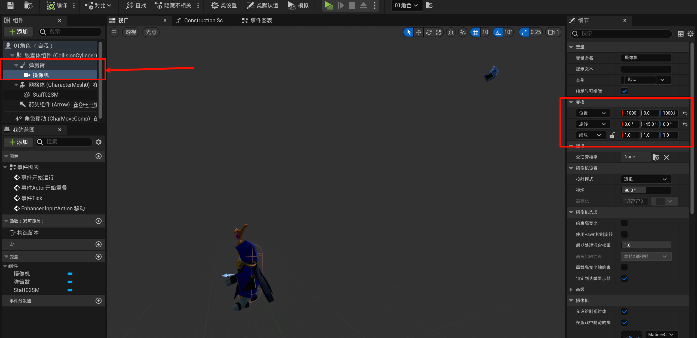
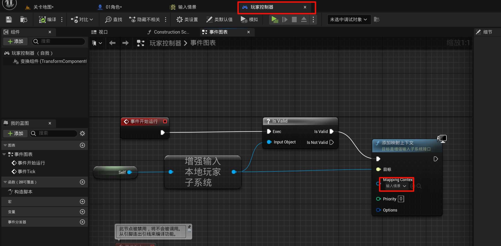
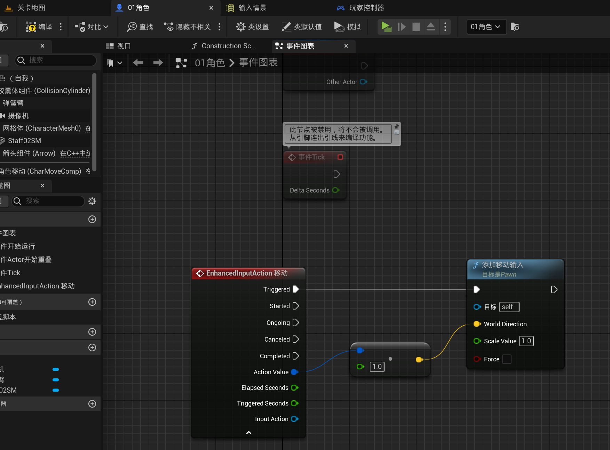

# 2.5 让角色动起来，增强输入系统
- 请学习: [UE5入门教程-22.增强输入](https://www.bilibili.com/video/BV1n14y1N7wa/), 系列视频讲的有点乱qwq...

## 2.5.1 创建输入

然后再创建一个`输入操作`

## 2.5.2 添加摄像机和弹簧臂

## 2.5.3 增强输入系统
> [!TIP]
> 大项目都是使用一个单独的蓝图来进行初始化的, 而不是在角色那里初始化.

使用增强输入:

按键映射:

人物移动逻辑:

