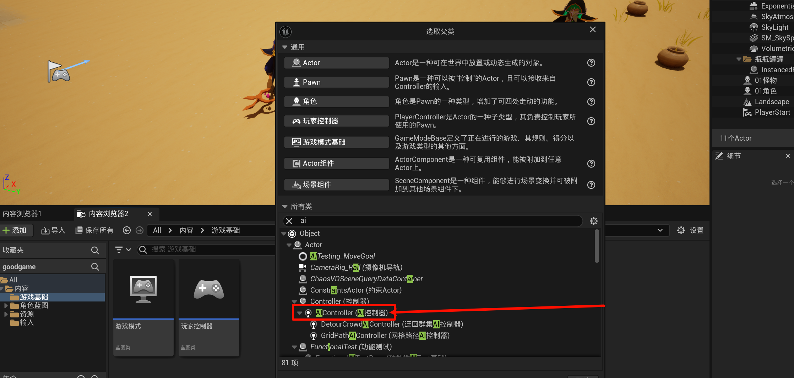
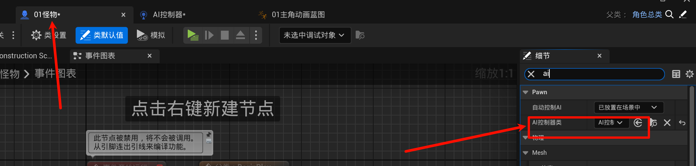
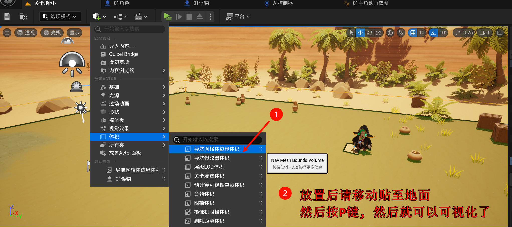
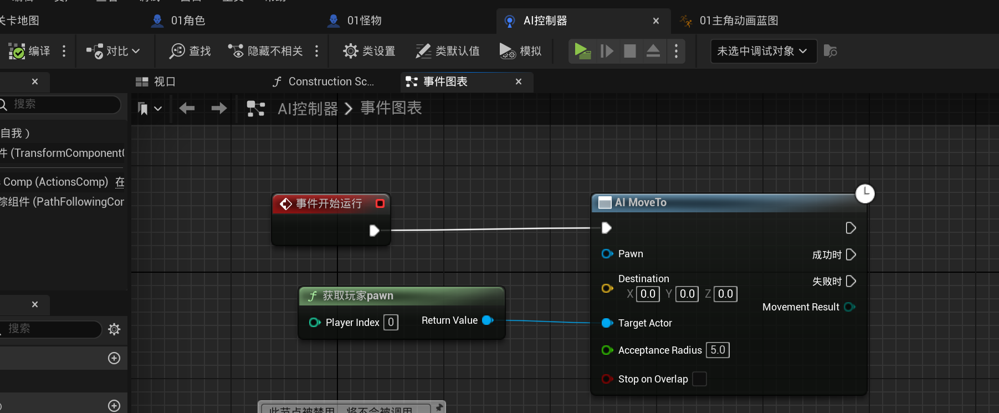
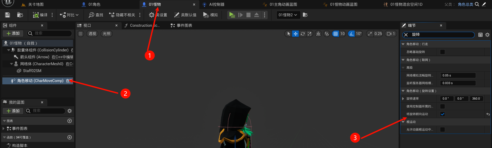
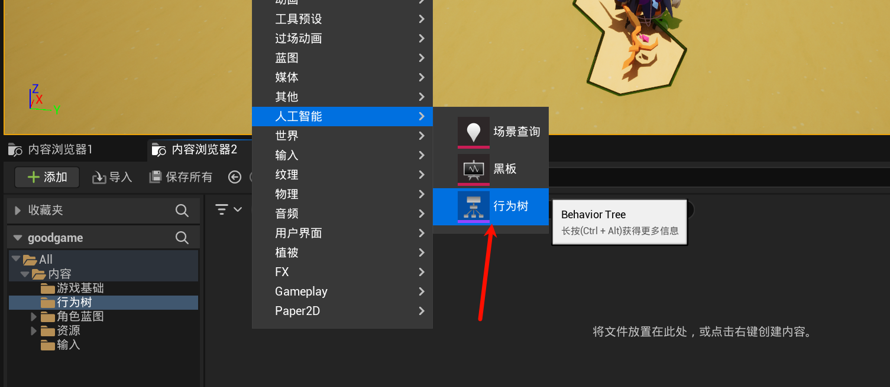
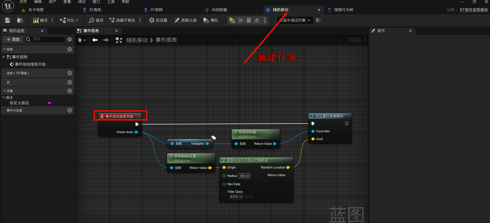
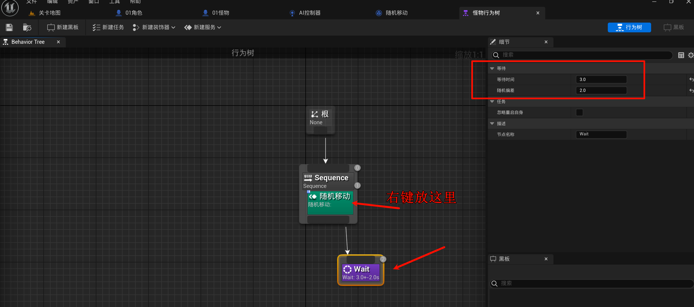

# 2.12 让怪物动起来：AI行为树
## 2.12.1 创建AI控制器蓝图

## 2.12.2 给怪物配置AI控制器

> [!TIP]
> 注: 此处留下了一个坑, 即自动控制AI`已放置在场景中`, 如果之后这个怪物是刷(生成)的, 可能有BUG.

## 2.12.3 放置导航网格体边界体积

> [!TIP]
> 在这个范围内的怪物, 才可以使用`寻路`功能, 并且寻路范围被限制在这个范围内.

## 2.12.4 AI导航: ai move to

传入坐标会移动到坐标, 传入玩家类, 会移动到玩家处; 分执行成功和失败

但一般不这样搞, 更多是使用`行为树`, 因为`ai move to`是本地计算, 而`行为树`是服务端计算, 这样有利于联机状态的同步.

## 2.12.4 优化怪物: 移动的朝向与移动动画

边移动边旋转:

实现怪物移动动画, 同复制蓝图(动画蓝图和混合空间, 把目标改为怪物的, 然后混合空间的速度改一下和怪物的匹配就OK)

## 2.14.5 创建行为树 & 随机移动

不知道是`UE5.4`的问题还是我的问题, 不能像up一样搞, 甚至连线也不是用那个构建成功消息的蓝图...(而且, 明明是新建的任务, 为什么右键不能新建节点, 而且是需要在`服务`那里才可以使用这个`随机移动`??!)

## 2.14.6 解决渲染问题: 出现地形脚印
试试`项目设置-引擎-渲染-阴影-阴影贴图方法`改为`阴影贴图`