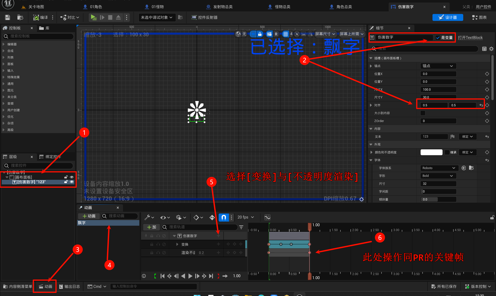
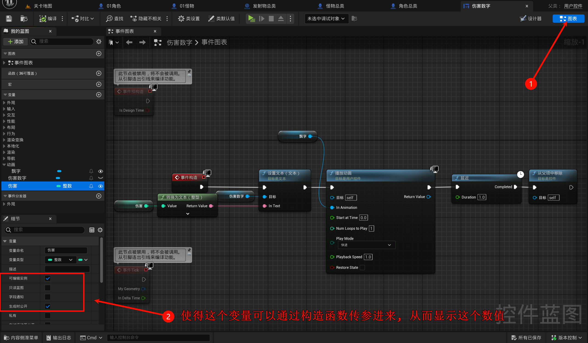
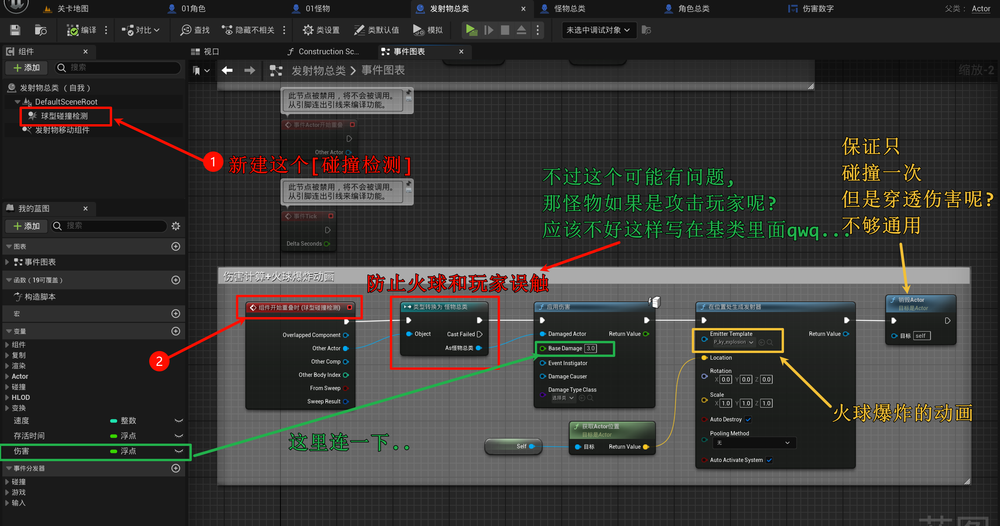
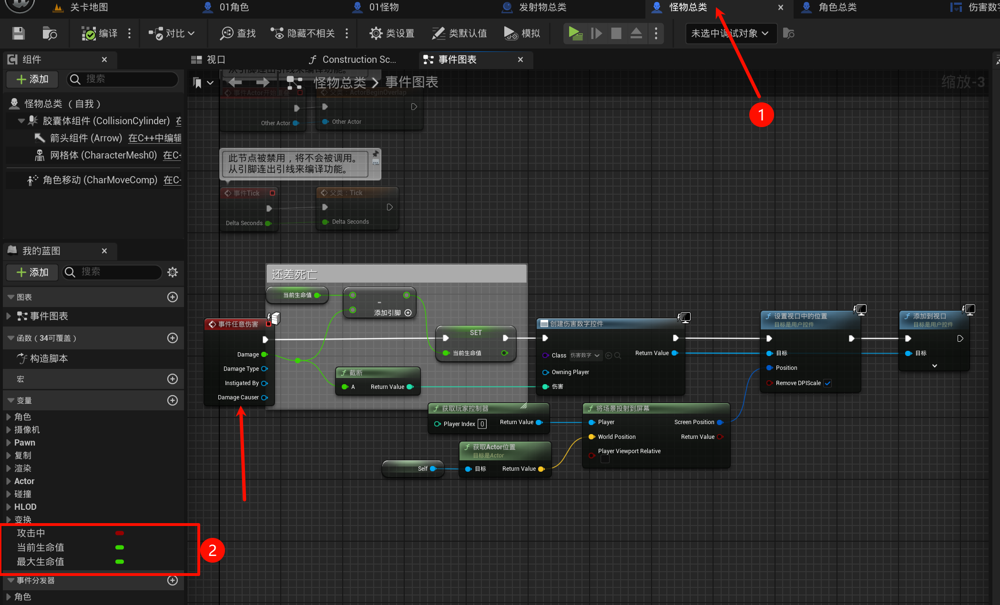
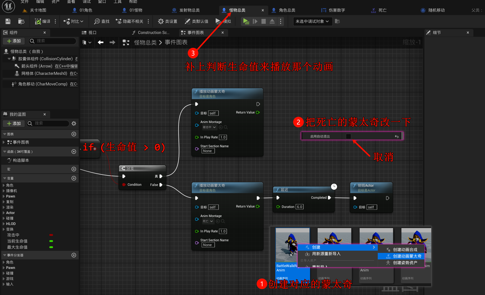
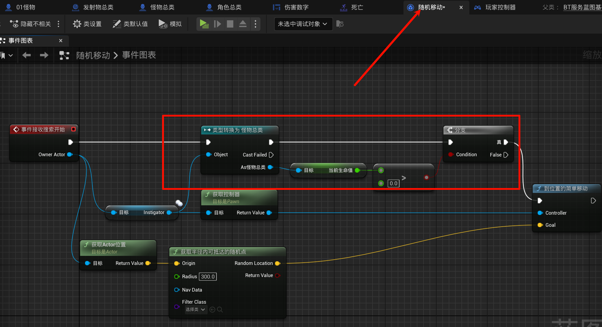
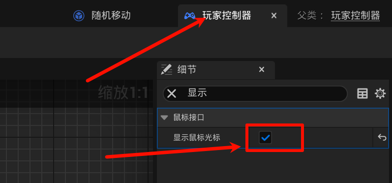

# 2.13 伤害事件, 伤害飘字, UI动画
## 2.13.1 调整一下: 01怪物类应该是继承怪物总类的
新建一个继承`角色总类`的`怪物总类`, 然后改一下`01怪物类`的父类就OK

## 2.13.2 伤害飘字

新建文件夹`UI`, 新建`用户界面`>`控件蓝图`, 然后:

## 2.13.3 伤害事件

## 2.13.4 受伤害/死亡动画

这样怪物倒地就不会导航了:

## 2.13.补充 显示鼠标

勾选:

