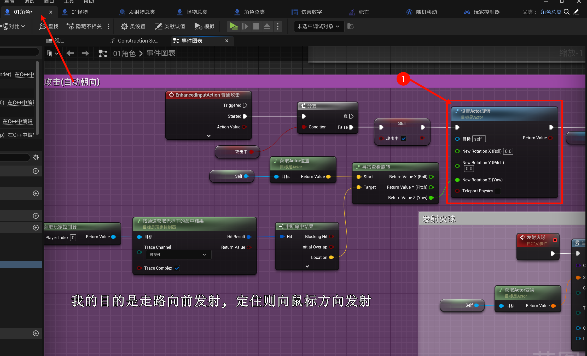
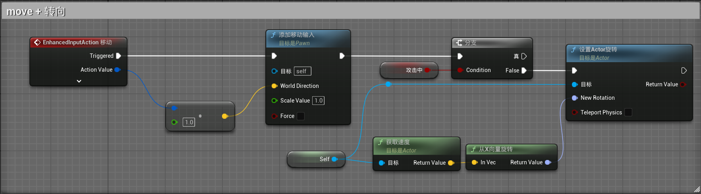

# 2.14 朝向鼠标、怪物死亡、状态机、纯函数
## 2.14.1 朝向鼠标

> [!TIP]
> 个人认为视频那种并不好, 即`边走边往鼠标方向打`, 因为
> 1. 打的时候人物会漂移
> 2. 不够精准, 因为人物的移动的, 你在点击的时候获取了点击位置的坐标 点 $d(x_d, y_d)$, 假设此时人物在点 $A(x_A, y_A)$, 因为你在移动, 所以人物移动到了点 $A'(x_{A'}, y_{B'})$ 处, 此时才进行发射, 但是人物朝向却是按照 向量 $A \to d$ 计算的, 但是正确的应该是 $A' \to d$. 可能你会说, 这个不简单吗? 在发射的时候再使用一次鼠标位置 $d'$ 不就OK了. 那么问题来了:
>     1. $d$ != $d'$, 你的鼠标是会动的
>     2. 即便你解决了上面的问题, 使用缓存 $d$ 的坐标, 然后再计算一次, 那不还是改变了朝向(变化很大的会被看出来)
>     3. 对于 上面的[2], 我们在这个时间段内 (即从 $A \to A'$ 时间段内) 让每一帧更新玩家的朝向不就ok了 (即每一帧计算 $A_i' \to d$ 向量, 作为面的朝向)
>     4. 又会引发一个新问题 -- (可能的, 诡异的)平移 (倒着走吗qwq?)

> 如果实在坚持, 就像下面这样改, 然后通过调整施法的前摇来提高手感...

## 2.14.2 怪物死亡
见上一节(我已经实现了)

- 对于怪物死亡子弹还可不可以攻击它

1. 如果你希望可以鞭尸, 那么就是可以攻击嘛 (当然可能伤害数字什么的需要优化)

2. 如果你希望子弹是穿过它, 那么可以在加上一层判断(如果子弹碰撞的怪物已经死亡(甚至可以加一个`bool`标记`已死亡`)/或者是去除胶囊体的碰撞什么的...)

## 2.14.3 状态机
因为我是复制一份动作蓝图来做怪物的动作蓝图, 因此没有bug, 所以就先不用状态机了..

状态机就是管理不同状态下执行不同动画, 并且有相互状态之间转化的.

## 2.14.4 纯函数
你可以在函数中, 勾选纯函数, 这样就不需要连`白色`的电线进来了(里面主要是类型转换/或者get一些变量之类的)