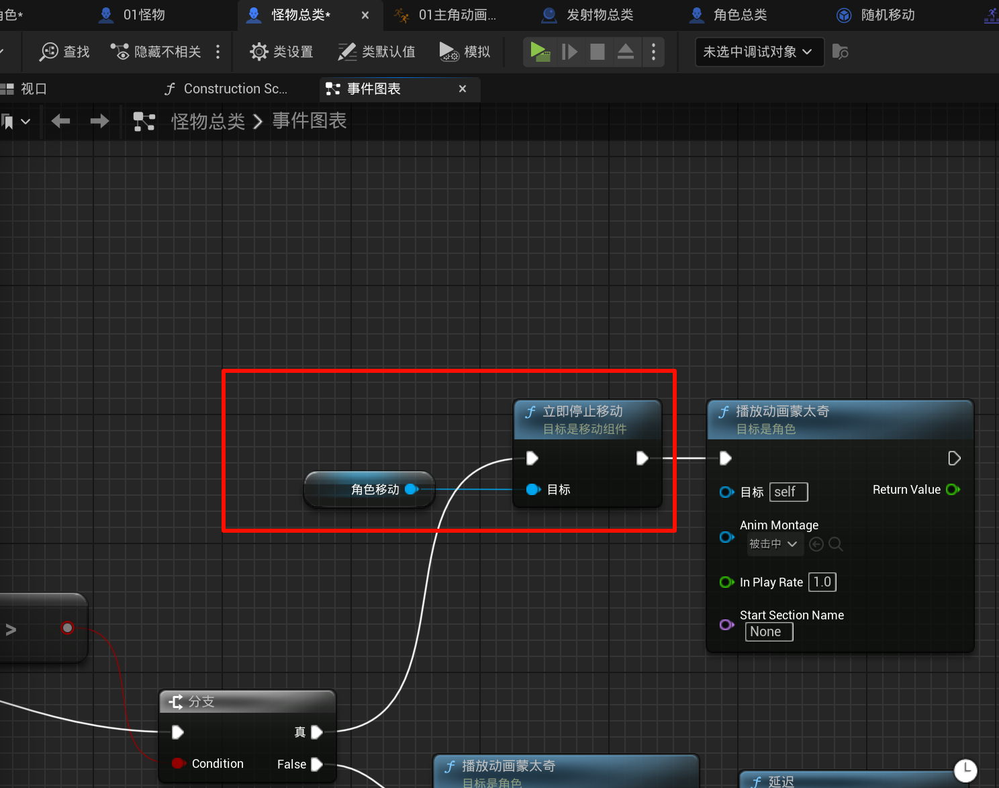
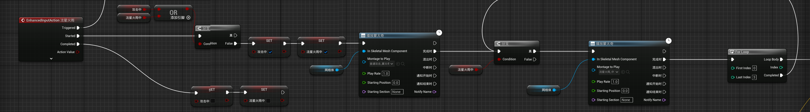
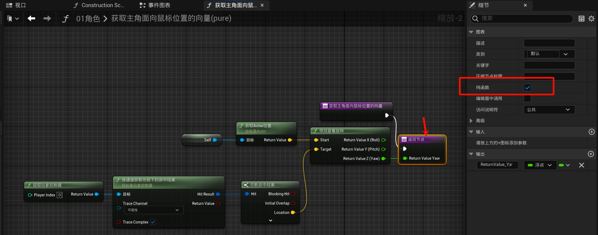
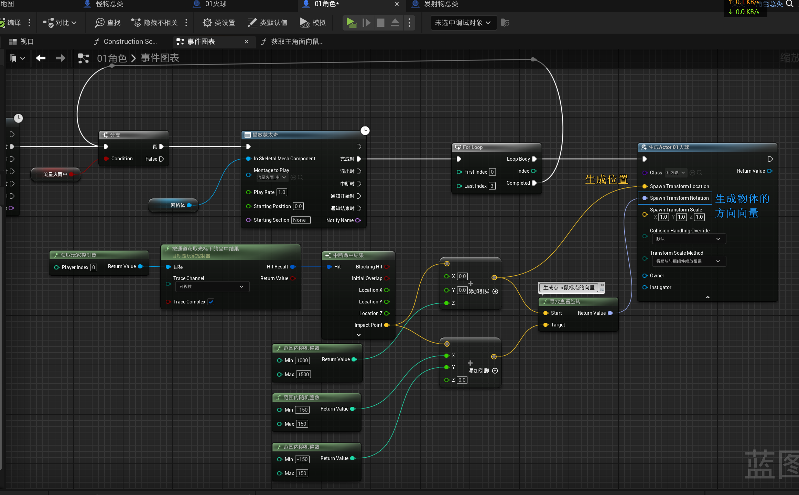
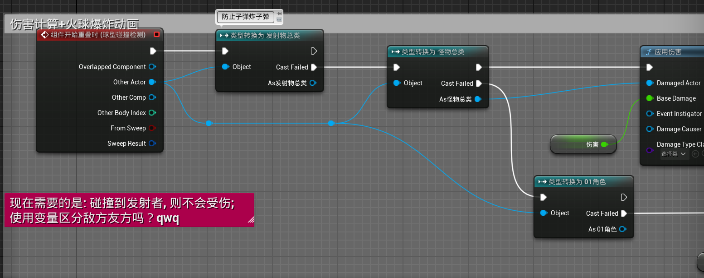

# 2.15 流星火雨，引导施法技能制作、随机数
## 2.15.1 优化: 让怪物受到攻击会僵直

先停止再播放动画.

## 2.15.2 引导施法技能的动画
先搞一个`右键`事件...

然后搞一个正在释放动画的蒙太奇...

然后就是写`按住`右键就会持续释放的动画:

使用一个布尔变量, 表示是否处于按住状态(右键弹起就将它设置为`false`), 然后循环播放攻击中的动画(可能看着有点别扭):

(顺便写了实时指向鼠标位置 (用到了自定义的`纯函数`))

## 2.15.3 创建火球类似陨石落地的逻辑

子弹逻辑也改一下, 让它碰到地面也会爆炸(记得启用地图的`生成重叠事件`)

