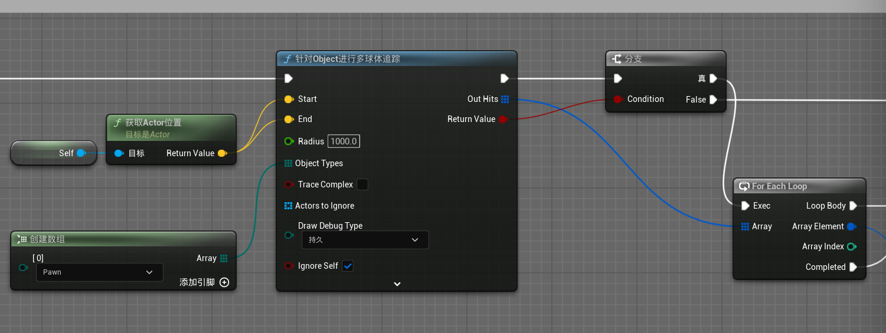
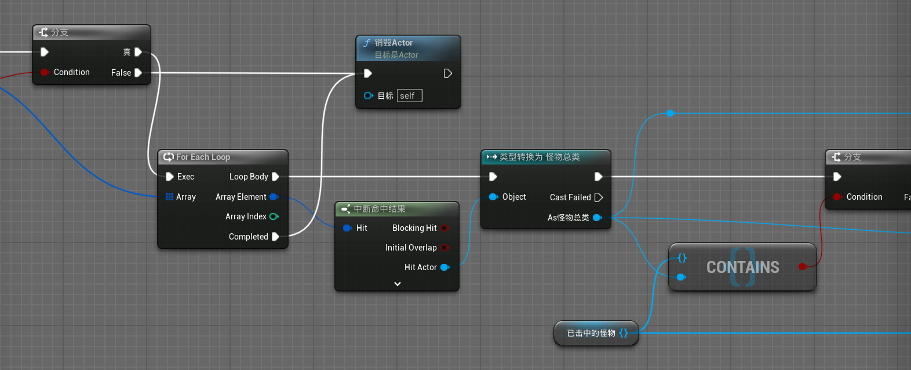
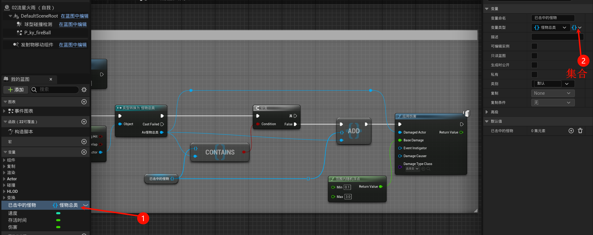
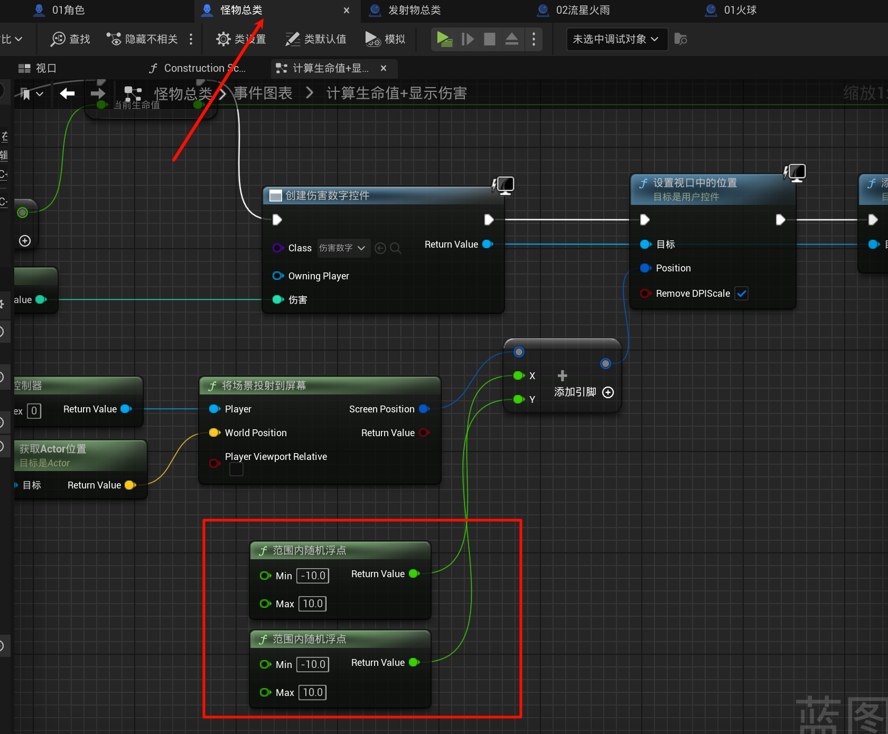
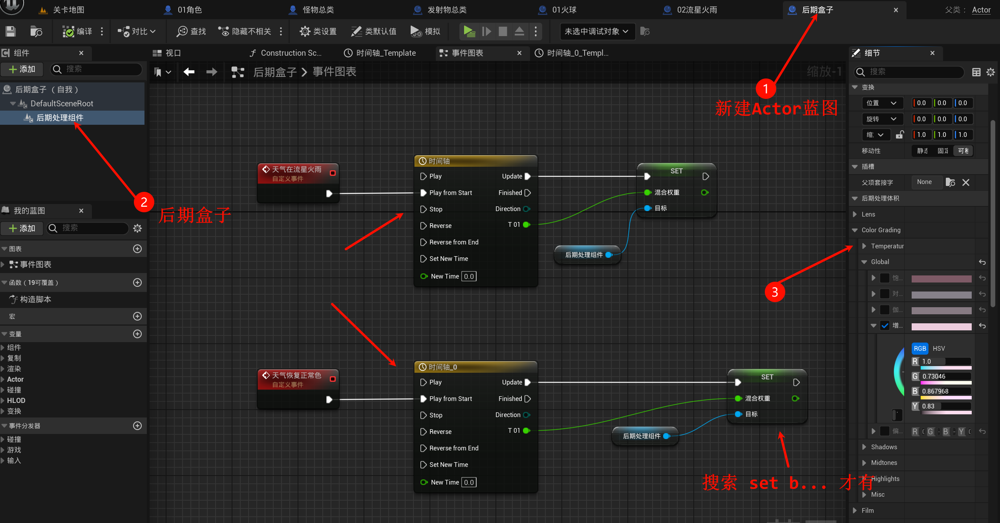
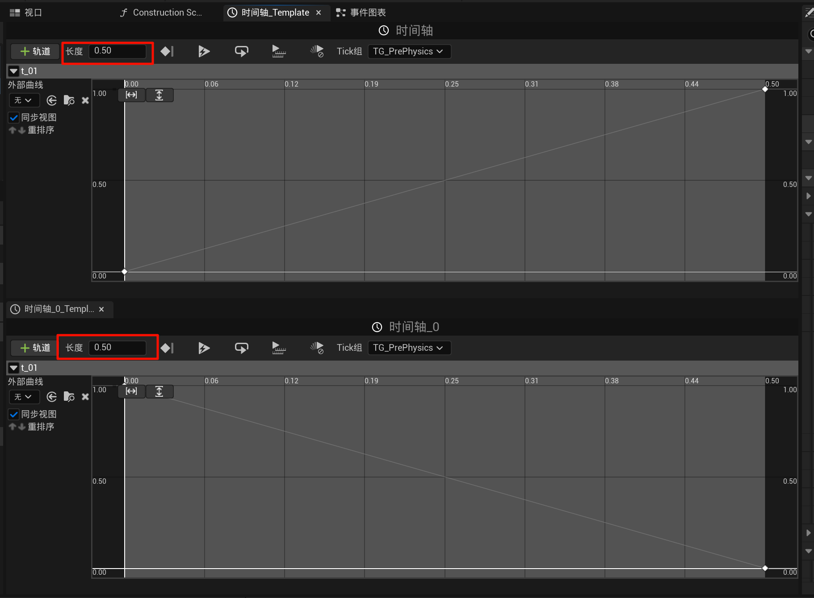
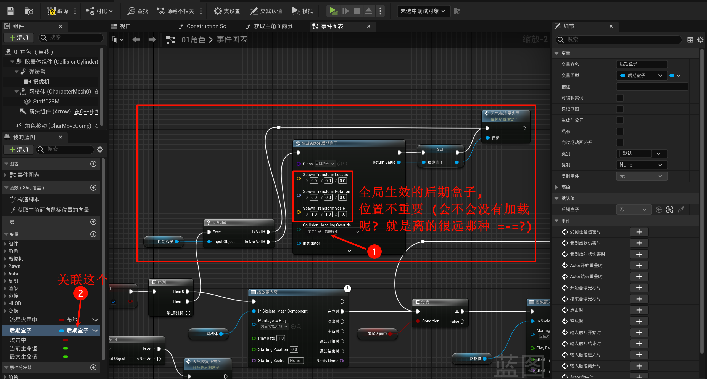
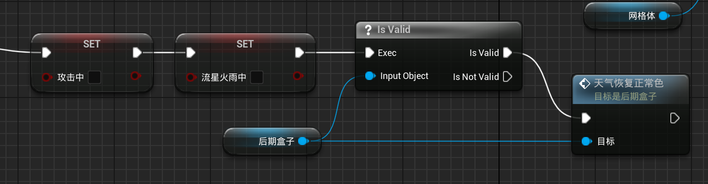

# 2.16 爆炸伤害，球体监测，场景变暗、时间轴
## 2.16.1 爆炸伤害，球体监测
有点麻烦了qwq, 现在新建一个`02流星火雨`继承`发射物总类`蓝图(其实之前就应该建立的qwq(偷懒不好)), 因为需要做火球的范围爆炸伤害:

- 把`发射物总类` 组件开始重叠时 (球型碰撞检测）的内容全部复制过啦后:

## 2.16.2 伤害数字随机浮动

## 2.16.3 场景变暗 & 时间轴

创建`时间轴`, 双击后, 创建一个新的轨道, (这里需要使用英文命名(UP说UE4会有BUG, (不知道UE5有没有)))

然后就是一个逐渐亮, 一个逐渐暗 (注意长度!!!)

你是销毁也没问题, (不过我这里就空间换时间了=-=)

