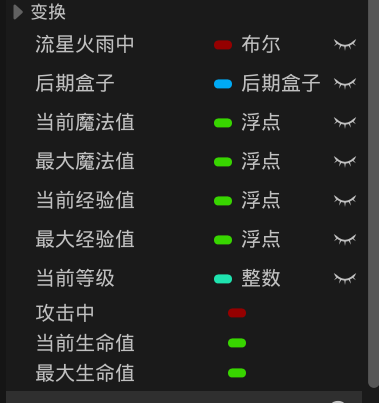
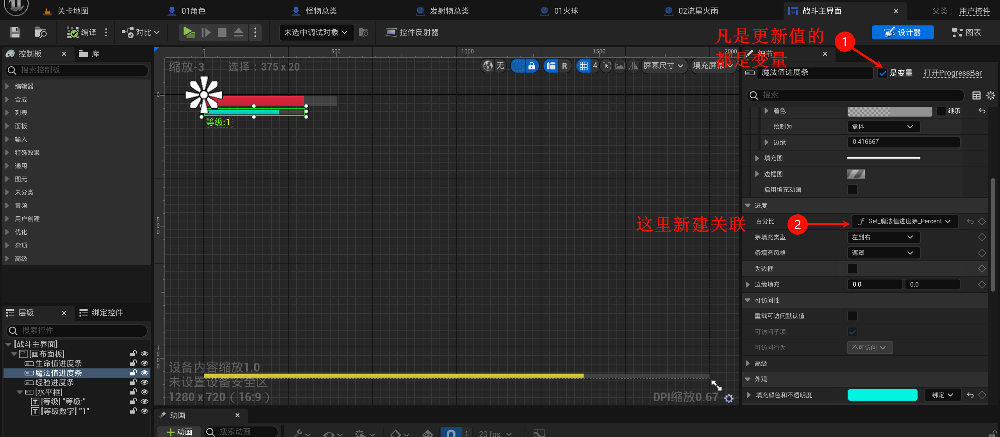
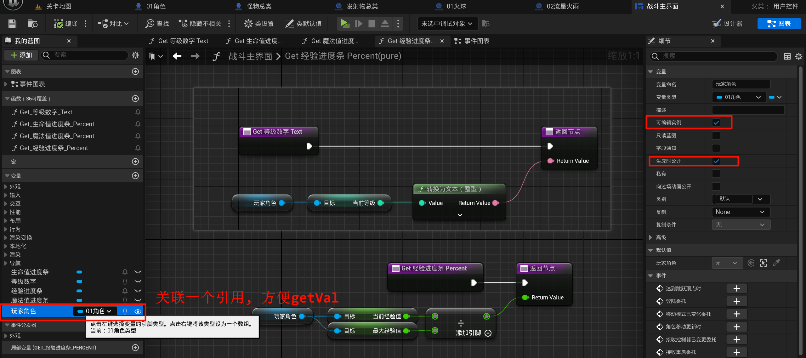
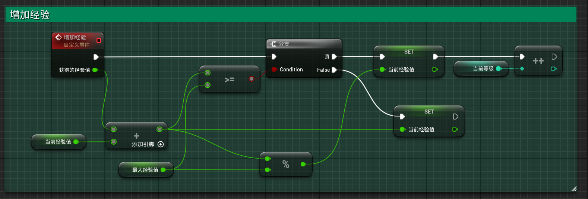
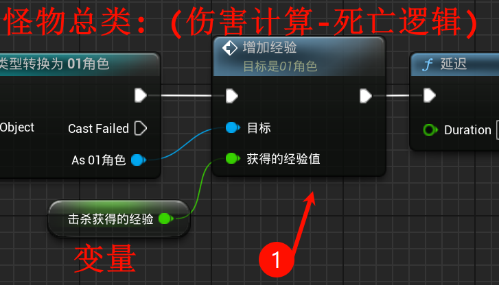
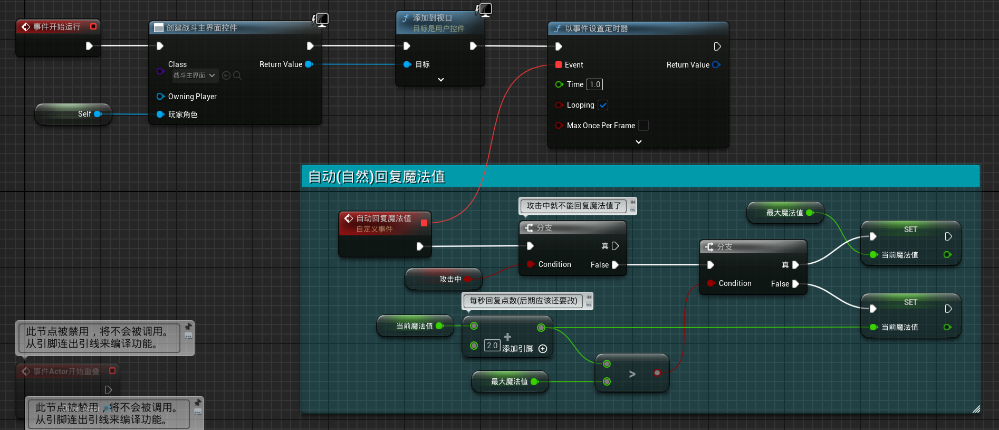
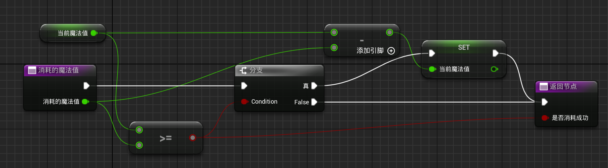
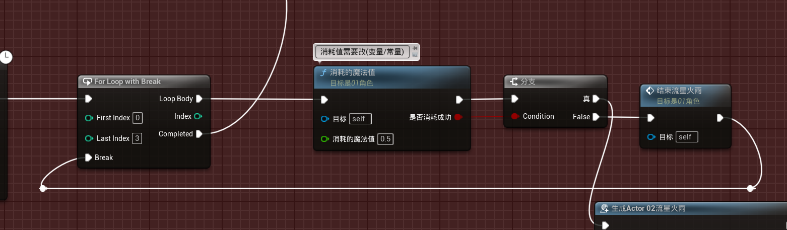

# 2.17 等级、经验、血条、魔法消耗
## 2.17.1 添加对应的变量

使用浮点! (不然到时候不能在进度条显示(至少我使用浮点就不行qwq(可能是我的问题, 没有尝试其他方法)))

## 2.17.2 创建 & 编写 战斗主界面

## 2.17.3 增加经验逻辑

01主角类 编写:

怪物总类 添加以下:

## 2.17.4 魔法条逻辑

没有攻击就自动回复:

编写一个函数 (返回值是是否有足够的魔法值, 有就`-=`了):

添加到`流星火雨`逻辑里面:

