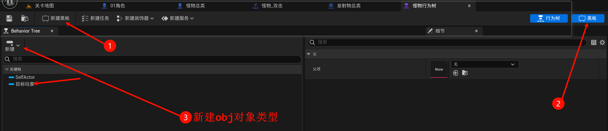
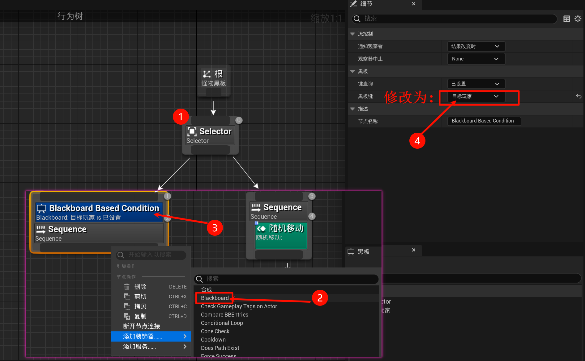
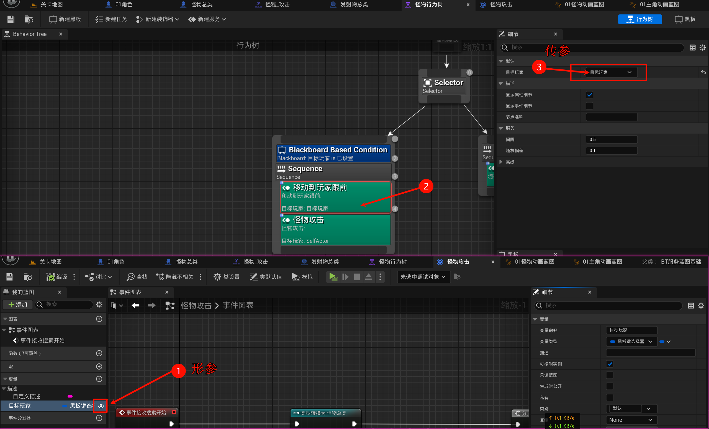
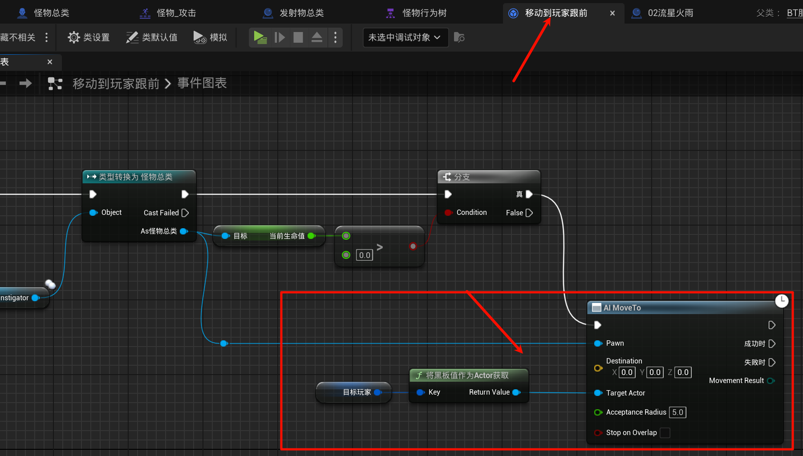
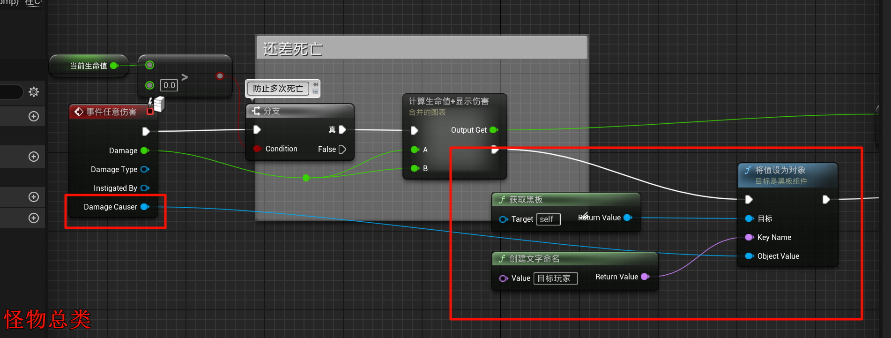
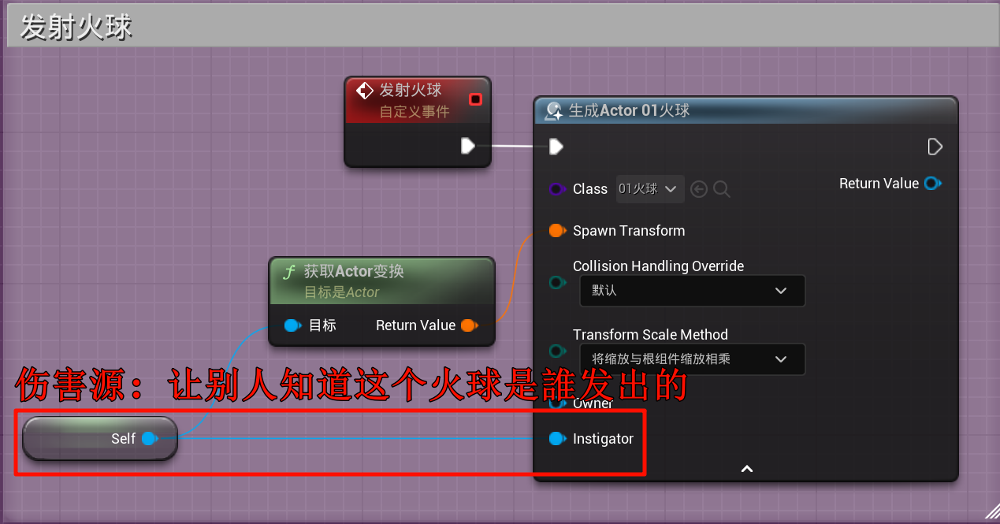
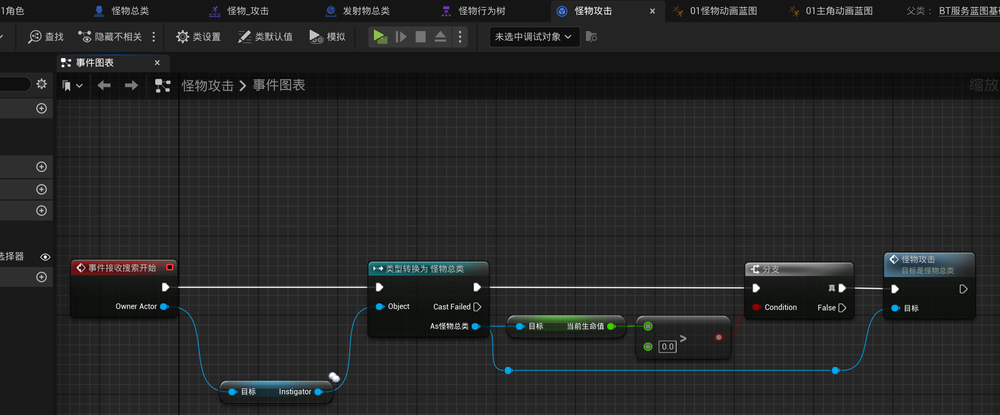
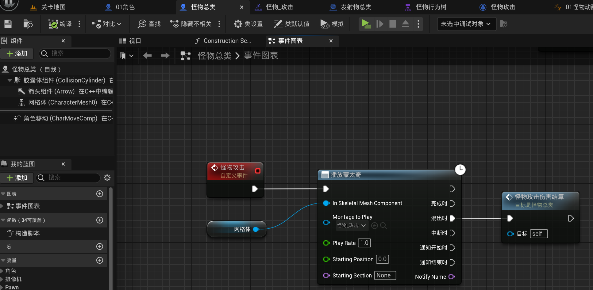
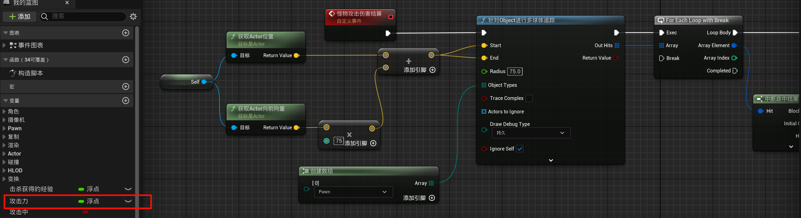
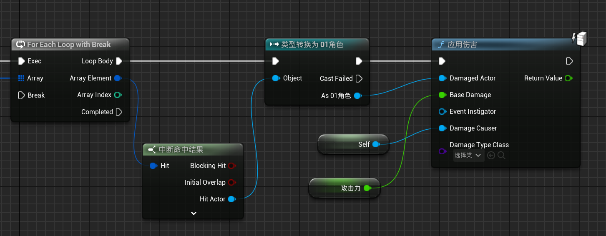

# 2.18 拉怪机制，怪物攻击玩家、伤害源、黑板
## 2.18.1 行为树: 黑板

(把`随机移动`复制一下后: 命名为`移动到玩家跟前`), 然后添加变量`黑板选择器类型`:

编写被打则从中立转为敌对逻辑: (实际上就是向玩家移动)

并在怪物总类中编写如下逻辑: (使用到了`伤害源`)

- 关闭主角的`弹簧臂`的`进行碰撞测试`.

## 2.18.2 伤害源

## 2.18.3 怪物攻击玩家

(把`移动到玩家跟前`复制一下后: 命名为`怪物攻击`) 然后:

编写攻击事件(注: 动画这些你自己搞咯):

编写攻击逻辑(近战):

