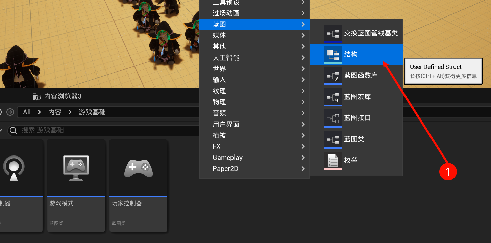
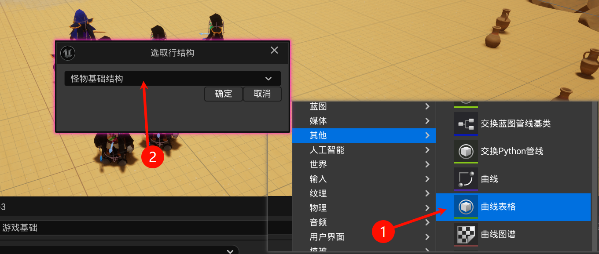
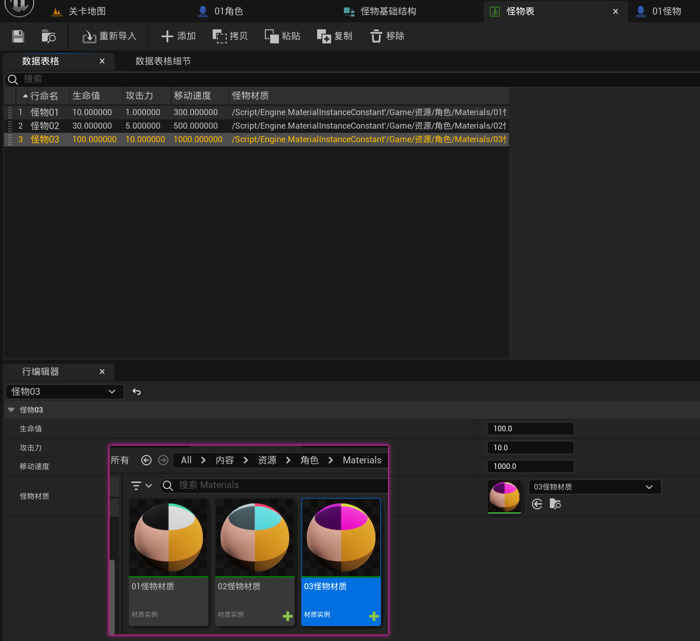
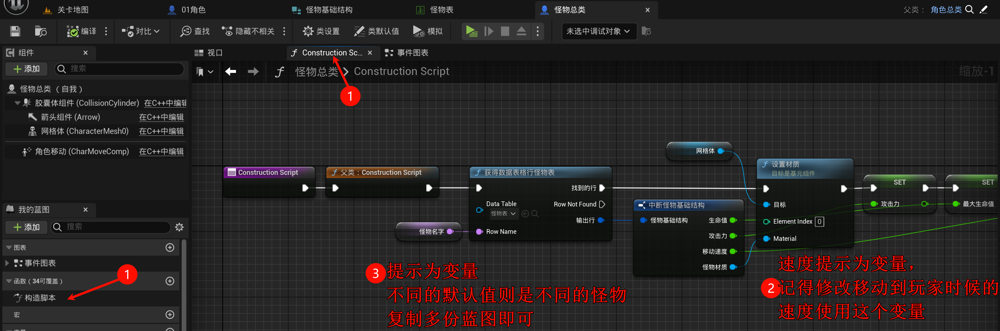
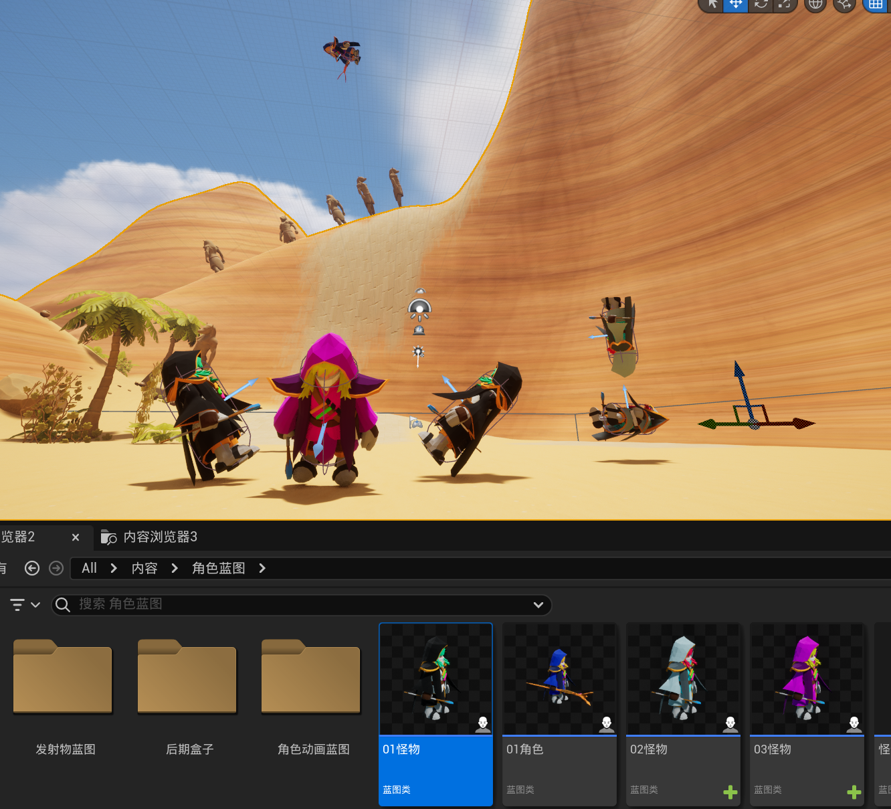
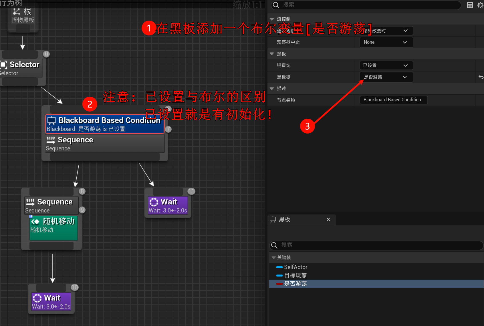
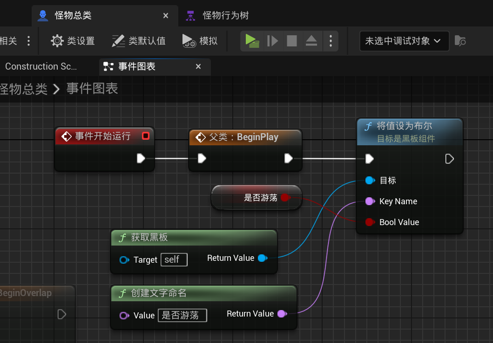

# 2.19 丰富怪物，结构体、数据表格、构造函数
我们需要多种多样的怪物, 至少数值和外观先不同
## 2.19.1 结构体

## 2.19.2 数据表格

并且创建多个怪物材质, 然后填上数值

## 2.19.3 构造函数

- 应该说是`预构造`? (感觉不是运行时new的那样)

- 怪物名称, 对应数据表的行

效果:

## 2.19.4 优化行为树: 只有某些怪物才可以移动

- 你应该发现, 行为树的运行顺序是`前序遍历`的. 如果执行失败就跳过继续往下执行, 如果在一个分支OK, 就一直在这里? (体感是这样, 实际看看如何还得深入了解!)

然后再添加一个布尔成员变量来控制是否移动, 注意, 黑板的设置应该在`事件开始运行`时设置; 在预构造中不行, 因为黑板还不存在!

