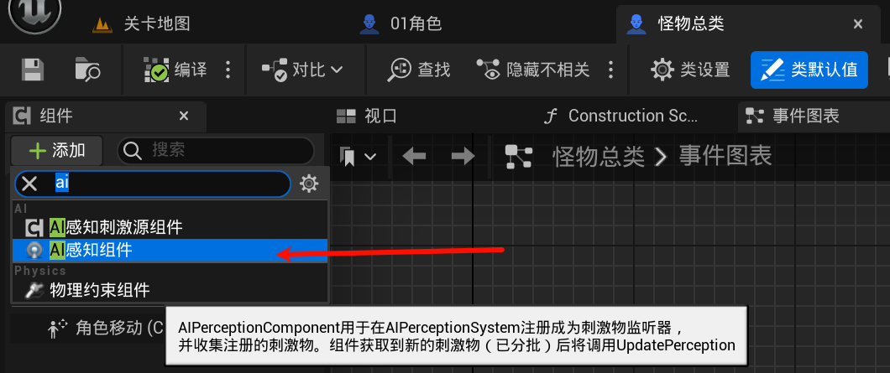
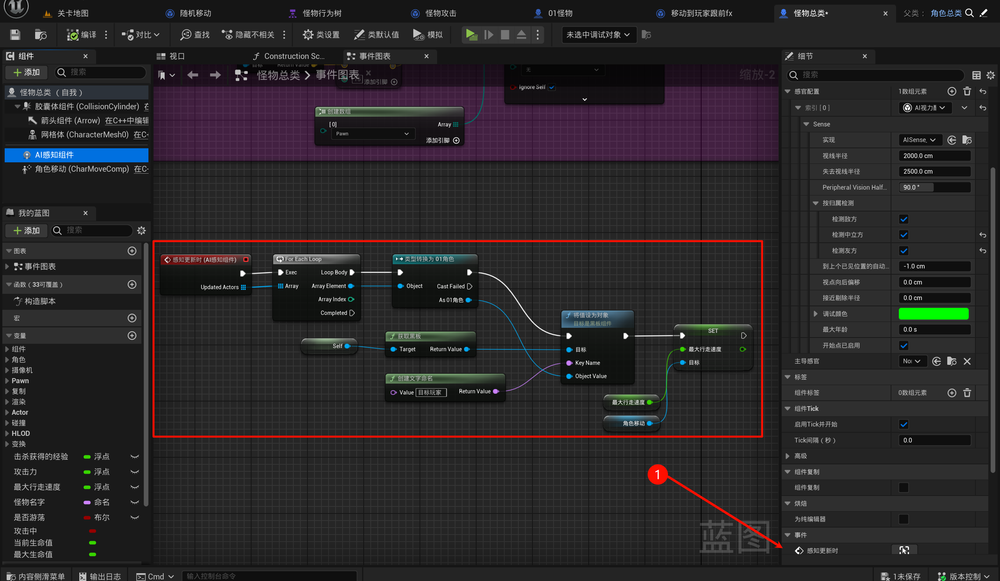
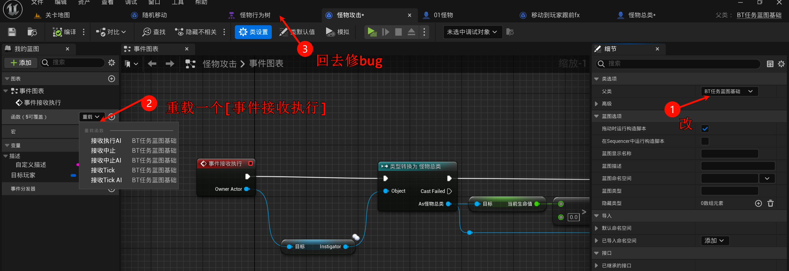
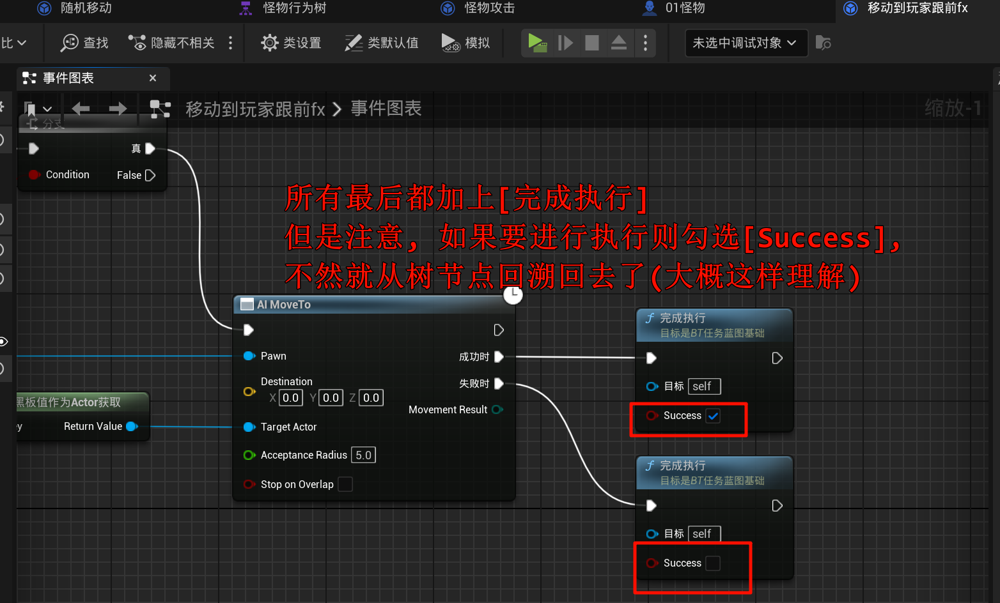
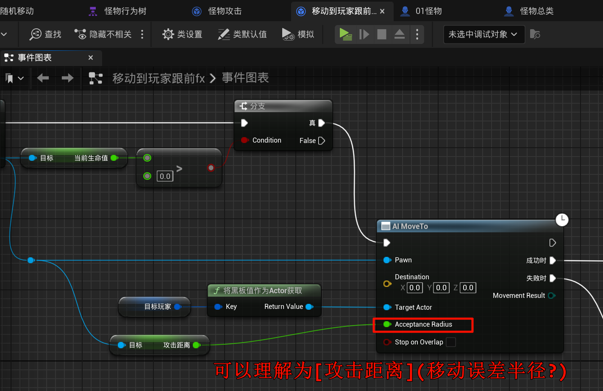
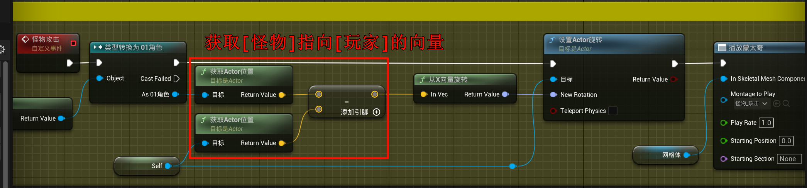
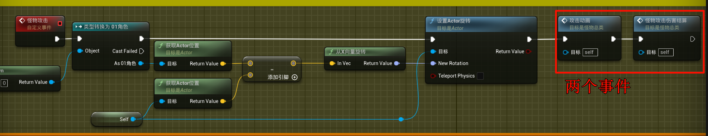
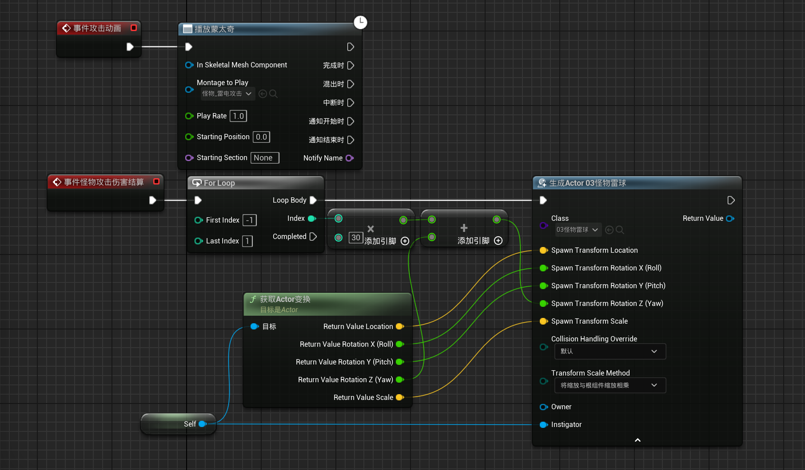
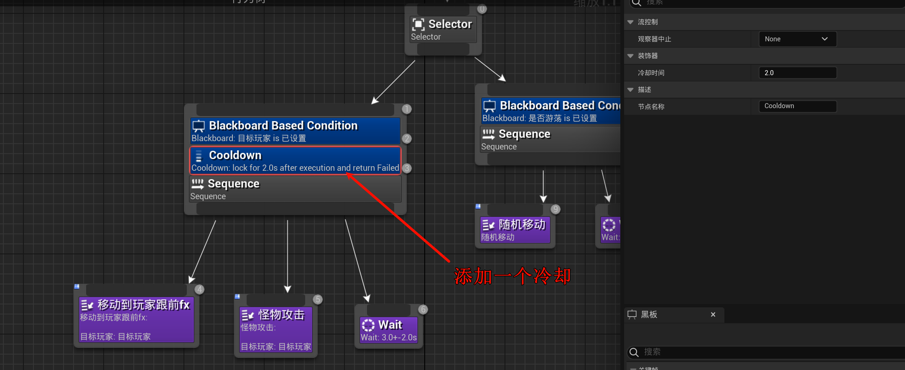

# 2.20 怪物视野、AI感知、攻击范围、散弹技能
## 2.20.1 给怪物添加视野: AI感知组件

## 2.20.2 修复一个严重的问题!
不知道为什么, 之前创建的`任务`, 不知道为什么是`服务`, 我以为没有这个东西的了qwq... 所以用的`服务`, 但是现在突然发现又可以了, 所以全部改为`任务`:

## 2.20.3 攻击范围
添加这个浮点变量在怪物总类, 对应的结构体, 数据表, 预构造 也补充上.

然后, 编写:

然后加一个远程攻击的自然转向: (你如果不在乎性能, 可以使用每一时刻转向)

## 2.20.4 怪物远程攻击 & 散弹技能

怪物总类:

子类重载 (自己搞雷球的材质/攻击动画/伤害判断)

- 右键节点, 添加装饰器...

(感觉不出来和wait有什么区别, 反而出现了bug (怪物打完我就`随机移动`了, 可以体感作用: `如果这个节点进入冷却就执行其他节点, 而wait是直接暂停了, 上面也不干`)), 可以把这个移动到`怪物攻击`处, 这样就不会`随机移动`了