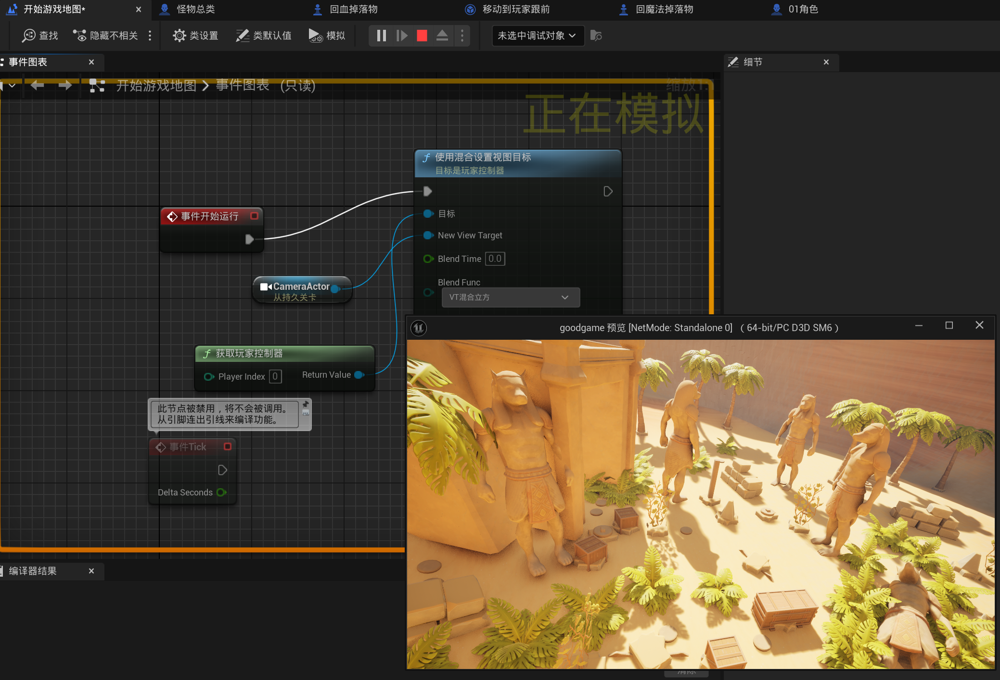
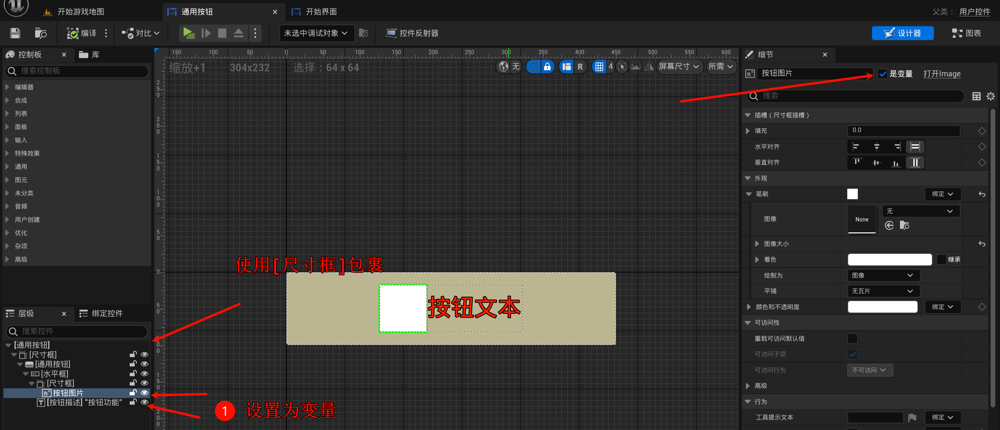
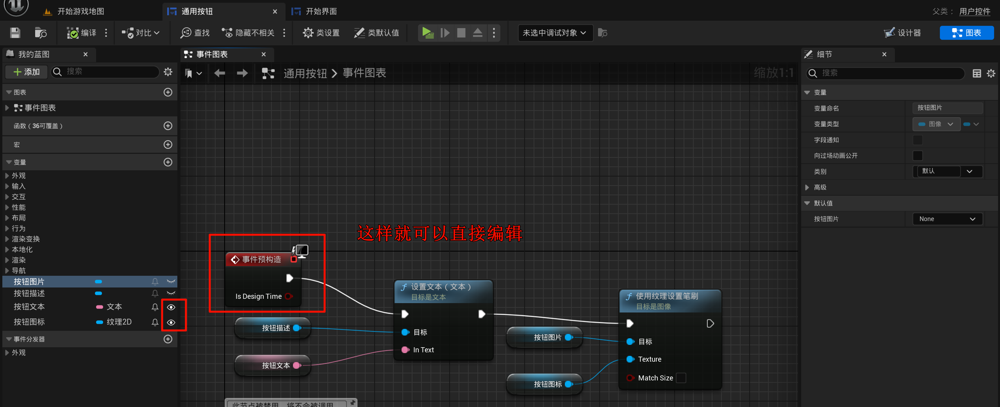
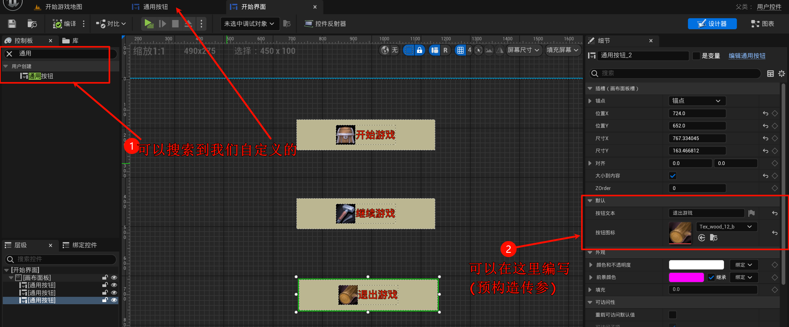
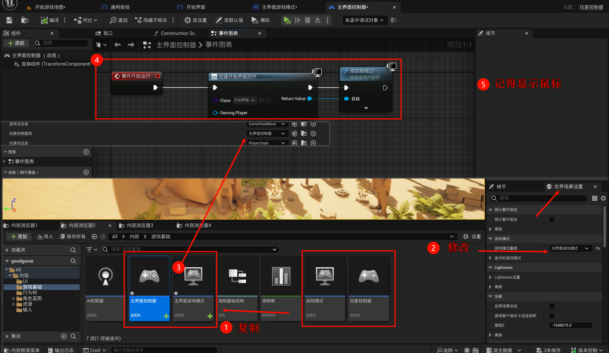
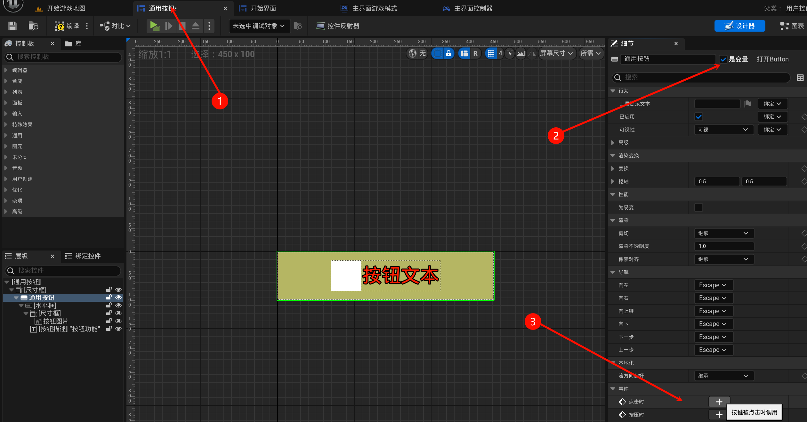
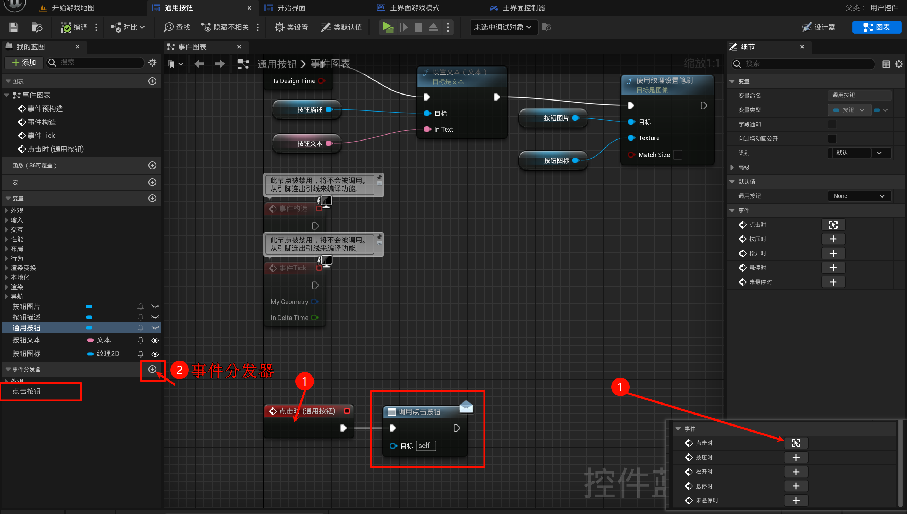
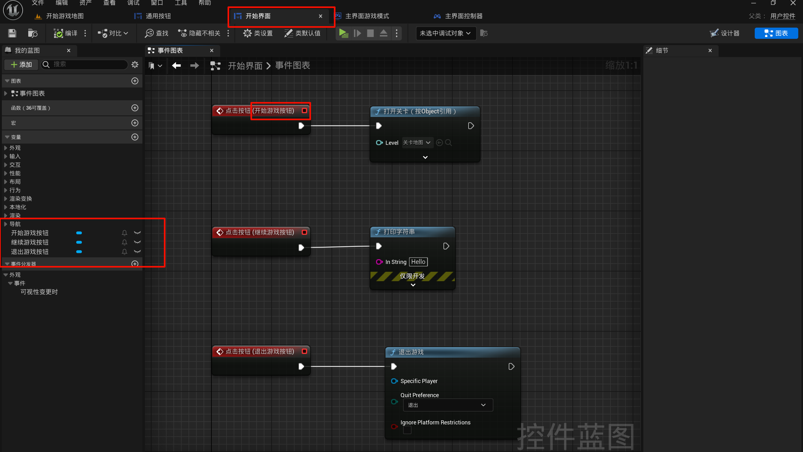
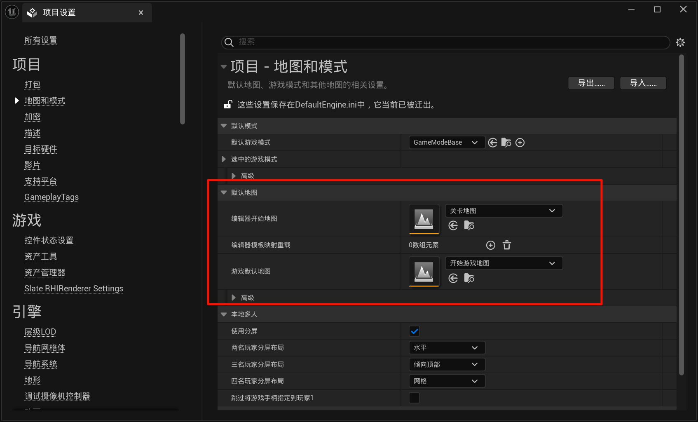

# 2.22 开始菜单、事件分发器、UI预构造
## 2.22.1 开始菜单背景
创建一个新的关卡, 然后你可以复制之前的地图的地形/光照等.

然后搞点植物, 然后就创建一个摄像机, 然后在`关卡蓝图`绑定这个摄像机.

## 2.22.2 开始菜单
先创建一个`通用按钮`基类 (控件)

再新建一个主界面UI界面

然后再复制一下, 一波操作:

## 2.22.3 事件分发器

然后用处就是这样:

(如果不使用事件分发器, 那么在`开始界面UI`处, 就看不到这些`点击事件`!)

## 2.22.4 打包测试一下 & 设置的修改

