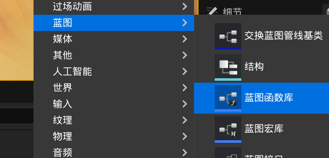
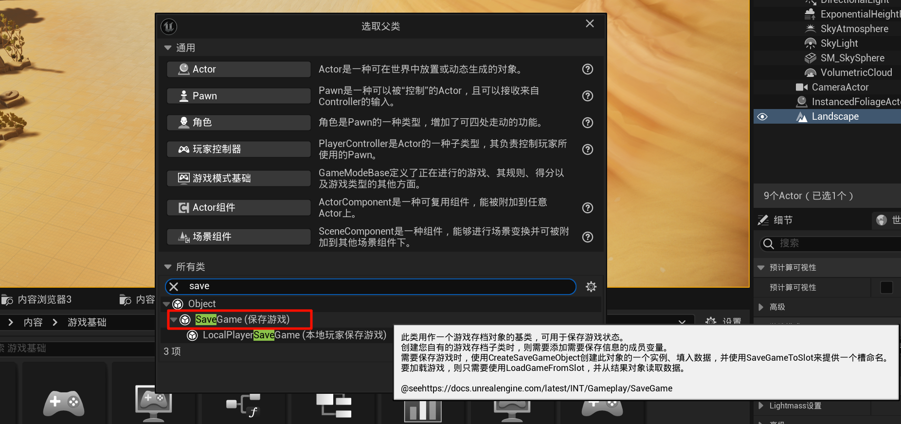
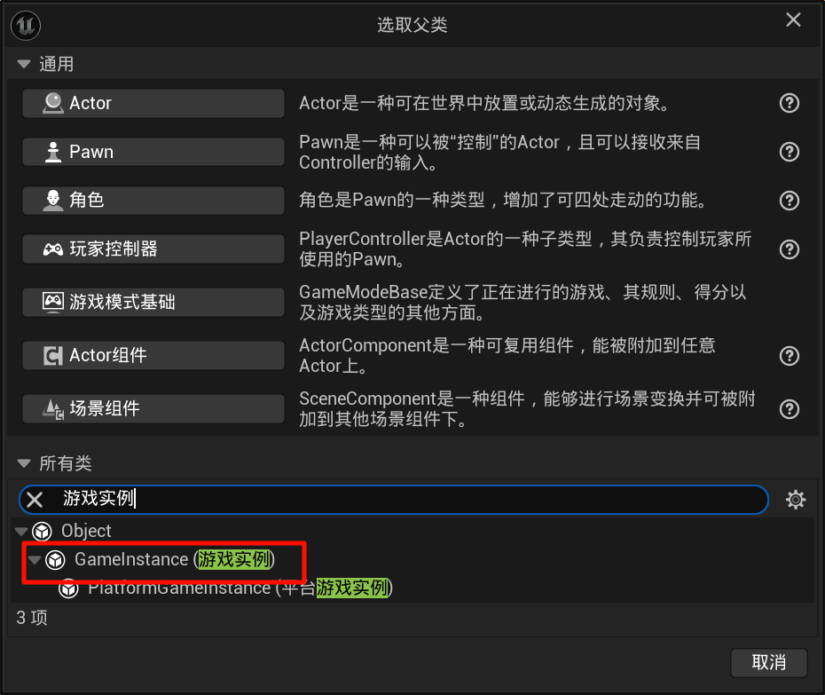
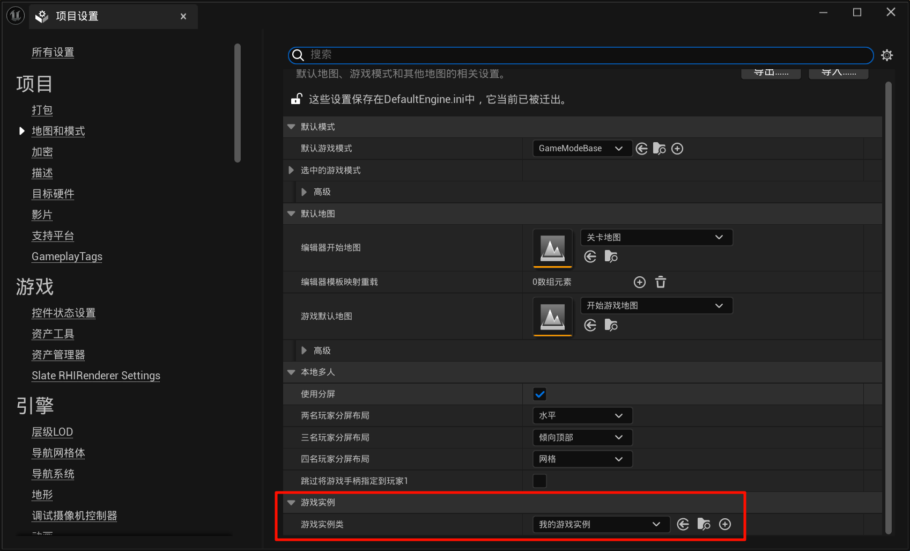
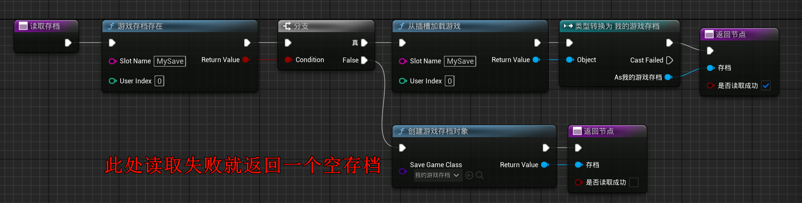
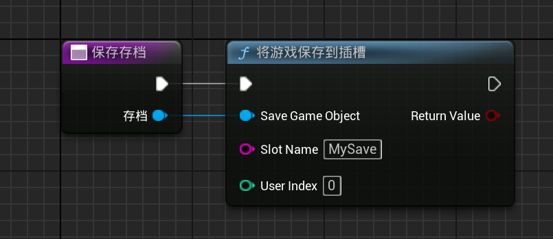
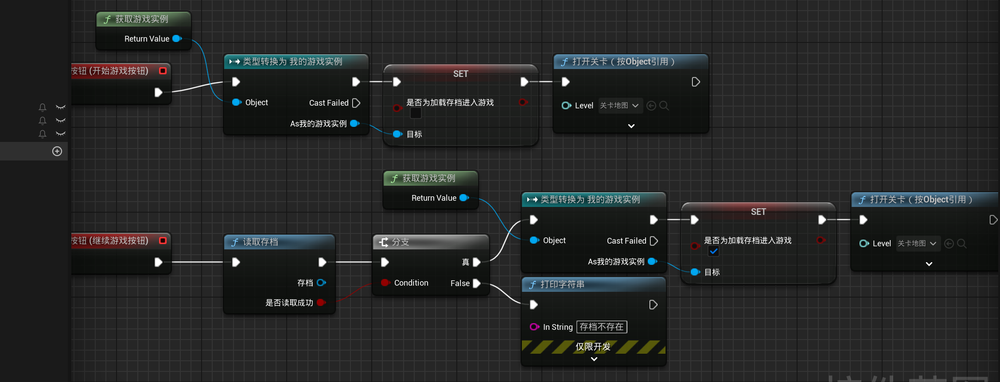
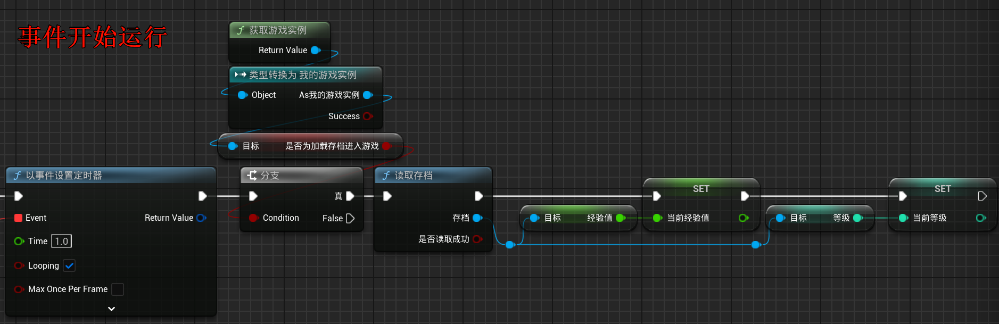
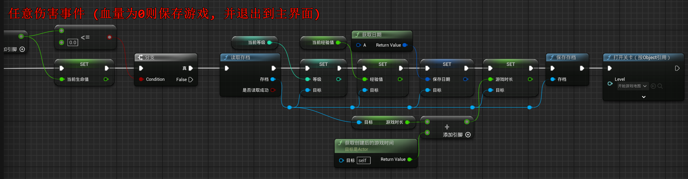

# 2.23 游戏存档、读档、函数库
## 2.23.1 创建 函数库蓝图

## 2.23.2 创建 存档蓝图

需要注意的是，Save Game蓝图能保存的变量类型只能是基础类型的变量，不能是对象类型等非基础类型变量。枚举，数据变量等基础类型都可以保存。结构体只能保存它里面的基础类型变量，比如结构体里面含有一个actor类型的变量，则它不会保存actor的变量值，只会保存结构体中的其他基础变量。加载游戏存档时，结构体获取不到这个actor类型的变量值，因为没有保存成功，是空值。引用: https://www.bilibili.com/read/cv27004468

## 2.23.3 创建 游戏实例蓝图

用于存储运行时的全局临时资源(体感理解)

并添加一个bool变量(`是否为加载存档进入游戏`)

## 2.23.4 编写存档逻辑
- 读取存档

- 保存存档

- 界面逻辑

- 在`01角色`类添加以下逻辑:
 

- 注意: 下面有bug! 如果短时间内受到多次伤害使得`hp <= 0`那么会多次保存, 请加一个`do one`节点

## 2.23.5 存档文件的保存位置

一般开发是在`.\项目路径\项目名称\Saved\SaveGames\xxx.sav`中

而打包发行, 则是在 C盘, 用户 > ${用户名} >`\AppData\Local\项目名称\Saved\SaveGames\xxx.sav`中 (没有测试过, 不过大致应该是这个路径)