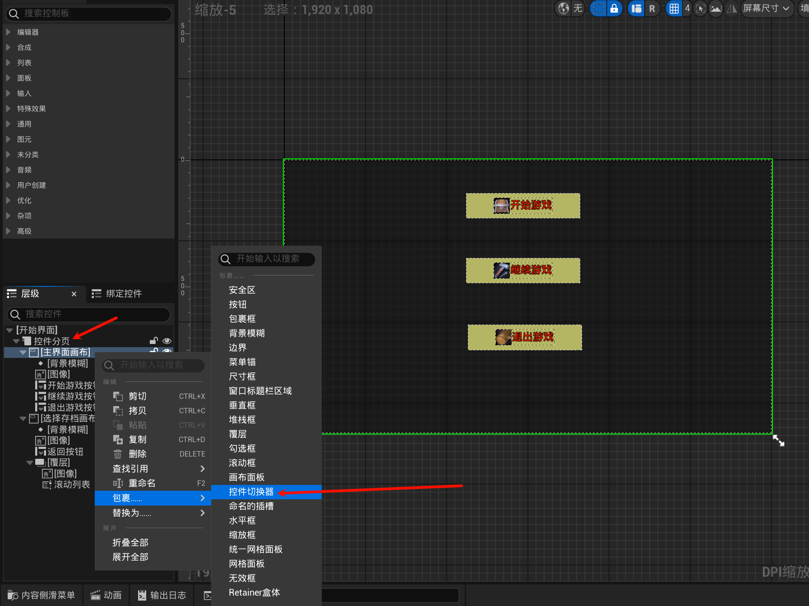
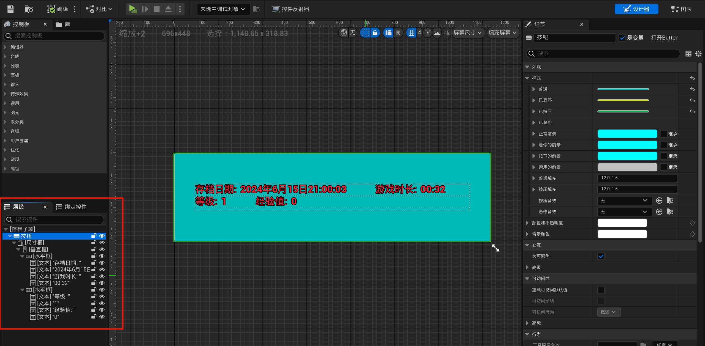
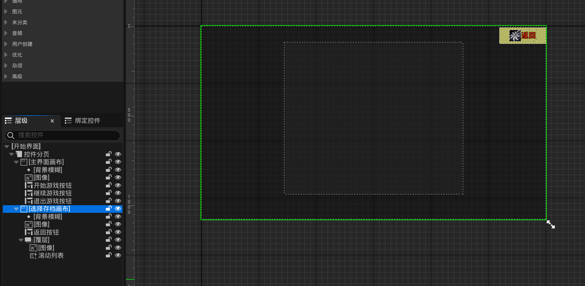
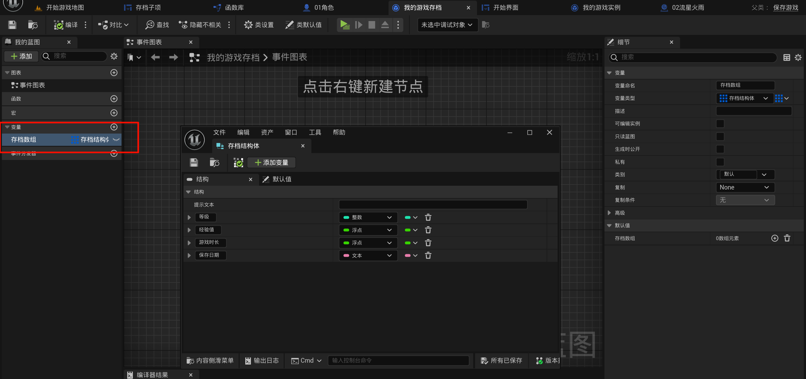
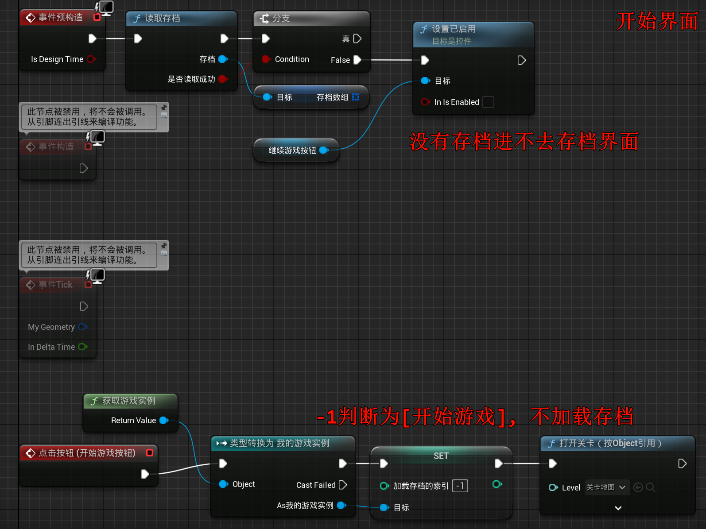
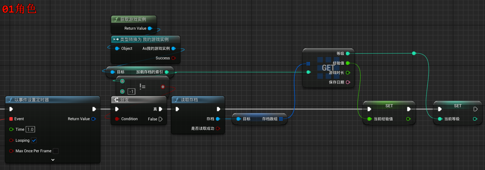
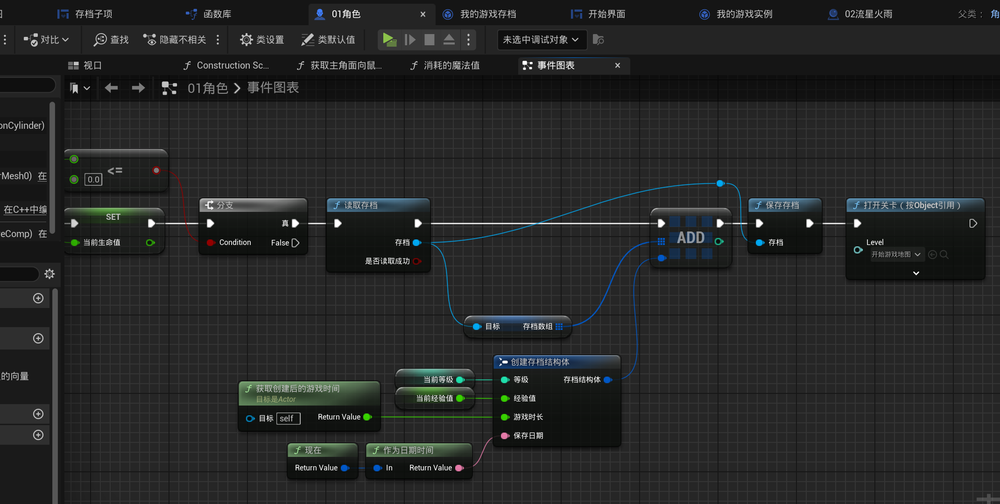
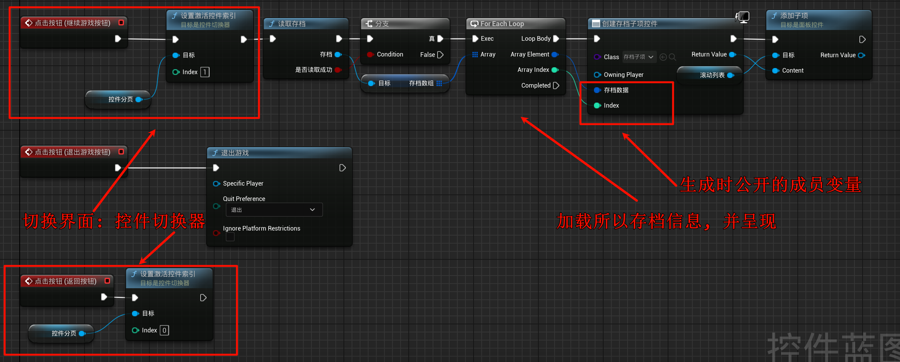
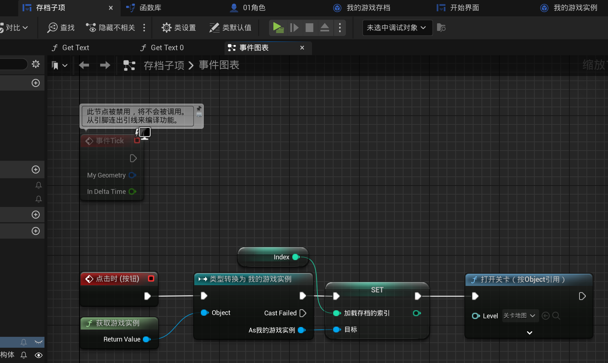

# 2.24 控件切换器、多存档、存档日期、游戏时长
## 2.24.1 控件切换器

- 顾名思义, 就是可以分页切换, 此处实现存档界面

## 2.25.2 多存档

- 存档子项(控件蓝图)

- 存档界面

## 2.25.3 修改之前的代码 & 新增代码

- 存档蓝图变量修改, 写到一个存档数据结构体数组中

- 修改`游戏实例蓝图`的布尔变量为整数变量, 并且其含义是当前载入的存档在上面数组中的索引. (`-1`作为无效值)

- 加载存档

- 保存游戏 (01角色蓝图), 此处偷懒直接添加, 你可以通过存档名称来判断, 是否新增等等(和这里的逻辑千差万别了感觉(因为这里是一个文件多个存档, 而使用存档名称的一般不都是单文件已存档?! 然后使用一个存档名称文件来存储所有存档的简介(索引)信息))

- 读取所有存档并展示: (开始界面蓝图)

- 存档子项的点击事件: 加载存档 | (注: 有一个索引变量, 表示其在存档数组中的索引)

