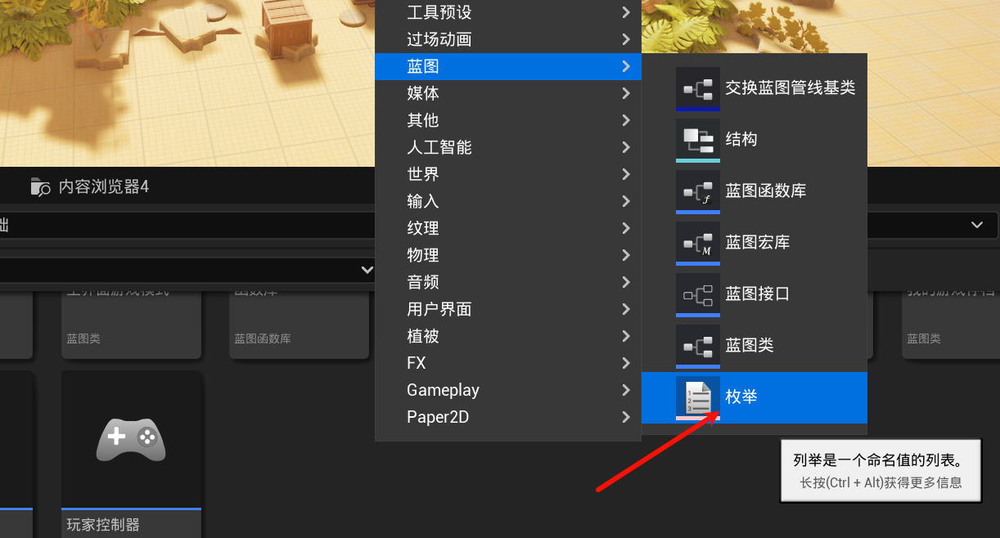
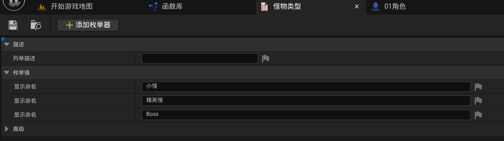
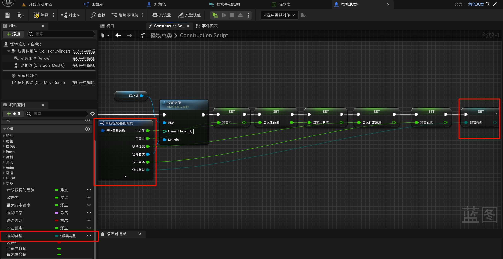
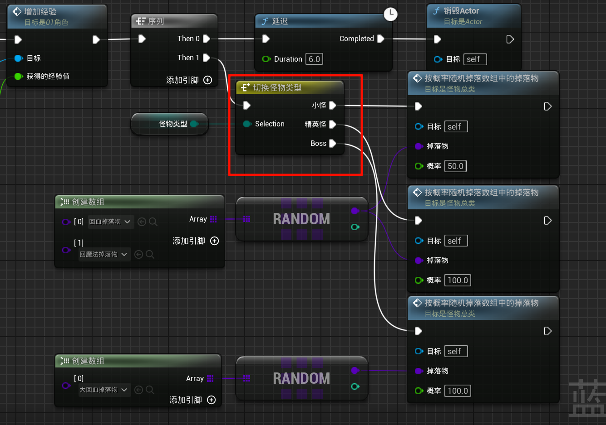
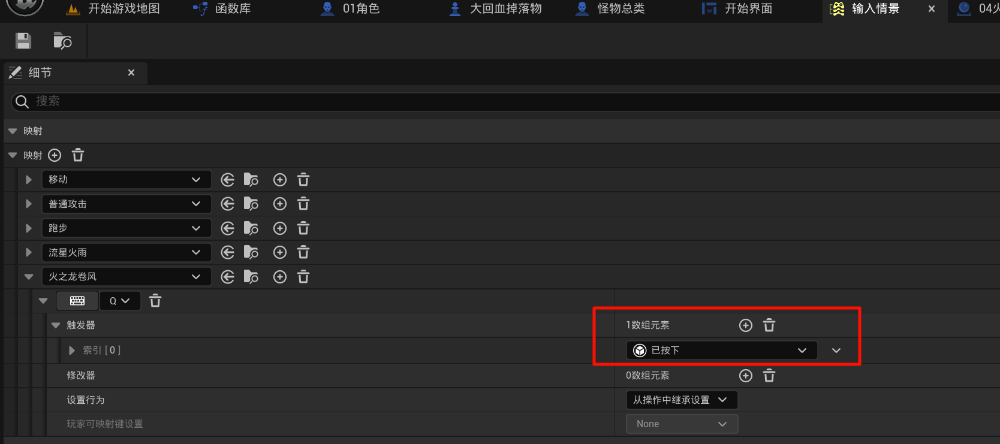
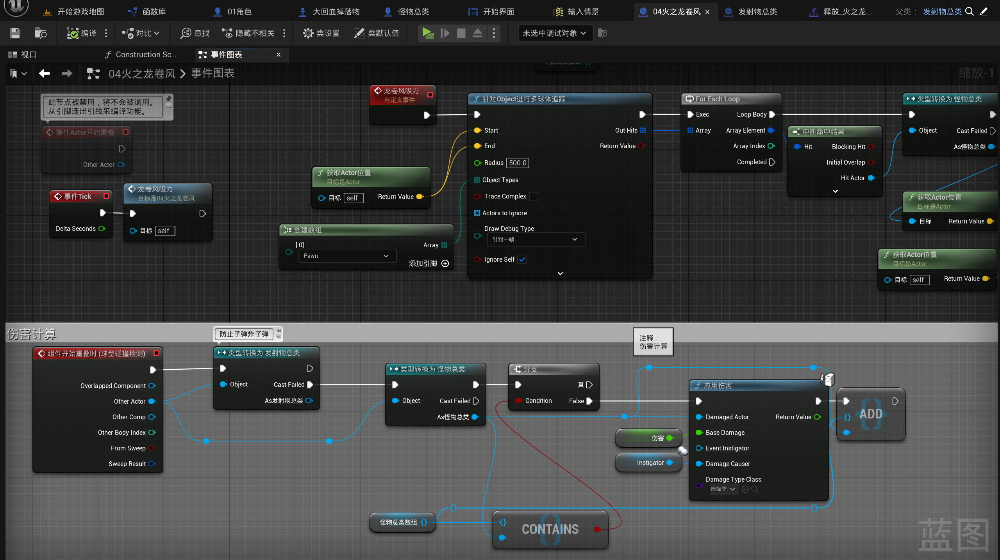
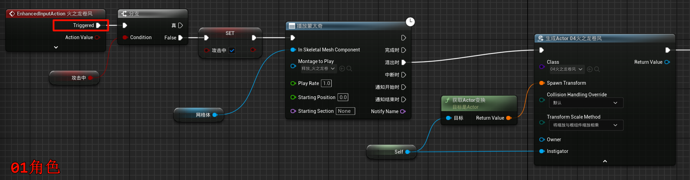

# 2.26 枚举、怪物分类、龙旋风技能、掉落概率
## 2.26.1 创建枚举蓝图: 用枚举区分怪物类型

并且对 怪物结构体/数据表 也同步进行修改(添加上面这个枚举类型)

## 2.26.2 怪物分类 实现: 掉落概率の异

添加以下逻辑在`怪物总类`预构造:

比如根据不同的枚举来进行不同的操作:

## 2.26.3 龙旋风技能

- 按键绑定个新的: (注意有不同!)

- 伤害/吸力

- 按键事件 (因为绑定的是`按下`, 所以不会每一帧触发)

- (动画什么的, 略)