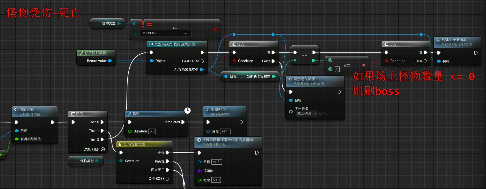

# 2.27 时间膨胀、慢动作、切换地图、刷BOSS
## 2.27.1 刷BOSS
我们期望当场景中的怪物全部死亡后, 可以刷出一个BOSS

(此处修改一下之前的枚举, 分四个等级...)

然后复制一份`03怪物`蓝图, 命名为`04怪物`, 然后技能随便你发挥!

然后是来到`游戏实例`这里, 我们只需要一个`int32`记录当前地图上怪物数量即可, 不需要数组:

然后是判断:

刷出boss的判断: 在没有怪物的时候:

注意: 还记得之前留的坑吗? 我们需要为生成的怪也配置逻辑(行为树), 不然会出现怪物不动, 然后报错.

## 2.27.2 时间膨胀、慢动作、切换地图

- 时间膨胀、慢动作

- 切换地图

- 如果boss死亡, 则通关 (此处的通过的下一个关卡具有局限性!不建议这样写!(除非你只有两关, 因为逻辑写死在`怪物总类`了))

