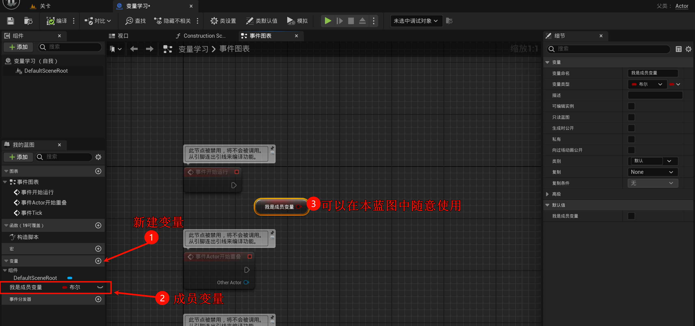
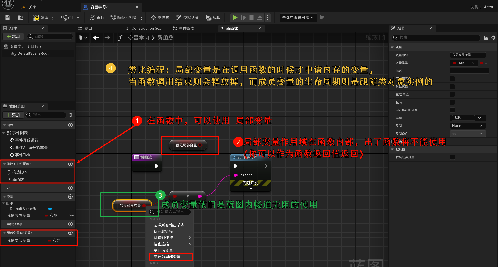
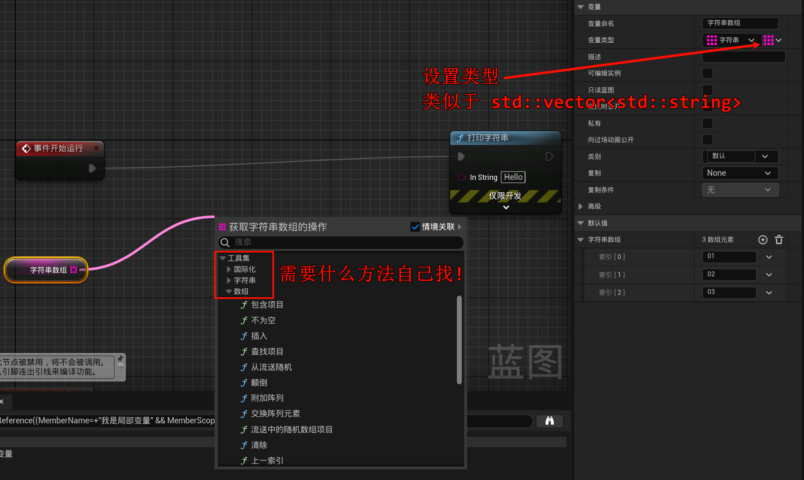
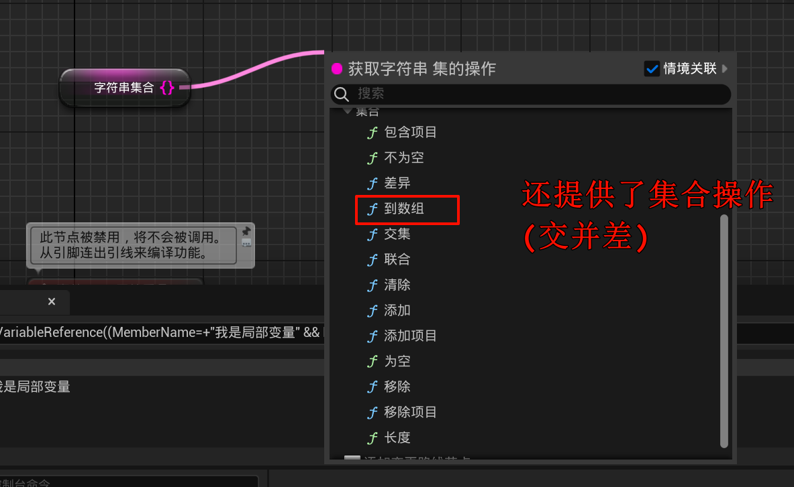
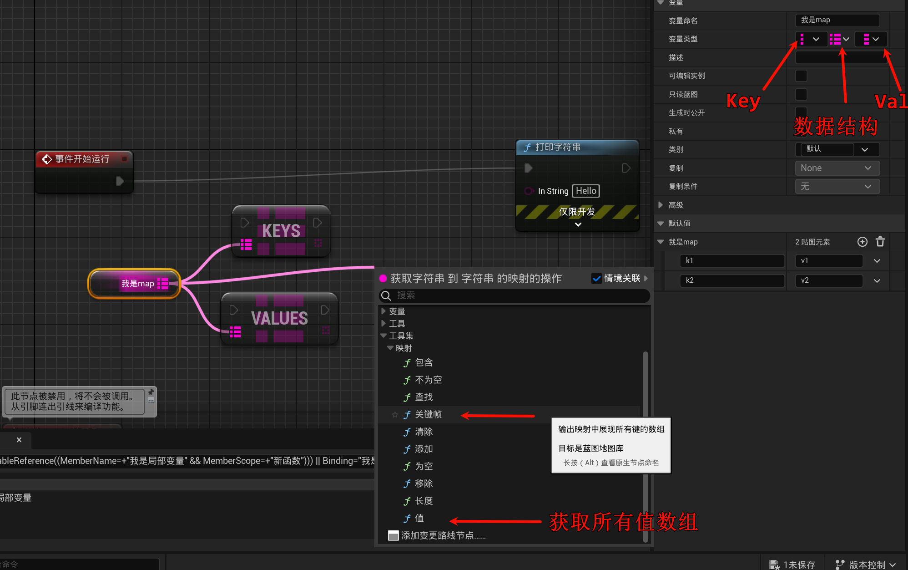
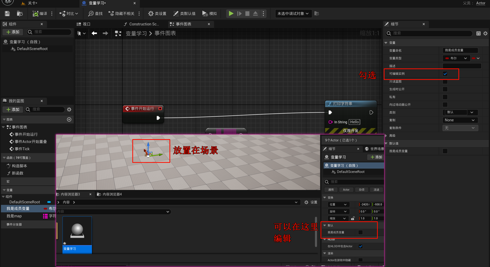
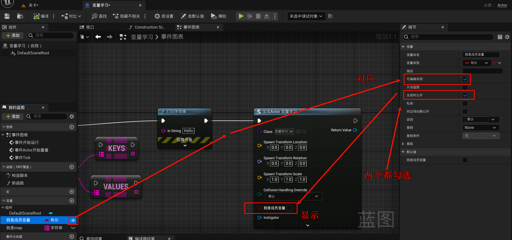
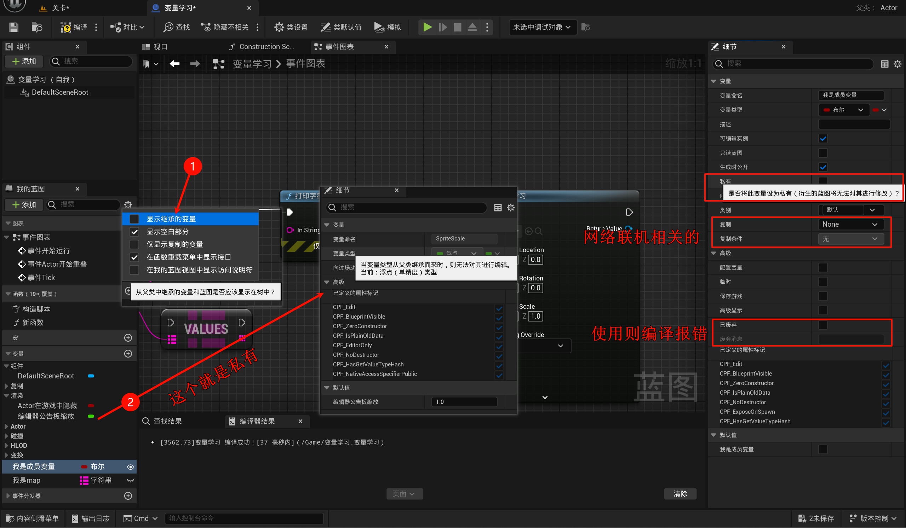

# 3.2 变量详解: 数组、集、映射

> ctrl + n 创建一个新关卡(选择第三个)

本节会使用`C++`术语进行辅助理解.

## 3.2.1 变量的作用域

1. 新建一个Actor蓝图

- 蓝图就相当于`类`

### 3.2.1.1 成员变量

### 3.2.1.2 局部变量

~~(太懒了, 学过编程的应该一眼丁真了吧)~~

## 3.2.2 变量的类型

什么浮点/整数就不说了, 只说要注意的.

---

- 下面参考: [FSTRING VS FNAME VS 虚幻中的文本](https://agrawalsuneet.github.io/blogs/fstring-vs-fname-vs-text-in-unreal/) | [UE学习笔记--如何区分FString、FName、FText，以及使用场景](https://blog.csdn.net/qq_52855744/article/details/135699763)

### 3.2.2.1 字符串

类似于`std::string`, 是`动态`字符串类型

### 3.2.2.2 命名

FName是虚幻引擎中更专业的数据类型。它主要用于存储和引用名称，例如对象名称、属性名称和资产名称。

**高效的内存使用**: FName 使用全局名称表，可减少多次存储相同名称时的内存开销。

不适用于动态文本: FName 是不可变的，不是为动态文本操作而设计的。为此，请使用 FString 或 Text。

### 3.2.2.3 文本
文本是虚幻引擎中另一种与文本相关的数据类型，对于本地化和以人类可读格式维护文本特别有用。

- **本地化支持**: 文本支持本地化，可以更轻松地管理游戏中的多种语言和翻译。

- **不可变且安全**: 与 FName 一样，Text 是不可变的，可确保文本在运行时保持一致且不变。

- **适用于面向用户的文本**: 使用文本显示用户界面、对话或玩家可见的任何文本。

- **内存开销略高**: 由于 FName 的本地化支持，Text 的内存开销略高，但它仍然比 FString 更省内存。

## 3.2.3 存储变量的数据结构
### 3.2.3.1 单个

- ~~我不告诉你~~

### 3.2.3.2 数组
- 这里有图片: [UE5数组的常用方法及操作](https://blog.csdn.net/cigarette_Xu/article/details/132134963)

类似于`std::vector<T>`

### 3.2.3.3 集合

类似于`std::set<T>`/`std::unordered_set<T>`, [【UE】TMap&TSet&Map实现原理 红黑树&稀松数组&哈希表](https://blog.csdn.net/zzq00zzj/article/details/135969098) 底层是红黑树还是哈希表就请自行探索~

集合的特点:

1. 集合中的元素是不重复的。

2. 集合中的元素是无序的

### 3.2.3.4 映射

类似于`std::map<T, Y>`/`std::unordered_map<T, Y>`, [【UE】TMap&TSet&Map实现原理 红黑树&稀松数组&哈希表](https://blog.csdn.net/zzq00zzj/article/details/135969098) 底层是红黑树还是哈希表就请自行探索~

~~(什么破翻译?)~~

## 3.2.4 可编辑实例

- 将`蓝图`放置到场景, 相当于 **实例化** 这个类, 得到的是一个`对象实例`. 此时你点击它, 会展示`可编辑实例`的变量, 相当于你可以在这里传参(设置默认值)

## 3.2.5 生成时公开

- 相当于`有参构造函数`, **不传参** 则使用变量默认值!

### 3.2.6 私有 & 其他不常用的

