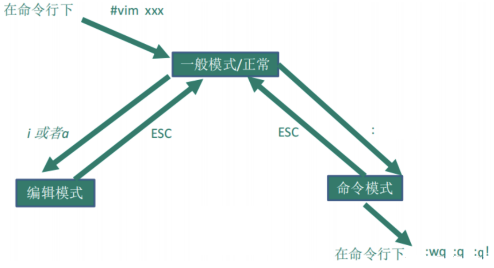
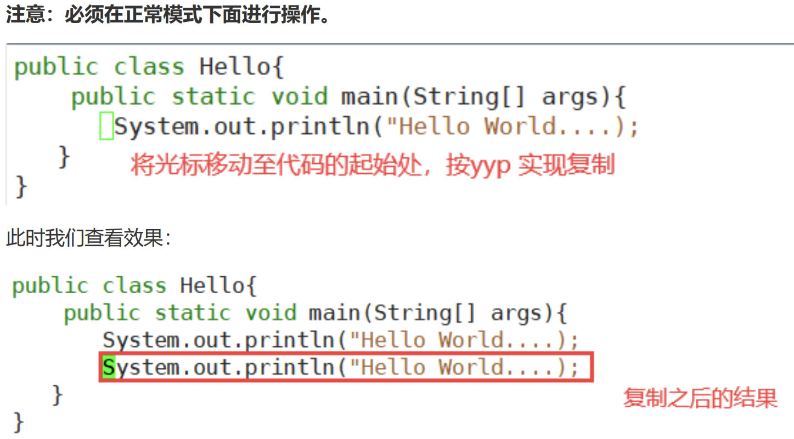
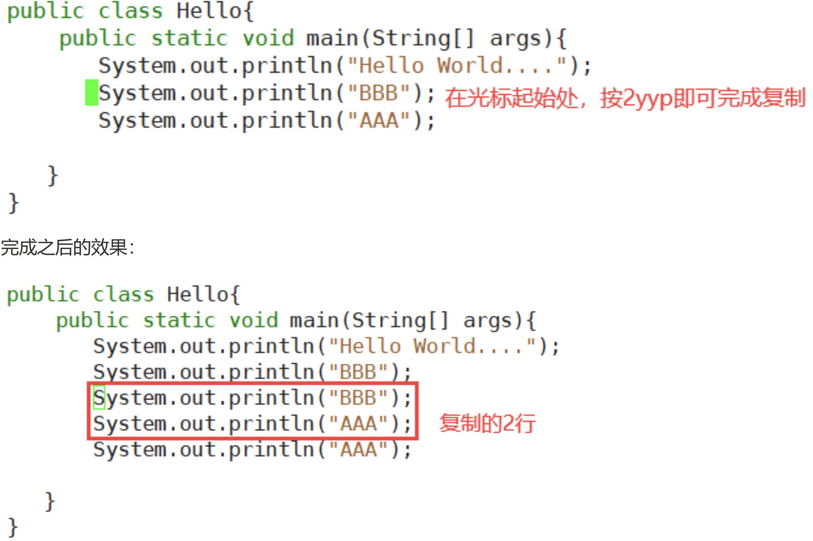
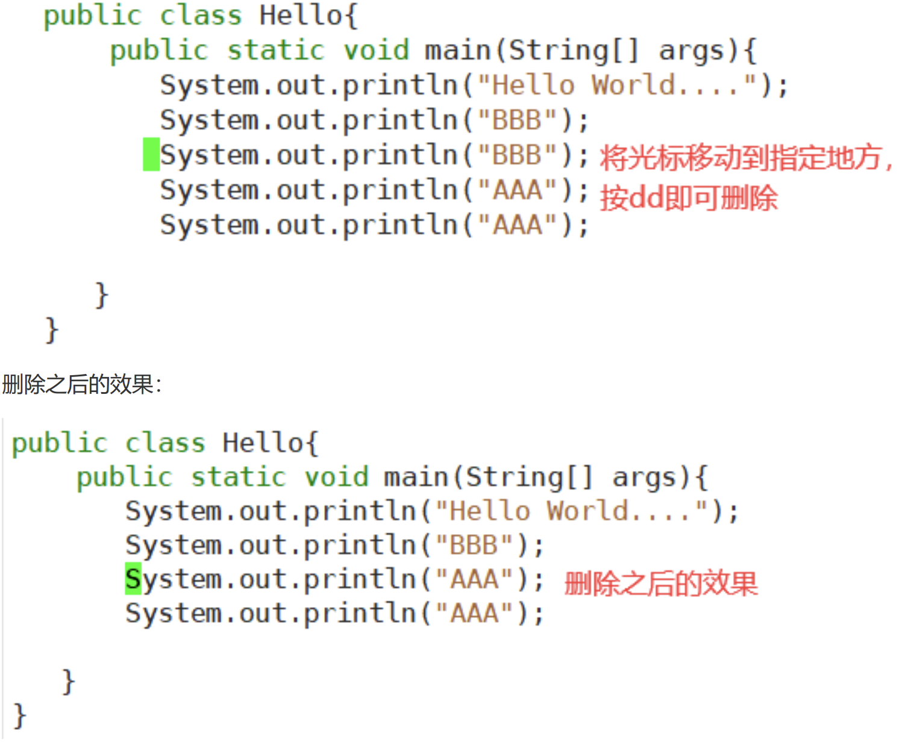
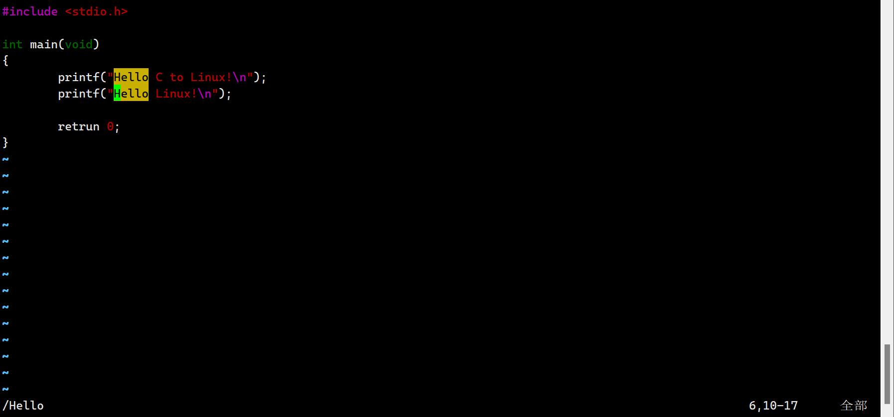
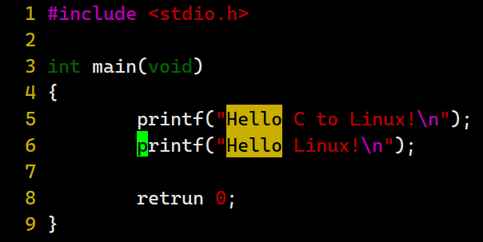

# vi/vim 编辑器
## 概述
所有的 Linux 系统都会内置 vi 文本编辑器。Vim 具有程序编辑的能力，可以看做是Vi的增强版本，可以**主动的以字体颜色辨别语法的正确性，方便程序设计**。代码补完、编译及错误跳转等方便编程的功能特别丰富，在程序员中被广泛使用。

## vi/vim的三种模式
### 正常模式：
以vim打开一个档案就是直接进入了一般默认（这是正常的模式），在这个模式中，可以通过上下左右来移动光标，你也可以使用【删除字符】【删除整行】来编辑档案中的内容，也可以使用【复制】【贴上】来处理你的文件数据。

### 插入模式：
按下i，l，o，O，a等任意一个字母之后才会进入编辑模式，一般情况按下`i`即可。

### 命令行模式：
在这个模式当中，可以提供你相关指令，完成读取，存盘，替换vim，显示行号等操作是在此模式下完成的。

## 使用vim工具

使用 `vim` 命令， 如果当前目录不存在，则创建它；如果存在则打开这个文件.
```Bash
vim hello.c
```

## vim编辑器快捷键的使用



- `:wq` 保存并退出

- `:q` 直接退出

- `:q!` 不保存并退出(强制退出)

接下来我们简单使用vim编辑器的快捷键。

### yyp 复制

> 在 $正常模式$ 下， 将光标移到需要复制的行, 按下`yyp`
>
> 就会在当前行下面插入 一行当前行的内容
>
> 
>

> 拷贝当前向下的2行(2yy ) 并粘贴（p）
>
> 

### dd 删除

删除当前行 `dd`:



删除向下的2行 `2dd`: 图略

### 查找

**在文件中查找某个单词{[命令行下]`/关键字`} 回车查找，输入n就能查找下一个(光标会自动跳转)**

比如: 查找 `Hello`, 会高亮显示



### 设置行号
设置文件的行号(`: set nu`)

取消文件的行号(`: set nonu`)

| ##container## |
|:--:|
||
|设置行号后的显示|

### 使用快捷键回到文件内容的最起始处和最末尾处

**正常模式**下

- `G`: 回到文件的末尾处（光标回到文件的末尾处）

- `gg`: 回到文件的最开始处（光标回到文件的最开始处）

### 快速的定位到某个位置

**正常模式**下

`5 shift + g` (快速到定位到第5行)

### 在文件中输入内容，执行撤销操作

**正常模式**下

按**快捷键**`u`

### 替换指定内容

要搜索**当前行**中字符串`World`的首次出现，并将其替换为`shijie`

```vim Command
:s/World/shijie/
```

要替换**当前行**中搜索到的`所有`内容，可以添加 `g` 标志

```vim Command
:s/World/shijie/g
```

想搜索和替换**整个文件**中的**匹配内容**(全部的内容(贪婪匹配))，使用百分比字符 `%` 作为范围。此字符指示从**文件第一行到最后一行**的范围

```vim Command
:%s/World/shijie
```