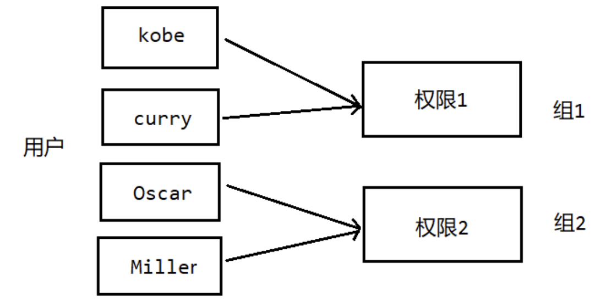

# Linux用户组
Linux用户组具有多种用途，其中包括但不限于以下几点：

`权限控制`：用户组可以用于管理文件和目录的权限。通过将用户添加到特定的用户组中，可以实现对文件和目录的读取、写入和执行权限进行精细控制。

`简化权限管理`：通过将用户划分到不同的用户组中，管理员可以更轻松地管理用户的权限。例如，可以为某个用户组分配特定目录的访问权限，而无需单独为每个用户进行设置。

`共享资源`：用户组允许一组用户共享特定的资源。管理员可以创建一个用户组，并将多个用户添加到该组中，以便它们可以共享文件、目录或其他系统资源。

`简化系统管理`：在某些情况下，当需要给一组用户分配相似的权限时，将这些用户放入同一个用户组中可以简化系统管理。这样可以更容易地管理和分配用户的权限。

| ##container## |
|:--:|
||
|图示|

## 创建用户组

```Bash
groupadd [组名] # 创建用户组
```

## 删除用户组

```Bash
groupdel [组名] # 删除用户组
```

## 将用户移到用户组
### 出生在罗马
**增加用户的时候，直接指定组名称**

之前我们创建用户的时候，没有指定组，其实系统会自动给用户分配一个组，这个组的名称和用户名称是一样的。

现在我们**创建用户的时候直接指定组名称**。

```Bash
useradd -g [用户组] [用户名]
```

```Shell
[root@hxlinux /]# groupadd imouto
[root@hxlinux /]# useradd -g imouto loli
[root@hxlinux /]# su loli
[loli@hxlinux /]$ id
uid=1001(loli) gid=1001(imouto) 组=1001(imouto) 环境=unconfined_u:unconfined_r:unconfined_t:s0-s0:c0.c1023
```

### 修改用户所在组
将用户`A`从`A组`移动到`B组`(前提是`B组`得存在!)

```Bash
usermod -g [用户组] [用户名]
```

## 用户和组相关的文件
### /etc/passwd文件
`/etc/passwd` 用户的配置文件，记录用户的各种信息。

使用cat命令浏览这个文件： `cat /etc/passwd`

**每行的含义:** 用户名:口令:用户标识号:组标识号:注释性描述:主目录:登录shell

```text
heng_xin:x:1000:1000:Heng_Xin:/home/heng_xin:/bin/bash
```

### /etc/shadow文件
口令的配置文件，用户登录的时候需要口令(密码)。口令的验证都是通过这个shadow文件去验证的。

**每行的含义:** 登录名:加密口令:最后一次修改的时间:最小时间间隔:最大时间间隔:警告时间:不活动时间:失效时间:标志

```text
heng_xin:$6$a7bILcFkz54.Evwz$y6fchXADTd8ZjXL6JJmUSrv3PbVcKViU4NMrVbcPGuBIE9kR/rev7ZI9snBSL.hIf9bzLtL.Q0l4Me.wr/iLS1::0:99999:7:::
```

*如果发现没有加密口令, 实际上是因为没有设置密码, 设置上就有了*

### /etc/group文件
组的配置信息，记录linux包含的组的信息

**每行含义:** 组名:口令:组标识号:组内用户列表

```text
heng_xin:x:1000:heng_xin
```