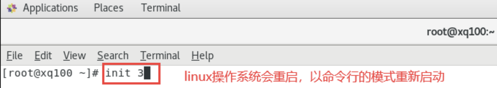

# Linux运行级别
linux操作系统运行的7种级别:

1：**单用户**（找回用户丢失的密码，可以使用单用户模式）

2：**多用户状态但没有网络服务**（一般很少用）

3：**多用户状态但有网络服务**（没有图形化界面，但是有网络，这种用的最多）

4：**系统未使用，保留给用户**（很少用）

5：**图形界面**

6：**系统重启**

**常用**的运行级别是`3`和`5`，我们也可以指定系统默认的运行级别。

## 切换运行级别

切换运行级别的口令
```Bash
init [1 ~ 6]
```

示例:



## 修改默认的运行级别

在centos7中，有一个文件`/etc/inittab`文件中，描述了运行级别的相关信息:

```Shell
[root@hxlinux /]# cat /etc/inittab 
# inittab is no longer used when using systemd.
#
# ADDING CONFIGURATION HERE WILL HAVE NO EFFECT ON YOUR SYSTEM.
#
# Ctrl-Alt-Delete is handled by /usr/lib/systemd/system/ctrl-alt-del.target
#
# systemd uses 'targets' instead of runlevels. By default, there are two main targets:
#
# multi-user.target: analogous to runlevel 3
# graphical.target: analogous to runlevel 5
#
# To view current default target, run:
# systemctl get-default
#
# To set a default target, run:
# systemctl set-default TARGET.target
#
```

修改默认的运行级别:

```Shell
[root@hxlinux ~]# systemctl get-default #获取linux操作系统默认的运行级别
graphical.target # 图形化的运行级别
[root@hxlinux ~]# systemctl set-default multi-user.target # 设置linux操作系统默认的运行级别为纯命令行级别
Removed symlink /etc/systemd/system/default.target.
Created symlink from /etc/systemd/system/default.target to
/usr/lib/systemd/system/multi-user.target.
[root@hxlinux ~]# reboot # 重启生效
```

*建议：在初学的时候，还是使用带有图形化界面的运行级别。*