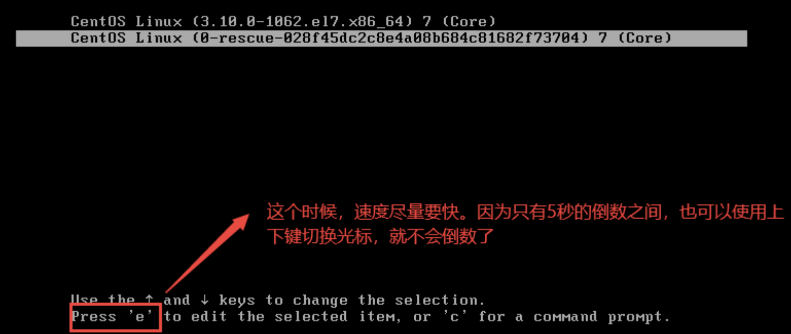
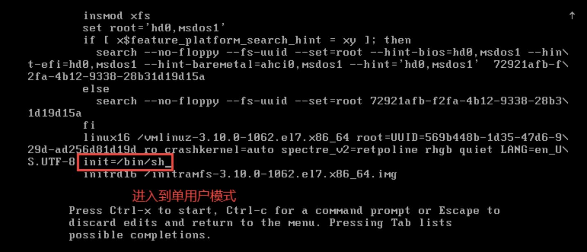
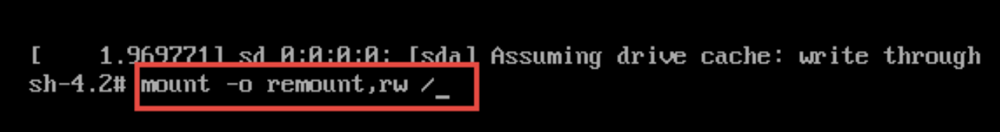
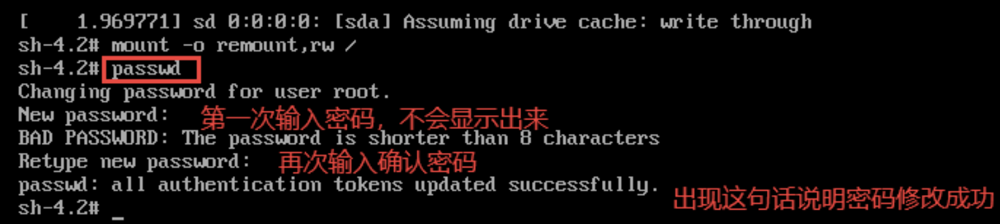
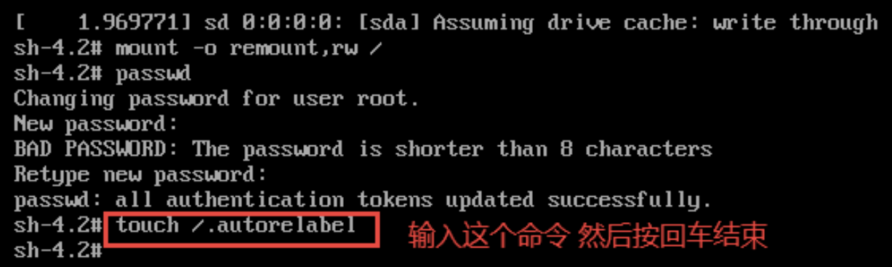
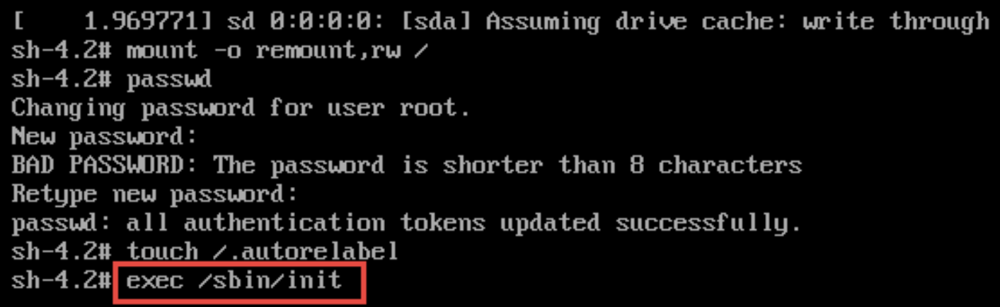

# 如何找回root密码
> 这是一道经典的面试题。希望大家要能够掌握，如果以后自己忘记了root账户的密码，我们也可以按照下面的方法自己去找到root用户的密码。

1. 进入到linux开机界面，然后按`e`键

| ##container## |
|:--:|
||

2. 按下`e`键然后进入另一个界面，找到以`linux16`开头的行数。在行的最后面输入:`init=/bin/sh`。

| ##container## |
|:--:|
||

3. 接着输入完成之后，直接按快捷键Ctrl + X 进入单用户模式

4. 接着在光标闪烁的位置输入: `mount -o remount,rw /` 然后按回车键。

| ##container## |
|:--:|
||

5. 在新的一行最后面输入: `passwd`，然后按回车键。输入密码，然后再次输入确认密码（密码长度最好是8位以上，但不是必须的）。密码修改成功之后，会显示`passwd .....`的字样，说明密码修改成功。

| ##container## |
|:--:|
||

6. 接着在光标闪烁的位置输入: `touch /.autorelabel`(**注意touch 与后面的/之间有空格**)。完成后按回车。

| ##container## |
|:--:|
||

8. 接着在光标闪烁的位置继续输入: `exec /sbin/init`(**注意exec 与后面的/之间有空格**)。然后按回车键，等待系统自动修改密码（这个**时间可能会有点长，请耐心等待**）。完成后系统会**自动重启，新的密码生效**了。

| ##container## |
|:--:|
||