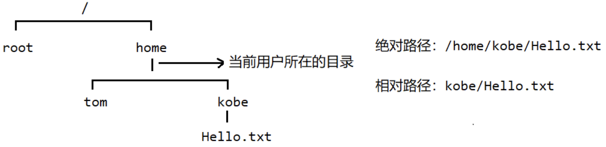

# Linux文件(目录)相关的指令
# 文件/目录 操作
在linux操作系统里面，获取文件的方式有两种，一种是通过绝对路径的方式获取文件，一种是相对路径获取文件。

假设我们在当前指定的目录下面，想要获取指定的文件，我们可以通过相对路径和绝对路径的方式来获取。

| ##container## |
|:--:|
||
|示例|

## pwd
`pwd`指令: **显示当前目录的绝对路径**

```Shell
[root@hxlinux ~]# pwd
/root
```
## ls
`ls`指令: **显示当前目录下面的所有文件(目录)**

常用选项：

- `-a`: 显示当前目录下面的所有文件和目录, **包括隐藏的**。

- `-l`: 以**列表**的方式显示文件(目录)信息

```Shell
[root@hxlinux ~]# ls -al
总用量 60
dr-xr-x---. 17 root root 4096 1月   4 17:23 .
dr-xr-xr-x. 17 root root  224 12月 21 22:43 ..
-rw-------.  1 root root 1907 12月 21 22:44 anaconda-ks.cfg
-rw-------.  1 root root 1235 1月   4 08:03 .bash_history
-rw-r--r--.  1 root root   18 12月 29 2013 .bash_logout
```

## cd

`cd`命令: **切换到指定目录**

```Bash
cd [目标路径(相对路径/绝对路径)] # 切换到指定目录
```

常用选项：

- `~`： `cd ~` 回到**当前用户的`home目录`（如果是root用户，那么回到的就是`root目录`下面**，如果是非root用户，那么就回到`home/用户目录` 下面）

- `/`: `cd /` 回到系统**根目录**

- `..`: `cd ..` 回到**当前目录的上一级目录**

- `-`: `cd -` 回到**上一条命令**所在的目录

```Shell
[root@hxlinux /]# cd tmp/vmware-root
[root@hxlinux vmware-root]# pwd
/tmp/vmware-root
[root@hxlinux vmware-root]# cd -
/
[root@hxlinux /]# pwd
/
[root@hxlinux /]# cd ~
[root@hxlinux ~]# pwd
/root
[root@hxlinux ~]# cd ..
[root@hxlinux /]# pwd
/
[root@hxlinux /]# cd /tmp/vmware-root
[root@hxlinux vmware-root]# pwd
/tmp/vmware-root
```

*注意: Linux下 `/`就是根目录, 区别Win的盘符`C:\`才是根目录的表示*, 所以 `/路径` 实际上是**绝对路径**了!

## mkdir

`mkdir`: **用于创建目录**

常用参数:

- `-p`: 递归创建目录(创建多级目录)

```Shell
[root@hxlinux ~]# mkdir dev
[root@hxlinux ~]# ll
总用量 8
-rw-------. 1 root root 1907 12月 21 22:44 anaconda-ks.cfg
drwxr-xr-x. 2 root root    6 1月   4 17:40 dev

[root@hxlinux ~]# cd dev
[root@hxlinux dev]# mkdir mm/ll
mkdir: 无法创建目录"mm/ll": 没有那个文件或目录

[root@hxlinux dev]# mkdir -p ll/mm
[root@hxlinux dev]# ll
总用量 0
drwxr-xr-x. 3 root root 16 1月   4 17:42 ll
[root@hxlinux dev]# cd ll
[root@hxlinux ll]# ll
总用量 0
drwxr-xr-x. 2 root root 6 1月   4 17:42 mm
```

## rmdir

`rmdir`: **指令删除**<b style="color:red">空</b>**目录**

不常用参数:

- `-p`: 递归删除空目录 (需要指定递归的目录) *(建议使用`rm`)*

```Shell
[root@hxlinux dev]# rmdir ll
rmdir: 删除 "ll" 失败: 目录非空

[root@hxlinux dev]# rmdir -p ll
rmdir: 删除 "ll" 失败: 目录非空
[root@hxlinux dev]# rmdir -p ll/mm/
```

## touch

`touch`: **创建空文件** (重复创建不会报错, 也不会把已有的文件覆盖)

*区别: `vim [文件名]`, 这个创建是不会打开编辑的!*

```Shell
[root@hxlinux dev]# touch awa.txt
[root@hxlinux dev]# touch awa.txt
[root@hxlinux dev]# ll
总用量 0
-rw-r--r--. 1 root root 0 1月   4 17:48 awa.txt

[root@hxlinux dev]# vim awa.txt 
[root@hxlinux dev]# cat awa.txt 
qwq
[root@hxlinux dev]# touch awa.txt # 不会把已有的文件覆盖
[root@hxlinux dev]# cat awa.txt 
qwq
```

## cp

`cp`: **拷贝文件到指定目录**

常用参数:

- `-r`: 递归复制整个文件(夹)

```Bash
cp [文件名] [目标路径]
```

```Shell
[root@hxlinux dev]# mkdir end       # 创建一个目标目录
[root@hxlinux dev]# ll
总用量 4
-rw-r--r--. 1 root root  4 1月   4 17:49 awa.txt
drwxr-xr-x. 2 root root  6 1月   4 17:52 end
drwxr-xr-x. 3 root root 16 1月   4 17:52 ll
[root@hxlinux dev]# cd ll/mm/
[root@hxlinux mm]# touch loli.txt   # 创建一个用于递归复制的文件
[root@hxlinux mm]# cd ../..
[root@hxlinux dev]# cp awa.txt end/ # 成功复制单个文件
[root@hxlinux dev]# cp ll end/      # 无法判断是复制单个文件夹还是连同里面的文件
cp: 略过目录"ll"
[root@hxlinux dev]# cp -r ll end/   # 递归复制
[root@hxlinux dev]# cd end/
[root@hxlinux end]# ll              # 确实成功复制了
总用量 4
-rw-r--r--. 1 root root  4 1月   4 17:53 awa.txt
drwxr-xr-x. 3 root root 16 1月   4 17:53 ll
```

## rm

`rm`: **移除文件或者目录**

*似乎没有参数的时候是不能删除`空文件夹`的*

常用参数:

- `-f`: 强制删除, 并且不提示

- `-r`: 递归删除整个文件夹

```Shell
[root@hxlinux dev]# rm awa.txt 
rm：是否删除普通文件 "awa.txt"？yes
[root@hxlinux dev]# cd end/
[root@hxlinux end]# rm -f awa.txt 
[root@hxlinux end]# ll
总用量 0
drwxr-xr-x. 3 root root 16 1月   4 17:53 ll
[root@hxlinux end]# rm ll
rm: 无法删除"ll": 是一个目录
[root@hxlinux end]# rm -r ll
rm：是否进入目录"ll"? y
rm：是否进入目录"ll/mm"? y
rm：是否删除普通空文件 "ll/mm/loli.txt"？y
rm：是否删除目录 "ll/mm"？y
rm：是否删除目录 "ll"？y
[root@hxlinux end]# cd ..
[root@hxlinux dev]# rm -f end/
rm: 无法删除"end/": 是一个目录
[root@hxlinux dev]# rm -r end/
rm：是否删除目录 "end/"？y
[root@hxlinux dev]# rm -rf ll
[root@hxlinux dev]# ll
总用量 0
```

## mv

`mv`：**移动文件（剪切）或重命名**

在`同一个目录`下面操作 即 **重命名**
```Bash
mv [原名称] [新名称]
```

在`不同目录`下面操作 即 **剪切**

```Bash
mv [原文件位置] [目标位置]
```

1. 重命名
```Shell
[root@hxlinux dev]# mv awa.c qwq.c
[root@hxlinux dev]# ll
总用量 0
-rw-r--r--. 1 root root 0 1月   4 22:13 qwq.c
```

2. 移动
```Shell
[root@hxlinux dev]# ll           # 展示原路径
总用量 0
drwxr-xr-x. 2 root root 6 1月   4 22:15 mm
-rw-r--r--. 1 root root 0 1月   4 22:13 qwq.c

[root@hxlinux dev]# mv qwq.c mm/ # 进行移动

[root@hxlinux dev]# ll           # 展示结果
总用量 0
drwxr-xr-x. 2 root root 19 1月   4 22:15 mm
[root@hxlinux dev]# cd mm/
[root@hxlinux mm]# ll
总用量 0
-rw-r--r--. 1 root root 0 1月   4 22:13 qwq.c
```

# 查看文件
## cat

`cat`: **查看文件内容**
```Bash
cat [要查看的文件]
```
常用参数:

- `-n`: 显示行号

示例:
```Shell
[root@hxlinux mm]# cat qwq.c
#include <stdio.h>

int main(void)
{
    printf("Hello C!\n");

    return 0;
}
[root@hxlinux mm]# cat -n qwq.c
     1    #include <stdio.h>
     2    
     3    int main(void)
     4    {
     5        printf("Hello C!\n");
     6    
     7        return 0;
     8    }
```

`cat`只能浏览文件，并不能修改文件，为了浏览方便，一般会用上管道命令 `| more`<sup>{见下面}</sup>

## more

`more`: 该指令是一个基于vi编辑器的文本过滤器，他以全屏的方式显示文本文件的内容，more指令内置了若干快捷键。

|操作|功能说明|
|:-:|:-----:|
|空格键|向下翻页|
|Enter|向下翻一行|
|q|代表立刻more，不再显示文件内容|
|Ctrl + F|向下滚动一屏幕|
|Ctrl + B|返回上一屏|
|=|输出当前行号|
|:f|输出文件名和当前行号|

```Bash
more [文件名]
```

## less

`less`: 该指令用于来`分屏查看文件内容`，他的功能与more类似，但是比more更加强大，支持各种显示终端。less指令在显示文件内容时，并`不是一次将整个文件加载后才显示的，而是根据要加载的内容`，对**显示大型文件具有高效率**。

|操作|功能说明|
|:--:|:----:|
|空格键|向下翻动一页|
|上箭头键|向上翻动一行|
|下箭头键|向下翻动一行|
|/字符串内容|搜索字符串:<br>按下`n`: 向下搜索<br> 按下`N`: 向上搜索|
|q|立刻less，不再显示文件内容|

```Bash
less [文件名称]
```

## echo

`echo`: **将输入内容到控制台**

```Bash
echo [内容]
```

1. 输出环境变量
```Shell
[root@hxlinux mm]# echo $PATH
/usr/local/sbin:/usr/local/bin:/usr/sbin:/usr/bin:/root/bin
```

2. 使用`管道符`, 写入数据到文件(文件不存在会自动创建)

- `>`: 是覆盖写入(输出重定向). (类似于`w`)

- `>>`: 是追加, 会从文件末尾并且新开一行进行追加. (类似于`a`)

```Shell
[root@hxlinux mm]# echo awa > awa.txt
[root@hxlinux mm]# cat awa.txt 
awa
[root@hxlinux mm]# echo loli > awa.txt
[root@hxlinux mm]# cat awa.txt 
loli
[root@hxlinux mm]# echo imouto >> awa.txt
[root@hxlinux mm]# cat awa.txt 
loli
imouto
```

## head

`head`: **用于显示文件开头部分内容，默认情况下head显示的是文件前10行的内容**

使用 `head -n [行数] [文件名]`, 可以指定显示行数.

示例:
```Shell
[root@hxlinux mm]# head qwq.c 
#include <stdio.h>

void fun(void)
{
    printf("The warudo!\n");

    return;
}

void fun_2(void)
[root@hxlinux mm]# head -n 5 qwq.c 
#include <stdio.h>

void fun(void)
{
    printf("The warudo!\n");
```

## tail

`tail`: **用于输出文件中尾部的内容，默认情况下tail指令显示文件的前10行内容**

使用 `tail -n [行数] [文件名]`, 可以指定显示行数.

使用 `tail -f [文件名]`, 是**实时监控文件发生的变化**。

示例:
```Shell
[root@hxlinux mm]# tail qwq.c 
    return; // 什么也没有做, 但是还是辛苦我这个函数了=-=
}


int main(void)
{
    printf("Hello C!\n");

    return 0;
}
[root@hxlinux mm]# tail -n 3 qwq.c 

    return 0;
}
```

## ln

`ln`: 创建软连接

软连接也称为符号链接，类似中windows里面的快捷方式，主要是存放了链接文件的路径

```Bash
ln -s [源文件或目录] [软连接名称]
```

注: `ll` 显示 有`->`, 就是`软连接`
```Shell
[root@hxlinux dev]# ln -s mm my
[root@hxlinux dev]# ll
总用量 0
drwxr-xr-x. 2 root root 34 1月   4 22:41 mm
lrwxrwxrwx. 1 root root  2 1月   4 22:49 my -> mm
```

## history

`history`: **查看用户已经执行过的历史指令**

```Bash
history [可选: 数字] # 如果不输入数字, 就是显示全部的历史, 输入数字就是显示倒数前n条
```

示例:
```Shell
[root@hxlinux dev]# history 10
  237  ll
  238  cd dd
  239  cd dev/
  240  ll
  241  ln -s mm my
  242  ll
  243  rm my
  244  ll
  245  history 
  246  history 10
```