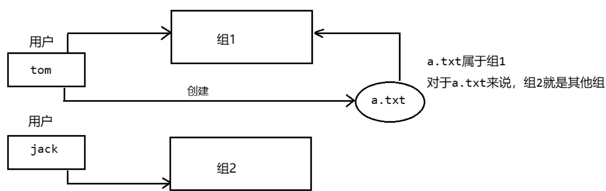

# Linux组介绍
在linux中**每个用户都必须属于一个组，不能独立于组外**，在linux中每个文件有所有者，所在组，其他组的概念。下面我们用一幅图来解释用户、组、其他组的概念。



默认情况下，谁创建了改文件，谁就是文件的所有者。

通过 `ls -l` 可以查看组名与用户:
```Shell
[root@hxlinux home]# ll
总用量 4
#              用户名     组名
drwx------. 15 heng_xin heng_xin 4096 1月   4 01:48 heng_xin
drwx------.  5     1001 root      128 1月   4 04:33 loli
```

## 修改文件所属的用户

`chown`: 可以修改文件所属的用户。

语法
```Bash
chown [用户名] [文件名]
```

示例:
```Shell
[root@hxlinux home]# chown heng_xin loli/
[root@hxlinux home]# ll
总用量 4
drwx------. 15 heng_xin heng_xin 4096 1月   4 01:48 heng_xin
drwx------.  5 heng_xin root      128 1月   4 04:33 loli
```

## 修改文件所在的组

`chgrp`: 修改文件所在的组.

语法:
```Bash
chgrp [组名] [文件名]
```

示例:
```Shell
[root@hxlinux heng_xin]# chgrp root 公共/
[root@hxlinux heng_xin]# ll
总用量 0
drwxr-xr-x. 2 heng_xin root     6 1月   3 05:05 公共
drwxr-xr-x. 2 heng_xin heng_xin 6 1月   3 05:05 模板
```

## 修改用户所在的组
在root用户下面，我们也可以修改用户所在的组。前提是新的组一定是存在的。

`usermod`: 改变用户所在的组.

语法:
```Bash
usermod -g [新组名] [用户名]
```

示例:
```Shell
[root@hxlinux home]# ll
总用量 4
drwx------. 15 heng_xin heng_xin 4096 1月   4 01:48 heng_xin
drwx------.  5 heng_xin root      128 1月   4 04:33 loli
drwx------.  3 lolikon  lolikon    78 1月   9 04:50 lolikon
[root@hxlinux home]# usermod -g loli lolikon
[root@hxlinux home]# ll
总用量 4
drwx------. 15 heng_xin heng_xin 4096 1月   4 01:48 heng_xin
drwx------.  5 heng_xin root      128 1月   4 04:33 loli
drwx------.  3 lolikon  loli       78 1月   9 04:50 lolikon
```